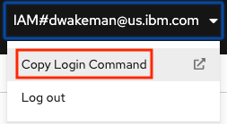
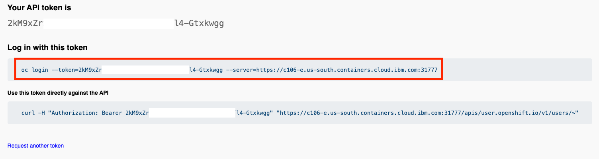
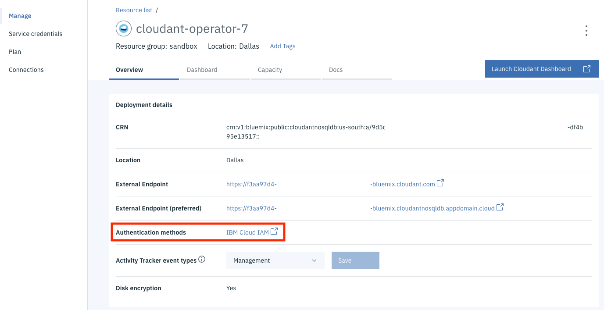
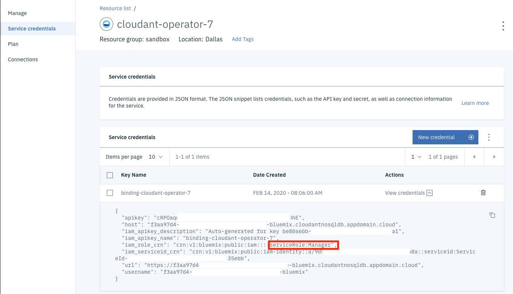
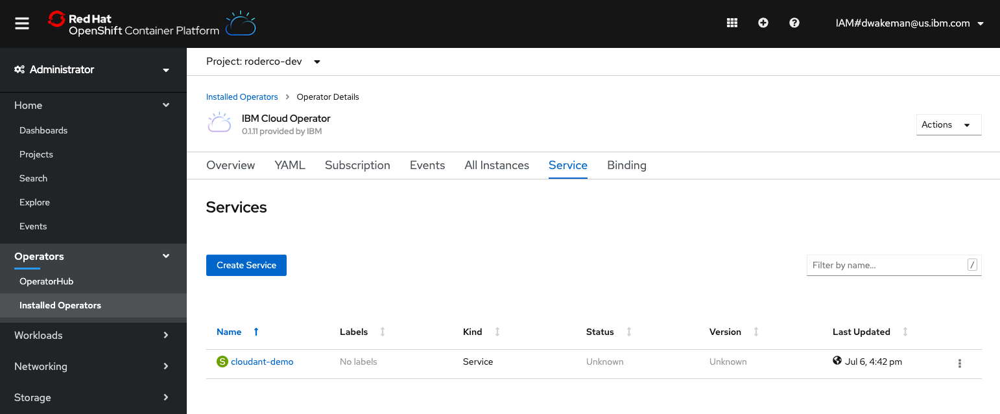
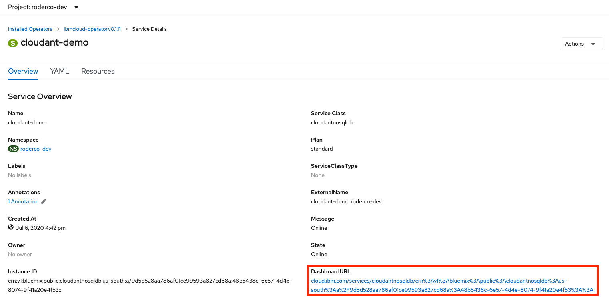

# IBM Cloud Operator

This operator is used to provision services in IBM Cloud and to create bindings that applications need to consume these services.

[IBM Cloud Operator](https://github.com/IBM/cloud-operators)


Instructions will be provided here when available.

## Installing the IBM Cloud Operator

The IBM Cloud Operator should be available by default in the OperatorHub console in OpenShift.  It can be installed using the OperatorHub Console in OpenShift, or be using the OpenShift CLI.

### Install using the UI

<screen shots and instructions coming soon....>

### Install using the OpenShift CLI

Documentation on installing operators in OpenShift can be found [here](https://docs.openshift.com/container-platform/4.3/operators/olm-adding-operators-to-cluster.html).  In the case of the IBM Cloud Operator, it is a matter of creating a yaml file and using the `oc` cli.

On that page it discusses two objects that are needed - the `OperatorGroup` object and the `Subscription` object.  If you intend to make the operator available in all projects you do not need to create a new `OperatorGroup` object; one already exists.  You only need to create one if you want to install the operator into a single project.

Here is sample yaml for creating a `Subscription` object:

```yaml
apiVersion: operators.coreos.com/v1alpha1
kind: Subscription
metadata:
  name: ibmcloud-operator
  namespace: openshift-operators
spec:
  channel: alpha
  installPlanApproval: Automatic
  name: ibmcloud-operator
  source: community-operators
  sourceNamespace: openshift-marketplace
  startingCSV: ibmcloud-operator.v0.1.7
```

_**Note:** If you specify the `openshift-operators` namespace the operator will be installed in all namespaces in the cluster.  This is the default behavior; if you specify any other namespace the operator will only be installed in that namespace.  More documentation can be found [here](https://docs.openshift.com/container-platform/4.3/operators/olm-adding-operators-to-cluster.html)._


1. Create a yaml file with the content above.  Make sure to change the `startingCSV` value to the correct version of the IBM Cloud Operator as it appears in the OperatorHub console.
1. Login to the `oc` cli.  You can copy the command from the OpenShift Web Console:

   
1. Click the "Display Token" link.  Select the command in the "Log in with this token" section:

   
   Paste the command in a terminal and run it. 
   ```
   oc login --token=5y7lF******************BOm2cSE --server=https://c106-e.us-south.containers.cloud.ibm.com:31777
   Logged into "https://c106-e.us-south.containers.cloud.ibm.com:31777" as "IAM#dwakeman@us.ibm.com" using the token provided.

   You have access to 55 projects, the list has been suppressed. You can list all projects with 'oc projects'

   Using project "default".
   ```
1. Run this command: `oc apply -f <yaml_file_name>`
   ```
   oc apply -f ibmcloud-operator-subscription.yaml 
   subscription.operators.coreos.com/ibmcloud-operator created
   ```
   You should see a message that the subscription was created.  It should now show up in the OpenShift console in the      "Installed Operators" page.

1. _**Congratulations, the IBM Cloud Operator has been installed!!**_

## Configuring the IBM Cloud Operator

There are a few things that need to be configured in order for the IBM Cloud Operator to work.  First, it needs an API key to use to authenticate with IBM Cloud.  That user must have sufficient permissions to create services and bindings.  More on that in a bit.  

That API Key gets loaded into a secret named `seed-secret`.  The operator will first look for a secret by that name in the current project, and use it if found.  If not, it will look in the `default` project, and if it finds one there it will use it.  This behavior will allow Kaiser Permanente to provide each team with a separate seed-secret that uses an API key for a service ID that only has permission to create certain services, and only in that team's resource group.

More discussion is needed to finalize the design for configuration of the operator for KP.  If there is no seed-secret in the default project then there must be one in the current project in order for it to work.  Each team can be given their own Service ID with permission to only create specific services, and only in the team's resource group.  An API Key for that Service ID can be loaded into a seed-secret in the team's project.  Similarly, a seed-defaults configmap can be created in the team's project that points to the team's resource group.

## Using the IBM Cloud Operator

_**Note:** For more details see the [User Guide](https://github.com/IBM/cloud-operators/blob/master/docs/user-guide.md) or the [Readme](https://github.com/IBM/cloud-operators/blob/master/README.md)._

The IBM Cloud Operator has two objects that can be created:

* **Service** - The service object represents the actual service instance in IBM Cloud.
* **Binding** - The binding object creates the service credentials that an application can use to interact with the service.

### Creating a Service

```yaml
apiVersion: ibmcloud.ibm.com/v1alpha1
kind: Service
metadata:
  name: dw-elasticsearch-operator-2
  namespace: dw-services
spec:
  plan: standard
  serviceClass: databases-for-elasticsearch
  tags: ["operator", "sandbox-roks-cluster","ibm-cloud-utility"]
  parameters:
  - name: members_disk_allocation_mb
    value: 30720
  - name: members_memory_allocation_mb
    value: 6144
  - name: service-endpoints
    value: private
```


### Creating a Binding


```yaml
apiVersion: ibmcloud.ibm.com/v1alpha1
kind: Binding
metadata:
  name: binding-dw-elasticsearch-operator-2
  namespace: dw-services
spec:
  serviceName: dw-elasticsearch-operator-2
  role: Editor
```


## Content from OpenShift Page (needs to be reviewed)

There are many [sample](https://github.com/IBM/cloud-operators/tree/master/config/samples) yaml files that show how to create various services.  Here is one that creates an instance of Cloudant Standard Plan and a binding for it:

```yaml
apiVersion: ibmcloud.ibm.com/v1alpha1
kind: Service
metadata:
  name: cloudant-operator-7
  namespace: ibm-cloud-utility
spec:
  plan: standard
  serviceClass: cloudantnosqldb
  parameters:
  - name: legacyCredentials
    value: false
  - name: environment_crn
    value: "crn:v1:bluemix:public:cloudantnosqldb:us-south:a/bd****************************:5d774b30-****-****-****-d7**********::"
---
apiVersion: ibmcloud.ibm.com/v1alpha1
kind: Binding
metadata:
  name: binding-cloudant-operator-7
spec:
  serviceName: cloudant-operator-7
  role: Manager
  serviceNamespace: ibm-cloud-utility
```

In this example the application that will be using the service is in the `ibm-cloud-utility` project in OpenShift.  This service will be configured to use only IAM credentials, and the corresponding service credentials will be generated with the `Manager` role.

_**Note:** one additional parameter that Kaiser Permanente will need to use is the `environment_crn` parameter, which "pins" the standard plan instance onto dedicated hardware as defined by an Enterprise Plan instance of Cloudant.  At the time this testing was done there was no such instance available to use in testing._

To create this service simply save this content to a file (cloudant.yml in this example) and run these commands:

```bash
oc project ibm-cloud-utility
```
This command targets the `ibm-cloud-utility` project in the oc cli.

```bash
oc apply -f cloudant.yml
```

After you run the command you can check the status of the service using this command:

```bash
oc get service.ibmcloud
NAME                  STATUS     AGE
cloudant-operator-3   Online     14h
cloudant-operator-7   inactive   72s
mycos-operator-1      Online     12h

```

The command will continue to show `inactive` status until the service completes the provisioning process in IBM Cloud and shows `Active` status there.  Sometime after that the service will show `Online` status:

```bash
oc get service.ibmcloud
NAME                  STATUS    AGE
cloudant-operator-3   Online    14h
cloudant-operator-7   Online    2m42s
mycos-operator-1      Online    12h
```

There is a similar command to view the status of the binding:

```bash
oc get binding.ibmcloud
NAME                          STATUS    AGE
binding-cloudant-operator-3   Online    14h
binding-cloudant-operator-7   Failed    27s
binding-mycos-operator-1      Online    12h
```

_**Note:** It is okay that the status is initially `Failed` for the binding.  It fails because the service has not been created.  The operator will keep trying to create the binding, and it will eventually succeed when the service comes online._

```bash
 oc get binding.ibmcloud
NAME                          STATUS    AGE
binding-cloudant-operator-3   Online    14h
binding-cloudant-operator-7   Online    2m49s
binding-mycos-operator-1      Online    12h
```

Once provisioned you will see that the service instance in IBM Cloud is using only IAM credentials:



The credentials have the `Manager` role:



### Example for ElasticSearch

Here is another yaml file for creating an instance of ElasticSearch:

```yaml
apiVersion: ibmcloud.ibm.com/v1alpha1
kind: Service
metadata:
  name: myes4
  namespace: ibm-cloud-utility
spec:
  plan: standard
  serviceClass: databases-for-elasticsearch
  parameters:
  - name: members_disk_allocation_mb
    value: 30720
  - name: members_memory_allocation_mb
    value: 6144
  - name: service-endpoints
    value: private
---
apiVersion: ibmcloud.ibm.com/v1alpha1
kind: Binding
metadata:
  name: binding-myes4
  namespace: ibm-cloud-utility
spec:
  serviceName: myes4
  role: Editor
```

In this example, there are several parameters that we used to pass via a `-c '{<some JSON>}'` option on the cf cli.  In this case it provides alternate values for the disk and memory allocation, and specifies that the instance should only use private endpoints.  There are no screen shots to share here, but testing did verify that all of these parameters did get applied to the resulting service instance.  


## Viewing Dashboard Links

When the operator provisions a service in IBM Cloud it the data about the service that it stores includes the dashboard URL for that service.  When viewing the Service in the OpenShift console the UI includes a link to the dashboard.

Services can be viewed by following these  steps:

1. Login to the OpenShift Web Console.  Make sure to be in the Administrator view.
1. Click on _Operators -> Installed Operators_ in the left navigation menu.
1. Use the dropdown at the top of the page to switch to the project where the service has been created.
1. Click on the IBM Cloud Operator.  Make sure it is version 0.1.11; if not it will first need to be updated before proceeding.
1. Go to the Services tab.
  
1. Click on the name of one of the services in the list.

It should have a property named `DashboardURL` at the bottom right.  Click the link to go to the service dashboard.


