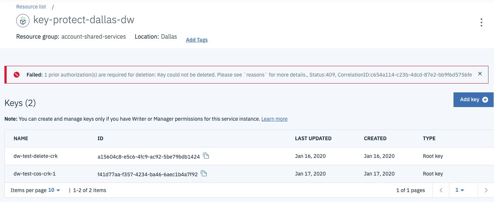
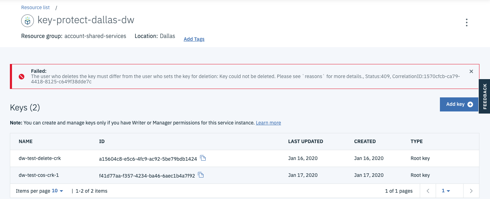
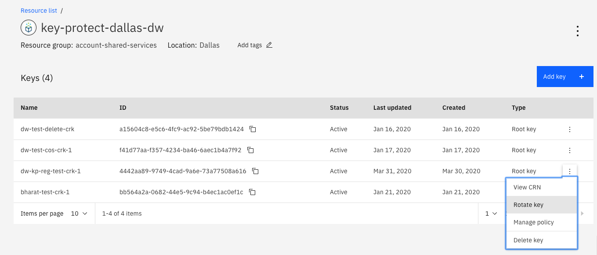
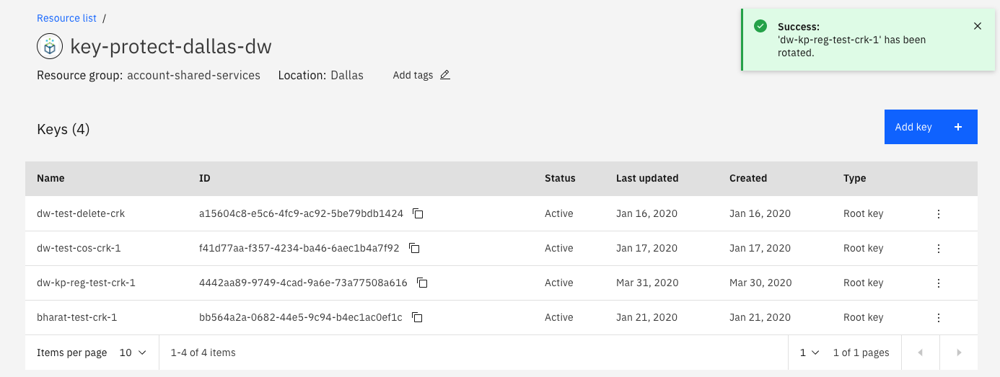
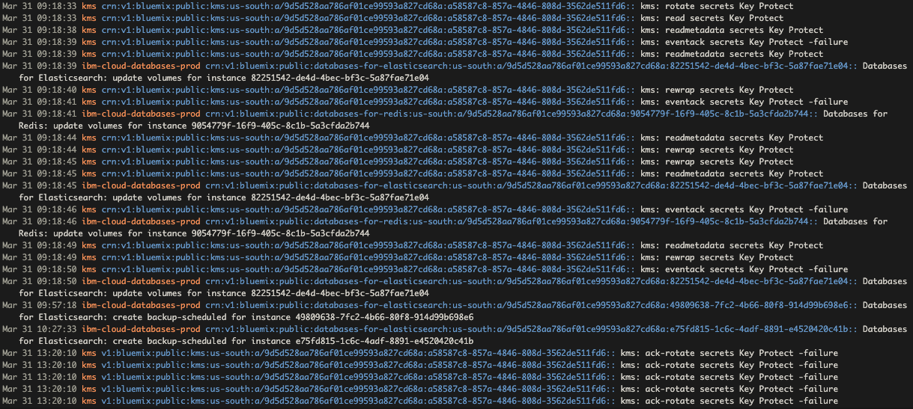
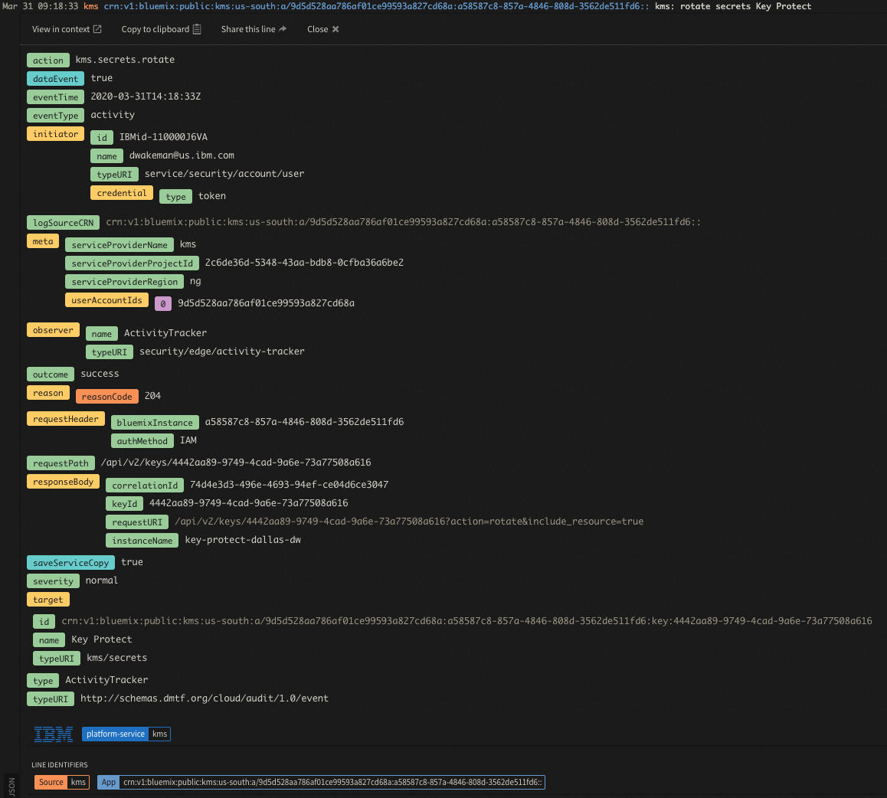
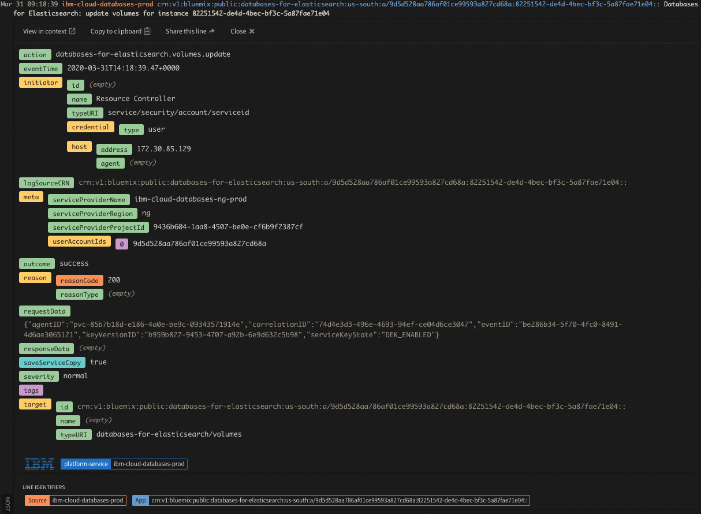
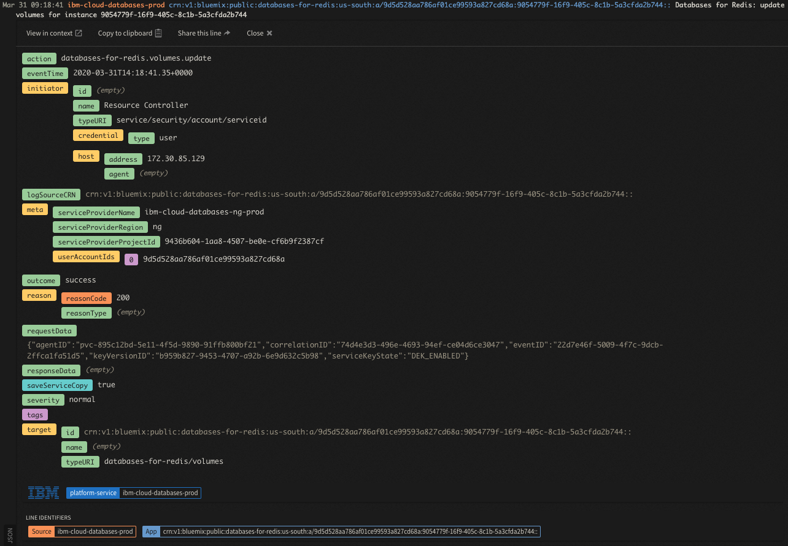
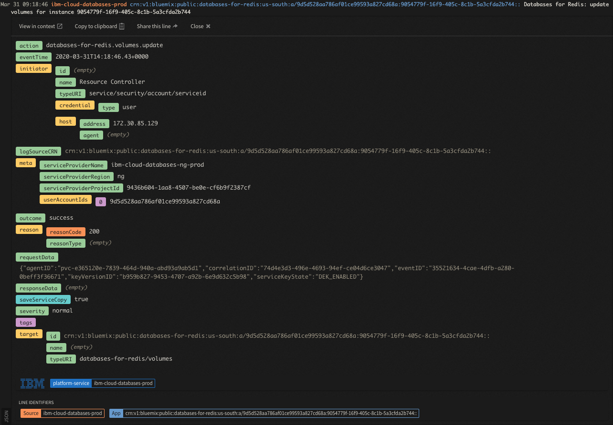
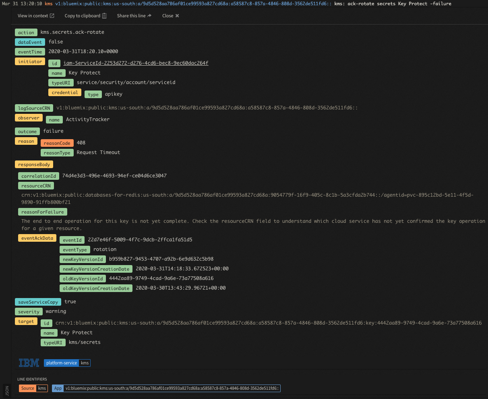

# Key Protect


## Restricting access to keys

Key Protect now supports the ability to assign access to a single key within a Key Protect instance to a given user or access group via Access Policy.  If Kaiser Permanente wishes to maintain a single, shared instance of Key Protect and assign individual keys to any development team, this feature will allow it.  When a user needs to specify a key for encryption of a particular service, that user will only see the instance of Key Protect to which the user has access and the specific key to which the user has been granted access.  In the UI this will filter any dropdowns appropriately and in the CLI or API, access will also be limited.

Documentation for setting this level of access can be found [here](https://cloud.ibm.com/docs/services/key-protect?topic=key-protect-grant-access-keys#grant-access-key-level).

_**Note:** Key level access is currently only available via access policy for a user or access group.  It cannot be applied when granting Service-to-Service Authorization, which is access between two IBM services, such as COS and Key Protect._

## Dual Authorization Delete

This is a new feature that was added to Key Protect that provides the ability to create an instance level policy requiring that two different users approve the deletion of a key.  In order to delete a key, a user with appropriate permissions must "set the key for deletion", which updates a flag on the key.  After that, another user with permission to do so can delete the key.  The person who does the first authorization cannot actually delete the key; it requires two different users to complete the key deletion.

_**Note:** At this time the "first" action to set the key for deletion can only be done via API.  Once done, any available option for deleting a key (UI, CLI, API) can be used to actually delete the key._


In order to make it easier to use this new feature IBM has provided (As-Is, not part of the product and not supported) a script that automates some of these actions using the API.  The script can be found [here](../tools/scripts/keyprotect.md).

**Considerations**

- The Dual Auth Delete policy is applied at the individual key level, although it can be defined at the service instance level.
- Once the Dual Auth policy is set for a service instance, all keys created after that will automatically inherit that policy.
- Any keys that existed prior to the creation of the service instance level policy will **NOT** inherit the policy.  If need be the policy can be set on individual keys.  _**Note:** This still needs to be validated._


## Using the script

The script leverages the Key Protect API via cURL commands.  These commands require an auth token, which can be retrieved via the `ibmcloud` CLI.  It also uses the CLI to look up information needed by some of the APIs.  The script will automatically get the auth token and use the CLI to look things up, but it does require the user of the script to first login to the CLI in the same terminal/shell where the script will be run.

**Command Options**

```
NAME:
keyprotect.sh - Manage features of Key Protect

USAGE:
keyprotect.sh <key-protect-instance-name> command [options]

COMMANDS:
-------------------------------------------------------------------------------------------

view-policies           List the current policies for the Key Protect Instance
enable-dual-auth        Enable the Dual Authorization policy for key deletes for all keys
disable-dual-auth       Disable the Dual Authorization policy for key deletes for all keys
view-keys               List the keys in the Key Protect Instance in JSON format
view-keys-list          List the keys in the Key Protect Instance in list format
view-deleted-keys       List the deleted keys in the Key Protect Instance in JSON format
view-deleted-keys-list  List the deleted keys in the Key Protect Instance in list format
view-key-material       View the material for a standard key
view-key-policies       View the current polices for the specified key
import-key              Import a standard or root key
restore-key             Restore an imported key that has been deleted
set-key-deletion        Set the specified key for deletion (first auth)
unset-key-deletion      Unset the specified key for deletion, which removes the first auth
help, h                 View help for this script


Note: For your convenience this command executes the ibmcloud cli to look up certain
      information needed to perform these tasks.  It requires you to be logged into
      the ibmcloud cli before you run this command.

```


#### Viewing policies for a Key Protect Instance

**Command**

`./keyprotect.sh key-protect-dallas-dw view-policies`

**Output**

```
Checking current policies for service key-protect-dallas-dw...

{
  "metadata": {
    "collectionType": "application/vnd.ibm.kms.policy+json",
    "collectionTotal": 0
  },
  "resources": []
}
```

#### Enabling the Dual Authorization policy for a Key Protect Instance

**Command**

`./keyprotect.sh key-protect-dallas-dw enable-dual-auth`


**Output**

```
Enabling Dual Authorization for service key-protect-dallas-dw...


Done.

Checking current policies for service key-protect-dallas-dw...

{
  "metadata": {
    "collectionType": "application/vnd.ibm.kms.policy+json",
    "collectionTotal": 1
  },
  "resources": [
    {
      "policy_type": "dualAuthDelete",
      "policy_data": {
        "enabled": true
      },
      "creation_date": "2020-01-16T20:47:30Z",
      "created_by": "IBMid-110000J6VA",
      "updated_by": "IBMid-110000J6VA",
      "last_updated": "2020-01-16T20:47:30Z"
    }
  ]
}

Request complete.
```


#### View Keys in JSON format

**Command**

`./keyprotect.sh key-protect-dallas-dw view-keys`

**Output**

```
Listing keys for service key-protect-dallas-dw...

{
  "metadata": {
    "collectionType": "application/vnd.ibm.kms.key+json",
    "collectionTotal": 2
  },
  "resources": [
    {
      "id": "a15604c8-e5c6-4fc9-ac92-5be79bdb1424",
      "type": "application/vnd.ibm.kms.key+json",
      "name": "dw-test-delete-crk",
      "state": 1,
      "crn": "crn:v1:bluemix:public:kms:us-south:a/9d5d528aa786af01ce99593a827cd68a:a58587c8-857a-4846-808d-3562de511fd6:key:a15604c8-e5c6-4fc9-ac92-5be79bdb1424",
      "createdBy": "IBMid-110000J6VA",
      "creationDate": "2020-01-16T21:03:41Z",
      "lastUpdateDate": "2020-01-16T21:03:41Z",
      "algorithmMetadata": {
        "bitLength": "256",
        "mode": "CBC_PAD"
      },
      "extractable": false,
      "imported": false,
      "algorithmMode": "CBC_PAD",
      "algorithmBitSize": 256
    },
    {
      "id": "f41d77aa-f357-4234-ba46-6aec1b4a7f92",
      "type": "application/vnd.ibm.kms.key+json",
      "name": "dw-test-cos-crk-1",
      "state": 1,
      "crn": "crn:v1:bluemix:public:kms:us-south:a/9d5d528aa786af01ce99593a827cd68a:a58587c8-857a-4846-808d-3562de511fd6:key:f41d77aa-f357-4234-ba46-6aec1b4a7f92",
      "createdBy": "IBMid-110000J6VA",
      "creationDate": "2020-01-17T21:44:39Z",
      "lastUpdateDate": "2020-01-17T21:44:39Z",
      "algorithmMetadata": {
        "bitLength": "256",
        "mode": "CBC_PAD"
      },
      "extractable": false,
      "imported": false,
      "algorithmMode": "CBC_PAD",
      "algorithmBitSize": 256
    }
  ]
}

Request complete.
```


#### View Keys in list format

**Command**

`./keyprotect.sh key-protect-dallas-dw view-keys-list`

**Output**

```
Listing keys for service key-protect-dallas-dw...

name                id                                    crn
dw-test-delete-crk  a15604c8-e5c6-4fc9-ac92-5be79bdb1424  crn:v1:bluemix:public:kms:us-south:a/9d5d528aa786af01ce99593a827cd68a:a58587c8-857a-4846-808d-3562de511fd6:key:a15604c8-e5c6-4fc9-ac92-5be79bdb1424
dw-test-cos-crk-1   f41d77aa-f357-4234-ba46-6aec1b4a7f92  crn:v1:bluemix:public:kms:us-south:a/9d5d528aa786af01ce99593a827cd68a:a58587c8-857a-4846-808d-3562de511fd6:key:f41d77aa-f357-4234-ba46-6aec1b4a7f92

Request complete.

```

#### View Deleted Keys in JSON Format

**Command**

`./keyprotect.sh key-protect-dallas-dw view-deleted-keys`

**Output**

```
Listing keys for service key-protect-dallas-dw...

Values for State field:
-------------------------
0  Pre-activation
1  Active
2  Suspended
3  Deactivated
5  Destroyed

{
  "metadata": {
    "collectionType": "application/vnd.ibm.kms.key+json",
    "collectionTotal": 4
  },
  "resources": [
    {
      "type": "application/vnd.ibm.kms.key+json",
      "id": "38d3c46d-0f94-4843-ba36-9ac6c08c4c3c",
      "name": "dw-ui-test-crk-1",
      "state": 5,
      "extractable": false,
      "crn": "crn:v1:bluemix:public:kms:us-south:a/9d5d528aa786af01ce99593a827cd68a:a58587c8-857a-4846-808d-3562de511fd6:key:38d3c46d-0f94-4843-ba36-9ac6c08c4c3c",
      "imported": false,
      "creationDate": "2020-01-16T22:40:15Z",
      "createdBy": "IBMid-110000J6VA",
      "algorithmType": "AES",
      "algorithmMetadata": {
        "bitLength": "256",
        "mode": "CBC_PAD"
      },
      "algorithmBitSize": 256,
      "algorithmMode": "CBC_PAD",
      "lastUpdateDate": "2020-01-16T22:40:15Z",
      "keyVersion": {
        "id": "38d3c46d-0f94-4843-ba36-9ac6c08c4c3c"
      },
      "dualAuthDelete": {
        "enabled": true,
        "keySetForDeletion": true,
        "authExpiration": "2020-01-23T22:41:02Z"
      }
    },
    {
      "type": "application/vnd.ibm.kms.key+json",
      "id": "4b559191-e10e-4bf6-9891-9af1948b55f7",
      "name": "dw-test-import-delete-restore-01",
      "state": 5,
      "extractable": false,
      "crn": "crn:v1:bluemix:public:kms:us-south:a/9d5d528aa786af01ce99593a827cd68a:a58587c8-857a-4846-808d-3562de511fd6:key:4b559191-e10e-4bf6-9891-9af1948b55f7",
      "imported": true,
      "creationDate": "2020-05-01T21:31:47Z",
      "createdBy": "IBMid-110000J6VA",
      "algorithmType": "AES",
      "algorithmMetadata": {
        "bitLength": "256",
        "mode": "CBC_PAD"
      },
      "algorithmBitSize": 256,
      "algorithmMode": "CBC_PAD",
      "lastUpdateDate": "2020-05-01T21:31:47Z",
      "keyVersion": {
        "id": "4b559191-e10e-4bf6-9891-9af1948b55f7"
      },
      "dualAuthDelete": {
        "enabled": false
      }
    },
    {
      "type": "application/vnd.ibm.kms.key+json",
      "id": "75588eb5-81d4-4cdb-997c-b6deb6be06cf",
      "name": "dw-test-crk-1",
      "state": 5,
      "extractable": false,
      "crn": "crn:v1:bluemix:public:kms:us-south:a/9d5d528aa786af01ce99593a827cd68a:a58587c8-857a-4846-808d-3562de511fd6:key:75588eb5-81d4-4cdb-997c-b6deb6be06cf",
      "imported": false,
      "creationDate": "2020-01-16T20:53:55Z",
      "createdBy": "IBMid-110000J6VA",
      "algorithmType": "AES",
      "algorithmMetadata": {
        "bitLength": "256",
        "mode": "CBC_PAD"
      },
      "algorithmBitSize": 256,
      "algorithmMode": "CBC_PAD",
      "lastUpdateDate": "2020-01-16T20:53:55Z",
      "keyVersion": {
        "id": "75588eb5-81d4-4cdb-997c-b6deb6be06cf"
      },
      "dualAuthDelete": {
        "enabled": false
      }
    },
    {
      "type": "application/vnd.ibm.kms.key+json",
      "id": "814f0fa7-d343-4a76-b0c2-9ebb8ecea2c3",
      "name": "${keyName}",
      "state": 5,
      "extractable": true,
      "crn": "crn:v1:bluemix:public:kms:us-south:a/9d5d528aa786af01ce99593a827cd68a:a58587c8-857a-4846-808d-3562de511fd6:key:814f0fa7-d343-4a76-b0c2-9ebb8ecea2c3",
      "imported": false,
      "creationDate": "2020-05-01T14:37:44Z",
      "createdBy": "IBMid-110000J6VA",
      "algorithmType": "AES",
      "algorithmMetadata": {
        "bitLength": "256",
        "mode": "CBC_PAD"
      },
      "algorithmBitSize": 256,
      "algorithmMode": "CBC_PAD",
      "lastUpdateDate": "2020-05-01T14:37:44Z",
      "dualAuthDelete": {
        "enabled": true,
        "keySetForDeletion": true,
        "authExpiration": "2020-05-08T16:16:10Z"
      }
    }
  ]
}

```


#### View Deleted Keys in List Format

**Command**

`./keyprotect.sh key-protect-dallas-dw view-deleted-keys-list`

**Output**

```
Listing deleted keys for service key-protect-dallas-dw...

Values for State column:
-------------------------
0  Pre-activation
1  Active
2  Suspended
3  Deactivated
5  Destroyed

name                              id                                    state  crn
dw-ui-test-crk-1                  38d3c46d-0f94-4843-ba36-9ac6c08c4c3c  5      crn:v1:bluemix:public:kms:us-south:a/9d5d528aa786af01ce99593a827cd68a:a58587c8-857a-4846-808d-3562de511fd6:key:38d3c46d-0f94-4843-ba36-9ac6c08c4c3c
dw-test-import-delete-restore-01  4b559191-e10e-4bf6-9891-9af1948b55f7  5      crn:v1:bluemix:public:kms:us-south:a/9d5d528aa786af01ce99593a827cd68a:a58587c8-857a-4846-808d-3562de511fd6:key:4b559191-e10e-4bf6-9891-9af1948b55f7
dw-test-crk-1                     75588eb5-81d4-4cdb-997c-b6deb6be06cf  5      crn:v1:bluemix:public:kms:us-south:a/9d5d528aa786af01ce99593a827cd68a:a58587c8-857a-4846-808d-3562de511fd6:key:75588eb5-81d4-4cdb-997c-b6deb6be06cf
${keyName}                        814f0fa7-d343-4a76-b0c2-9ebb8ecea2c3  5      crn:v1:bluemix:public:kms:us-south:a/9d5d528aa786af01ce99593a827cd68a:a58587c8-857a-4846-808d-3562de511fd6:key:814f0fa7-d343-4a76-b0c2-9ebb8ecea2c3

Request complete.

```


#### View Key Policies

**Command**

`./keyprotect.sh key-protect-dallas-dw view-key-policies a15604c8-e5c6-4fc9-ac92-5be79bdb1424`

_**Note:** The key-specific commands require an extra parameter, the key id, which can be found in the UI, CLI or API.  If not provided these commands will produce this error:_

```
for view-key-policies a key id is required

USAGE:
keyprotect.sh [service instance name] view-key-policies [key-id]
```


**Output**

```
viewing policies for key a15604c8-e5c6-4fc9-ac92-5be79bdb1424...

{
  "metadata": {
    "collectionType": "application/vnd.ibm.kms.policy+json",
    "collectionTotal": 1
  },
  "resources": [
    {
      "id": "3b7a1be5-ab6b-4139-b856-a4c0fafc82e8",
      "crn": "crn:v1:bluemix:public:kms:us-south:a/9d5d528aa786af01ce99593a827cd68a:a58587c8-857a-4846-808d-3562de511fd6:policy:3b7a1be5-ab6b-4139-b856-a4c0fafc82e8",
      "dualAuthDelete": {
        "enabled": true
      },
      "createdBy": "IBMid-110000J6VA",
      "creationDate": "2020-01-16T21:03:41Z",
      "updatedBy": "IBMid-110000J6VA",
      "lastUpdateDate": "2020-01-16T21:03:41Z"
    }
  ]
}

Request complete.
```


#### Set Key for Deletion

**Command**

`./keyprotect.sh key-protect-dallas-dw set-key-deletion a15604c8-e5c6-4fc9-ac92-5be79bdb1424`

**Output**

```
Setting key a15604c8-e5c6-4fc9-ac92-5be79bdb1424 in service key-protect-dallas-dw for deletion...


Done.

viewing policies for key a15604c8-e5c6-4fc9-ac92-5be79bdb1424...

{
  "metadata": {
    "collectionType": "application/vnd.ibm.kms.policy+json",
    "collectionTotal": 1
  },
  "resources": [
    {
      "id": "3b7a1be5-ab6b-4139-b856-a4c0fafc82e8",
      "crn": "crn:v1:bluemix:public:kms:us-south:a/9d5d528aa786af01ce99593a827cd68a:a58587c8-857a-4846-808d-3562de511fd6:policy:3b7a1be5-ab6b-4139-b856-a4c0fafc82e8",
      "dualAuthDelete": {
        "enabled": true
      },
      "createdBy": "IBMid-110000J6VA",
      "creationDate": "2020-01-16T21:03:41Z",
      "updatedBy": "IBMid-110000J6VA",
      "lastUpdateDate": "2020-01-16T21:05:09Z"
    }
  ]
}

Request complete.
```

_**Note:** If the key has not been enabled for Dual Auth Delete, the command will return the error below._

```
Setting key 75588eb5-81d4-4cdb-997c-b6deb6be06cf in service key-protect-dallas-dw for deletion...

{
  "metadata": {
    "collectionType": "application/vnd.ibm.kms.error+json",
    "collectionTotal": 1
  },
  "resources": [
    {
      "errorMsg": "Action could not be performed on key. Please see `reasons` for more details.",
      "reasons": [
        {
          "code": "NOT_DUAL_AUTH_ERR",
          "message": "The key is not dual auth enabled and cannot be set for deletion",
          "status": 409,
          "more_info": "https://cloud.ibm.com/apidocs/key-protect"
        }
      ]
    }
  ]
}

Done.

viewing policies for key 75588eb5-81d4-4cdb-997c-b6deb6be06cf...

{
  "metadata": {
    "collectionType": "application/vnd.ibm.kms.policy+json",
    "collectionTotal": 0
  }
}

Request complete.
```

#### Unset key for deletion

In some cases it may turn out that the first authorization was done in error.  This command can be used to unset the key for deletion, which removes the first authorization.

**Command**

`./keyprotect.sh key-protect-dallas-dw unset-key-deletion a15604c8-e5c6-4fc9-ac92-5be79bdb1424`

**Output**

```
Unsetting key a15604c8-e5c6-4fc9-ac92-5be79bdb1424 in service key-protect-dallas-dw for deletion...


Done.

viewing policies for key a15604c8-e5c6-4fc9-ac92-5be79bdb1424...

{
  "metadata": {
    "collectionType": "application/vnd.ibm.kms.policy+json",
    "collectionTotal": 1
  },
  "resources": [
    {
      "id": "3b7a1be5-ab6b-4139-b856-a4c0fafc82e8",
      "crn": "crn:v1:bluemix:public:kms:us-south:a/9d5d528aa786af01ce99593a827cd68a:a58587c8-857a-4846-808d-3562de511fd6:policy:3b7a1be5-ab6b-4139-b856-a4c0fafc82e8",
      "dualAuthDelete": {
        "enabled": true
      },
      "createdBy": "IBMid-110000J6VA",
      "creationDate": "2020-01-16T21:03:41Z",
      "updatedBy": "IBMid-110000J6VA",
      "lastUpdateDate": "2020-01-16T21:15:44Z"
    }
  ]
}

Request complete.
```

_**Note:** Setting or unsetting the key for deletion does NOT affect the policy itself; as seen in the output above the policy is still set to true.  At this time the "set deletion" status and its lastUpdated date do not show up in the API response.  IBM is going to update the API in the next iteration to include these two fields._

## Deleting a Key from the UI

_**IMPORTANT WARNING:** New functionality for Key Protect has been delivered that will prevent a key from being deleted when using the Key Protect API if that key is being used by any services.  This feature has **NOT YET** been updated in the UI!!!  If you delete the key in the UI and the key (or the Key Protect instance) does **NOT** have Dual Authorization Delete policy enabled, that key **WILL** get deleted, regardless of whether or not is being used.  To protect against this possibility make sure that all Key Protect instances have the Dual Authorization Delete policy enabled and use the [Registration API](https://cloud.ibm.com/apidocs/key-protect#list-registrations-for-a-key) before deleting any key to see if it is being used by any services or resources._

_**Note:** The steps below for deleting a kay via the UI assume that the Dual Authorization Policy has been enabled._

If you try to delete a key from the UI and it has not yet been set for deletion you will see an error like this:



If you try to delete the key after it has been set for deletion and you're the one who did that you will see this error:



_**Note:** If you try to delete the key and somebody else set the key for deletion you will be able to delete the key._

## Viewing usage of keys

It is possible in IBM Cloud to track where Key Protect keys are being used.  When a service is provisioned or configure to use a Key Protect key, it "registers" that usage with Key Protect.  You can see the list of resources using a given key with a new operation in the [Key Protect API](https://cloud.ibm.com/apidocs/key-protect#list-registrations-for-a-key).

`GET https://us-south.kms.cloud.ibm.com/api/v2/keys/4442aa89-9749-4cad-9a6e-73a77508a616/registrations`

Headers:

* Authorization: 'Bearer <token>'
* bluemix-instance: '<guid of Key Protect instance>'

The URL endpoint will vary by region, and it contains the GUID of the key.

```json
{
    "metadata": {
        "collectionType": "application/vnd.ibm.kms.registration+json",
        "collectionTotal": 3
    },
    "resources": [
        {
            "keyId": "4442aa89-9749-4cad-9a6e-73a77508a616",
            "resourceCrn": "crn:v1:bluemix:public:cloud-object-storage:global:a/9d5d528aa786af01ce99593a827cd68a:b3f6085f-87fd-4b1a-945f-57ba00958fe8:bucket:dw-kp-bucket-test-registration-api-1578085-01",
            "createdBy": "crn-crn:v1:bluemix:public:cloud-object-storage:global:a/9d5d528aa786af01ce99593a827cd68a:b3f6085f-87fd-4b1a-945f-57ba00958fe8::",
            "creationDate": "2020-03-30T15:44:47Z",
            "lastUpdated": "2020-03-30T15:44:47Z",
            "preventKeyDeletion": false,
            "keyVersion": {
                "id": "4442aa89-9749-4cad-9a6e-73a77508a616",
                "creationDate": "2020-03-30T13:43:29Z"
            }
        },
        {
            "keyId": "4442aa89-9749-4cad-9a6e-73a77508a616",
            "resourceCrn": "crn:v1:bluemix:public:databases-for-redis:us-south:a/9d5d528aa786af01ce99593a827cd68a:9054779f-16f9-405c-8c1b-5a3cfda2b744::/agentid=pvc-895c12bd-5e11-4f5d-9890-91ffb800bf21",
            "createdBy": "crn-crn:v1:bluemix:public:databases-for-redis:us-south:a/9d5d528aa786af01ce99593a827cd68a:9054779f-16f9-405c-8c1b-5a3cfda2b744::",
            "creationDate": "2020-03-30T13:48:32Z",
            "lastUpdated": "2020-03-30T13:48:32Z",
            "preventKeyDeletion": false,
            "keyVersion": {
                "id": "4442aa89-9749-4cad-9a6e-73a77508a616",
                "creationDate": "2020-03-30T13:43:29Z"
            }
        },
        {
            "keyId": "4442aa89-9749-4cad-9a6e-73a77508a616",
            "resourceCrn": "crn:v1:bluemix:public:databases-for-redis:us-south:a/9d5d528aa786af01ce99593a827cd68a:9054779f-16f9-405c-8c1b-5a3cfda2b744::/agentid=pvc-e365120e-7839-464d-940a-abd93a9ab5d1",
            "createdBy": "crn-crn:v1:bluemix:public:databases-for-redis:us-south:a/9d5d528aa786af01ce99593a827cd68a:9054779f-16f9-405c-8c1b-5a3cfda2b744::",
            "creationDate": "2020-03-30T13:48:47Z",
            "lastUpdated": "2020-03-30T13:48:47Z",
            "preventKeyDeletion": false,
            "keyVersion": {
                "id": "4442aa89-9749-4cad-9a6e-73a77508a616",
                "creationDate": "2020-03-30T13:43:29Z"
            }
        }
    ]
}
```

In the JSON example above, the key is used with two service instances - an instance Databases for Redis and a Cloud Object Storage bucket.  Notice that the Redis instance has two entries; that is because Key Protect registers usage at the resource level, not necessarily at the service instance level.  In the case of Redis, the key is used in two separate PVCs, so there are two registrations, both that have the same value for the `createdBy` field, which contains the CRN of the Redis instance.  Later in the key's lifecycle, operations on that key (rotation, deletion, crypto erasure) can be tracked by individual resource instance.

## Crypto Erasure

It is sometimes necessary to rotate Key Protect Keys, whether it be proactive security measures to rotate periodically, or reactive, when it is possible that the key has become compromised.  Key rotation actually involves two steps:

* **Key Rotation**: - action initiated in Key Protect to rotate the key.  Key Protect replaces the old material with newly generated material.   Only works for IBM-generated keys today.
* **Key Replacement** - action initiated by the service using the key when notified by Key Protect that the key has been rotated.  The service does what it needs to to to replace the old material with the new material.

### Validation Steps

To validate the behavior of this feature the following general steps can be followed.

**Prerequisites**

* Key Protect Instance with an IBM-generated root key
* a service (i.e. Databases for Redis, Databases for PostGreS, Cloudant, Event Streams, Cloud Object Storage) that was provisioned using the key

**Validation steps**

1. Use the [Key Protect API](https://cloud.ibm.com/apidocs/key-protect#list-registrations-for-a-key) to verify that the key is being used.  In this example, the key is being used for two service instances, one Redis and one ElasticSearch.  The API will return JSON like this:

```json
{
"metadata": {
    "collectionType": "application/vnd.ibm.kms.registration+json",
    "collectionTotal": 5
},
"resources": [
    {
        "keyId": "4442aa89-9749-4cad-9a6e-73a77508a616",
        "resourceCrn": "crn:v1:bluemix:public:databases-for-elasticsearch:us-south:a/9d5d528aa786af01ce99593a827cd68a:82251542-de4d-4bec-bf3c-5a87fae71e04::/agentid=pvc-4061efea-2c14-48b7-b016-86da46238b2b",
        "createdBy": "crn-crn:v1:bluemix:public:databases-for-elasticsearch:us-south:a/9d5d528aa786af01ce99593a827cd68a:82251542-de4d-4bec-bf3c-5a87fae71e04::",
        "creationDate": "2020-03-31T13:15:48Z",
        "lastUpdated": "2020-03-31T13:15:48Z",
        "preventKeyDeletion": false,
        "keyVersion": {
            "id": "4442aa89-9749-4cad-9a6e-73a77508a616",
            "creationDate": "2020-03-30T13:43:29Z"
        }
    },
    {
        "keyId": "4442aa89-9749-4cad-9a6e-73a77508a616",
        "resourceCrn": "crn:v1:bluemix:public:databases-for-elasticsearch:us-south:a/9d5d528aa786af01ce99593a827cd68a:82251542-de4d-4bec-bf3c-5a87fae71e04::/agentid=pvc-781b92eb-c93a-49b8-96cc-d4b484d3bdeb",
        "createdBy": "crn-crn:v1:bluemix:public:databases-for-elasticsearch:us-south:a/9d5d528aa786af01ce99593a827cd68a:82251542-de4d-4bec-bf3c-5a87fae71e04::",
        "creationDate": "2020-03-31T13:15:44Z",
        "lastUpdated": "2020-03-31T13:15:44Z",
        "preventKeyDeletion": false,
        "keyVersion": {
            "id": "4442aa89-9749-4cad-9a6e-73a77508a616",
            "creationDate": "2020-03-30T13:43:29Z"
        }
    },
    {
        "keyId": "4442aa89-9749-4cad-9a6e-73a77508a616",
        "resourceCrn": "crn:v1:bluemix:public:databases-for-elasticsearch:us-south:a/9d5d528aa786af01ce99593a827cd68a:82251542-de4d-4bec-bf3c-5a87fae71e04::/agentid=pvc-85b7b18d-e186-4a0e-be9c-09343571914e",
        "createdBy": "crn-crn:v1:bluemix:public:databases-for-elasticsearch:us-south:a/9d5d528aa786af01ce99593a827cd68a:82251542-de4d-4bec-bf3c-5a87fae71e04::",
        "creationDate": "2020-03-31T13:15:44Z",
        "lastUpdated": "2020-03-31T13:15:44Z",
        "preventKeyDeletion": false,
        "keyVersion": {
            "id": "4442aa89-9749-4cad-9a6e-73a77508a616",
            "creationDate": "2020-03-30T13:43:29Z"
        }
    },
    {
        "keyId": "4442aa89-9749-4cad-9a6e-73a77508a616",
        "resourceCrn": "crn:v1:bluemix:public:databases-for-redis:us-south:a/9d5d528aa786af01ce99593a827cd68a:9054779f-16f9-405c-8c1b-5a3cfda2b744::/agentid=pvc-895c12bd-5e11-4f5d-9890-91ffb800bf21",
        "createdBy": "crn-crn:v1:bluemix:public:databases-for-redis:us-south:a/9d5d528aa786af01ce99593a827cd68a:9054779f-16f9-405c-8c1b-5a3cfda2b744::",
        "creationDate": "2020-03-30T13:48:32Z",
        "lastUpdated": "2020-03-30T13:48:32Z",
        "preventKeyDeletion": false,
        "keyVersion": {
            "id": "4442aa89-9749-4cad-9a6e-73a77508a616",
            "creationDate": "2020-03-30T13:43:29Z"
        }
    },
    {
        "keyId": "4442aa89-9749-4cad-9a6e-73a77508a616",
        "resourceCrn": "crn:v1:bluemix:public:databases-for-redis:us-south:a/9d5d528aa786af01ce99593a827cd68a:9054779f-16f9-405c-8c1b-5a3cfda2b744::/agentid=pvc-e365120e-7839-464d-940a-abd93a9ab5d1",
        "createdBy": "crn-crn:v1:bluemix:public:databases-for-redis:us-south:a/9d5d528aa786af01ce99593a827cd68a:9054779f-16f9-405c-8c1b-5a3cfda2b744::",
        "creationDate": "2020-03-30T13:48:47Z",
        "lastUpdated": "2020-03-30T13:48:47Z",
        "preventKeyDeletion": false,
        "keyVersion": {
            "id": "4442aa89-9749-4cad-9a6e-73a77508a616",
            "creationDate": "2020-03-30T13:43:29Z"
        }
    }
    ]
}
```

1. Use the Key Protect API to determine the current version of the key:

```
{
"metadata": {
    "collectionType": "application/vnd.ibm.kms.key+json",
    "collectionTotal": 1
},
"resources": [
    {
        "type": "application/vnd.ibm.kms.key+json",
        "id": "4442aa89-9749-4cad-9a6e-73a77508a616",
        "name": "dw-kp-reg-test-crk-1",
        "state": 1,
        "extractable": false,
        "crn": "crn:v1:bluemix:public:kms:us-south:a/9d5d528aa786af01ce99593a827cd68a:a58587c8-857a-4846-808d-3562de511fd6:key:4442aa89-9749-4cad-9a6e-73a77508a616",
        "imported": false,
        "creationDate": "2020-03-30T13:43:29Z",
        "createdBy": "IBMid-110000J6VA",
        "algorithmType": "AES",
        "algorithmMetadata": {
            "bitLength": "256",
            "mode": "CBC_PAD"
        },
        "algorithmBitSize": 256,
        "algorithmMode": "CBC_PAD",
        "lastUpdateDate": "2020-03-31T14:18:33Z",
        "lastRotateDate": "2020-03-31T14:18:33Z",
        "keyVersion": {
            "id": "b959b827-9453-4707-a92b-6e9d632c5b98",
            "creationDate": "2020-03-31T14:18:33Z"
        },
        "dualAuthDelete": {
            "enabled": true,
            "keySetForDeletion": false
        },
        "deleted": false
    }
    ]
}
```
   
   Notice the `keyVersion` object; it shows the id and creation date of the current version of the key.  In this example, the JSON above was obtained **after** the key rotation, so it shows a different version than what appears in the registrations.  

1. Go into the Key Protect instance and rotate the key.
   
   
   
   Once the key has been rotated you will see a popup saying that it has been done.  This means that Key Protect replaced the material and notified the services about it.
   
   
   
1. Review the Activity Tracker instance for the region in which the services are provisioned.  Filter by sources, selecting `kms` and `ibm-cloud-databases-prod`.  You should see an event from Key Protect (kms) that the key was rotated, and events from ICD that they completed the key replacement.
   
   
   
   Here is the detail for each event:
   
   Key Rotation:
   
   
   
   ElasticSearch:
   
   
   
   

   Redis:
   
   
   
   
   _**Note:** if Key Protect doesn't get a report back from a service that the rotation has been completed it will send failure events to Activity Tracker:_
   
   

   In this case, it turns out that there is a defect in the acknowledgement that ICD sends back to Key Protect to indicate that the rotation is complete.  The error message shows that the `Ack` failed, but the rotation did complete.  The ICD engineering team has already submitted a pull request with a fix for this issue, and as soon as it gets deployed these "ack failures" should no longer occur.

