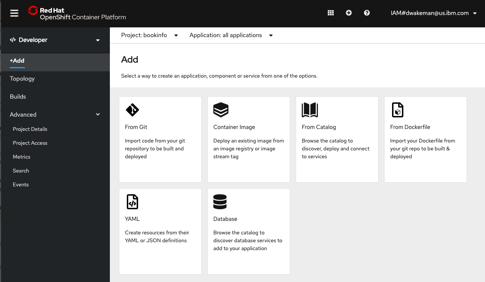
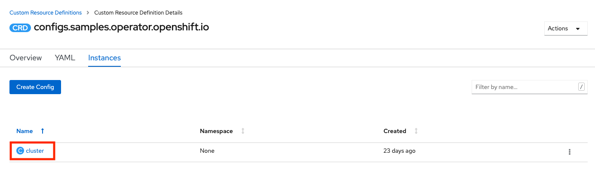
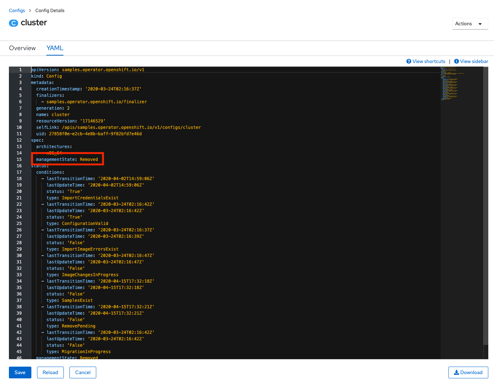
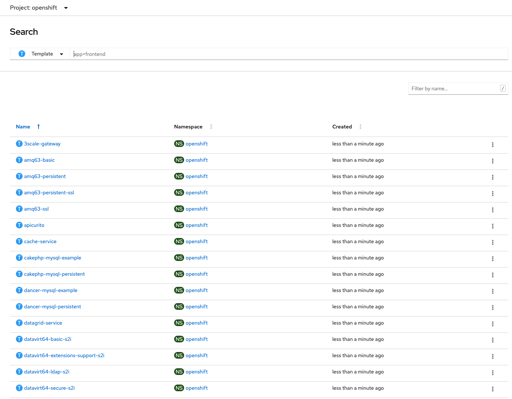
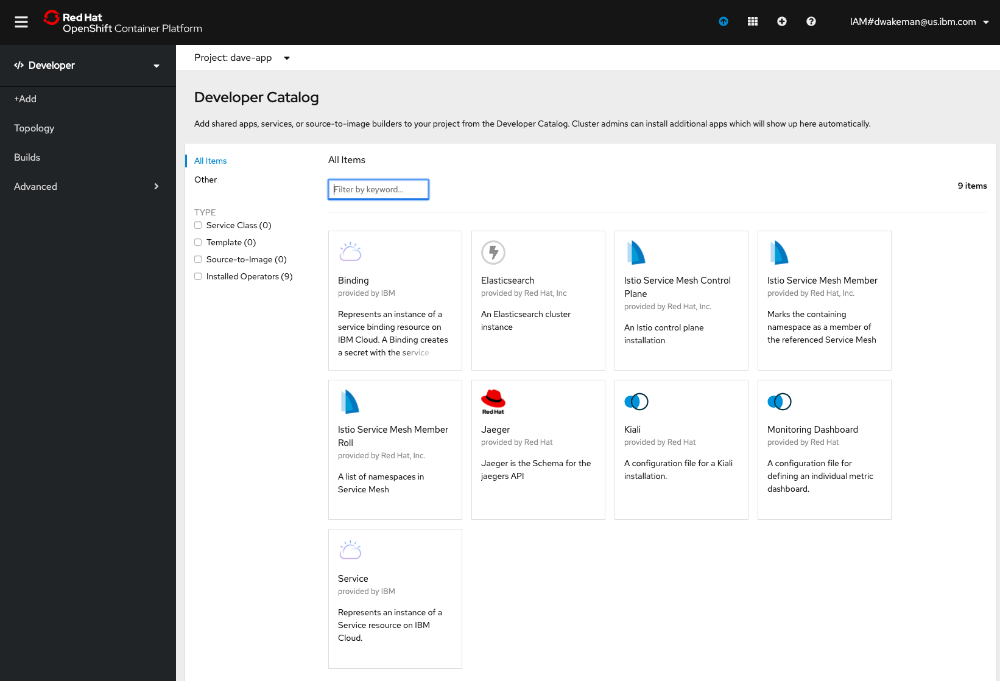

# OpenShift on IBM Cloud


This page will contain details and documentation about OpenShift 4.x on IBM Cloud as work progresses.

## Base Images

Many IBM Cloud Dedicated customers will be primarily using two images that correspond to two commonly used buildpacks in Cloud Foundry today:

* [WebSphere Liberty](https://hub.docker.com/_/websphere-liberty) - Both the standard liberty and open liberty images are available now.  The current version is 19.0.0.2, with many older versions available in the repo.  The current version of the buildpack also uses 19.0.0.2.
* [Node.js](https://hub.docker.com/_/node/) - IBM is no longer delivering builds of Node.js for buildpacks and is not delivering any images; instead IBM is providing support for the community buid.

An IBM Team (the Cloud Engagement Hub) has built a guide for customizing images prior to loading them into an enterprise registry:
[https://medium.com/cloud-engagement-hub/so-you-want-customized-websphere-container-images-heres-how-42f0e598733f](https://medium.com/cloud-engagement-hub/so-you-want-customized-websphere-container-images-heres-how-42f0e598733f)

## Operators

### Using the IBM Cloud Operator

The IBM Cloud Operator is used to create services in IBM Cloud (i.e. Cloudant, PostGreSQL, Redis, etc.) and bindings in an OpenShift project that contain the credentials needed to programmatically access the service.

The [IBM Cloud Operator]() can be found on [operatorhub.io](https://operatorhub.io/operator/ibmcloud-operator).  It is currently in the alpha channel.  It may not appear in the OperatorHub Console in OpenShift right away after a new cluster is provisioned.  There is post-provisioning configuration that will update the OperatorHub Console.  If you don't see it right away and this is a new cluster, please wait awhile and look again.

For more information see the [Operators](../ibm-cloud-operator) page in this wiki.

## Provision OpenShift on IBM Cloud

As of June 16, 2020 OpenShift on IBM Cloud is now generally available on VPC Gen 2!  It is now possible to provision a cluster on VPC Gen 2 with only private endpoints and a publicly resolvable but only privately accessible ingress subdomain.  When provisioning with the CLI or Terraform use the `disable_public_service_endpoint` to provision the cluster with private only networking.  

Worker pools are required to have a minimum count of 2 nodes per availability zone.  This change was made during the Early Access period, but really applies to all OpenShift clusters.  The UI, CLI and Terraform will all enforce a minimum `worker_count` of 2.

One other change that occurred during the Early Access period is that the storage configuration for the OpenShift internal registry was updated to use Cloud Object Storage.  Prior to that the configuration was set to `emptyDir: {}`, which used ephemeral storage on the worker nodes.  Images would be stored on the nodes, and if the node was rebooted or replaced the images would be lost.

With the GA release cluster provisioning requires you to provide a valid CRN for a Cloud Object Storage instance.  The docs have been updated to reflect new [user access permissions](https://cloud.ibm.com/docs/openshift?topic=openshift-access_reference#cluster_create_permissions) required for Cloud Object Storage.  When the cluster is provisioned it will perform the following additional actions:

- Create a new bucket in the COS instance (US-Geo, Standard tier)
- Create Service Credentials (including HMAC)
- Configure the Image Registry to use the bucket for storage of images.

If for any reason these steps fail and the cluster is not able to access the instance or the bucket it will "fail gracefully" and revert back to the `emptyDir: {}` configuration.  If that happens there are instructions in the [troubleshooting docs](https://cloud.ibm.com/docs/openshift?topic=openshift-cs_troubleshoot#ts_cos_bucket_cluster_create) for how to manually configure the cluster to use a bucket once the problems have been resolved.


### Provisioning with Terraform

The IBM Terraform Provider now supports OpenShift on IBM Cloud in VPC Gen 2 as of [v1.8.0](https://github.com/IBM-Cloud/terraform-provider-ibm/releases).  It includes support for the new `cos_instance_crn` parameter that is required for OpenShift clusters.

Examples for provisioning a cluster can be found [here](https://github.com/IBM-Cloud/terraform-provider-ibm/tree/master/examples/ibm-cluster/roks-on-vpc-gen2).

Here is example terraform that was used to perform validation testing:

**Provider**

```tf
variable "ibmcloud_api_key" {}

provider "ibm" {
    generation = var.generation
    region     = var.region
    version    = "~> 1.8"
    ibmcloud_api_key = var.ibmcloud_api_key
}
```

**Variables**
```tf
variable "environment" {
    default = "sandbox"
}

variable "vpc_name" {
    default = "sandbox-dallas"
}

variable "vpc_resource_group" {
    default = "vpc-sandbox"
}

variable "adm_resource_group" {
    default = "account-admin-services"
}

variable "env_resource_group" {
    default = "sandbox-tf-env"
}

variable "region" {
    default = "us-south"
}

variable "generation" {
    default = 2
}
```


**Main**
```tf
data "ibm_resource_group" "vpc_resource_group" {
    name = "${var.vpc_resource_group}"
}

data "ibm_resource_group" "adm_resource_group" {
    name = "${var.adm_resource_group}"
}

data "ibm_resource_group" "env_resource_group" {
    name = "${var.env_resource_group}"
}

data "ibm_resource_group" "cos_group" {
  name = "roks-cos-test-deleteme"
}


data "ibm_resource_instance" "cos_instance" {
  name              = "cos-roks-internal-registry-test"
  resource_group_id = data.ibm_resource_group.cos_group.id
  service           = "cloud-object-storage"
}

##############################################################################
# Create OCP Cluster
##############################################################################
resource "ibm_container_vpc_cluster" "app_cluster2" {
    name                            = "${var.environment}-tf-02"
    vpc_id                          = "r006-a1705bea-d7ab-429c-8e17-00d21c6ffe83"
    flavor                          = "bx2.4x16"
    kube_version                    = "4.3_openshift"
    worker_count                    = "2"
    entitlement                     = "cloud_pak"
    wait_till                       = "MasterNodeReady"
    disable_public_service_endpoint = false
    cos_instance_crn                = data.ibm_resource_instance.cos_instance.id
    resource_group_id               = data.ibm_resource_group.env_resource_group.id
    tags                            = ["env:${var.environment}","vpc:${var.vpc_name}"]
    zones {
        subnet_id = "0717-c63180ac-2765-4f91-b184-9373fb1514f2"
        name      = "${var.region}-1"
    }

}
```

## Remove items from OpenShift Catalog

This came up in a discussion with KP where we landed on the "Add" page in the Developer view of the OpenShift Console.



If you click on "From Catalog" or "Database" you get taken to a Developer Catalog.  Kaiser Permanente would like to completely remove the Developer Catalog, or at least remove all of the items in it.

The items that show up in the "From Catalog" image above are controlled by the [Samples Operator]().  Control over what shows up can be managed using [Samples Operator configuration parameters](https://docs.openshift.com/container-platform/4.3/openshift_images/configuring-samples-operator.html#samples-operator-configuration_configuring-samples-operator).  Specifically, if the `managementState` parameter is changed from `Managed` to `Removed` the set of managed imagestreams and templates in the `openshift` namespace are removed from the catalog.  

### Using the OpenShift Console

You can access the Samples Operator configuration using these [instructions](https://docs.openshift.com/container-platform/4.3/openshift_images/configuring-samples-operator.html#samples-operator-crdconfiguring-samples-operator).

It can also be viewed and changed from the UI using the Administrator -> Administration -> Custom Resource Definitions panel.  Click on the `Config` CRD for `samples.operator.openshift.io`.


Go to the Instances tab and click on `cluster`.



Go to the YAML tab and change the `managementState` parameter from `Managed` to `Removed`:



Click Save.  Then you can go back to the Developer view, click Add and click on the From Catalog tile.  The panel should be empty.

A variation of this option would be to set the `skippedTemplates` parameter.  This parameter tells the operator to ignore the templates in the list provided as the parameter's value.  This is an easy way to drop a few charts from the catalog.


The configuration above (setting `managedState` to `Removed`) only affects the templates managed by the Samples operator.  It will ignore any templates that a cluster administrator has added.  For this reason, if there is need to remove most of the ones in the catalog but leave a few in, you can export the charts you want to keep, then set the `managedState` to `Removed`, then import back in the templates that you want to add back in.

To export templates go to the `openshift` project in the `Administrator` view and search for `Template` Custom Resources.



Click on the template you want to export, go to the YAML tab and copy/paste the yaml to a file.  To do it with `oc` target the `openshift` project and run this command (using 3scale-gateway as an example):

```
oc get template 3scale-gateway -o yaml > 3scale-gateway.yaml
```

### Using the CLI or Ansible

Here is the patch command to use.  I created a file called `disablecatalog.yml` with this content:
```yaml
spec:
  managementState: Removed
```

Then I made sure I was logged into `oc`  in a terminal and ran this command:
```bash
oc patch configs.samples.operator.openshift.io/cluster --type merge --patch "$(cat disablecatalog.yml)"
```

The command will return this:  `config.samples.operator.openshift.io/cluster patched`


After a minute or two the operator will finish removing the content and it will be gone from the `From Catalog` page.



_**Note:** Even with the tiles removed from the Samples catalog there may still be tiles for any operators that are installed in the cluster.  See my comments above for more information about the object that gets patched._

This [Ansible playbook](https://us-east.git.cloud.ibm.com/raj_balasubramanian/kaiser-cloudnative-program/tree/master/tools/playbooks/disable-developer-catalog) will also apply the patch.

## Forwarding logs to external LogStash (on-premise)

These instructions can be run from a command line using `oc` authenticated to the target cluster.  They were derived from the OpenShift documentation for [installing the Cluster Logging Operator using the CLI](https://docs.openshift.com/container-platform/4.3/logging/cluster-logging-deploying.html#cluster-logging-deploy-clo-cli_cluster-logging-deploying).  Here is an [ansible playbook](https://github.com/dwakeman/ocp-cluster-config) that was also used during testing.


### Create the namespace for logging

Create a file named `logging_namespace.yml` with the following content:

```yaml
apiVersion: v1
kind: Namespace
metadata:
  name: openshift-logging 
  annotations:
    openshift.io/node-selector: "" 
  labels:
    openshift.io/cluster-monitoring: "true"
```

Run this command to create the namespace:

`oc create -f logging_namespace.yml`

### Create the Operator Group for the Cluster Logging Operator

Create a file named `og-clo.yml` with the following content:

```yaml
apiVersion: operators.coreos.com/v1
kind: OperatorGroup
metadata:
  name: cluster-logging
  namespace: openshift-logging 
spec:
  targetNamespaces:
  - openshift-logging 
```

Run this command:

`oc create -f og-clo.yml`

### Install the Cluster Logging Operator

Create a file named `clo_subscription.yml` with this content:

```yaml
apiVersion: operators.coreos.com/v1alpha1
kind: Subscription
metadata:
  name: cluster-logging
  namespace: openshift-logging 
spec:
  channel: "4.3" 
  name: cluster-logging
  source: redhat-operators 
  sourceNamespace: openshift-marketplace
```

Run this command:

`oc create -f clo_subscription.yml`

At this point the Cluster Logging Operator should be installed.  Verify that the installation succeeded by viewing the `Installed Operators` page in the `openshift-logging` project in the web console.

### Create the ClusterLogging Custom Resource

This custom resource tells the operator how to configure cluster logging.  A "full stack" configuration includes a highly-available ElasticSearch cluster, fluentd and Kibana for viewing logs.  Since Kaiser Permanente is going to be shipping logs on-premise to Splunk (via LogStash) the full stack is not required.  

Create a file named `clusterlogging.yml` with the following content:

```yaml
apiVersion: logging.openshift.io/v1
kind: ClusterLogging
metadata:
  name: instance
  namespace: openshift-logging
  annotations:
    clusterlogging.openshift.io/logforwardingtechpreview: enabled
spec:
  managementState: Managed
  logStore:
    type: elasticsearch
    elasticsearch:
      # no elasticsearch pods
      nodeCount: 0
  visualization:
    type: kibana
    kibana:
      # no kibana pods
      replicas: 0
  curation:
    type: curator
    curator:
      # schedule the cron job to never run curator
      schedule: "* * 31 2 *"
  collection:
    logs:
      type: fluentd
      fluentd: {}
```

_**Note:** This configuration was originally tested with the expectation that at least one ElasticSearch pod would be required.  The settings above in the ElasticSearch section would create a pod using the minimum CPU, memory and storage that would still run. During testing it was discovered that this configuration would work without ElasticSearch at all, so the nodeCount is set to 0, but the minimal configuration is still included for reference._

This configuration will not install or configure ElasticSearch, and it will create a Kibana deployment with 0 replicas.  

Run this command:

`oc create -f clusterlogging.yml`

### Configure Log Forwarding

At this point the fluentd daemonset has been created and fluentd pods are running but they have nowhere to send the logs.  The `LogForwarding` custom resource provides the additional configuration to set up log forwarding to LogStash.  When you create the `LogForwarding` custom resource in this step, the fluentd pods will automatically be deleted and recreated by the operator to pick up the changes.  The same thing happens if you delete the `LogForwarding` custom resource.

Create a file named `logforwarding.yml` with the following content:

_**NOTE:** Be sure to update the `endpoint` parameter with the url for the on-premise logstash server._

```yaml
apiVersion: logging.openshift.io/v1alpha1
kind: LogForwarding
metadata:
  name: instance
  namespace: openshift-logging
spec:
  disableDefaultForwarding: true
  outputs:
    - endpoint: 'host:port'
      name: insecureforward
      type: forward
  pipelines:
    - inputSource: logs.app
      name: container-logs
      outputRefs:
        - insecureforward
``` 

_**Disclaimer:** This is a test configuration that uses insecure communication between the fluentd pods and the logstash server.  Be sure to update the configuration to do secure forwarding.  Details can be found in the [OpenShift documentation](https://docs.openshift.com/container-platform/4.3/logging/config/cluster-logging-external.html#cluster-logging-collector-log-forward_cluster-logging-external)._

Run this command:

`oc create -f logforwarding.yml`

Once the fluentd pods restart the logs will start flowing to the external server.

