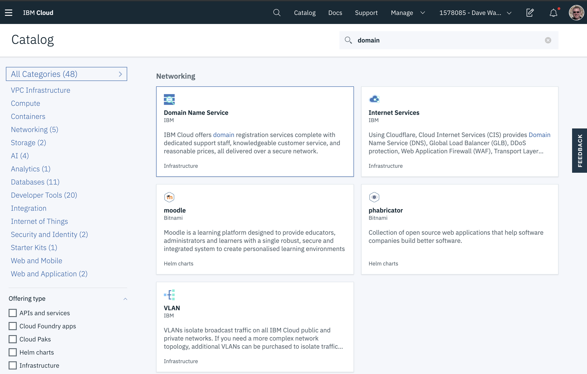
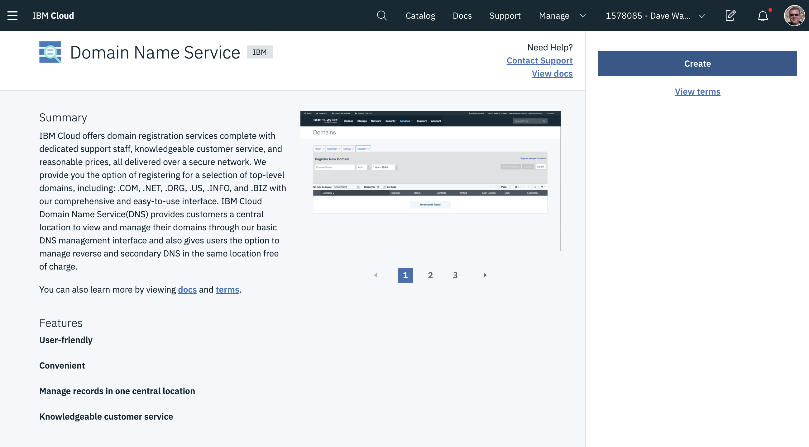
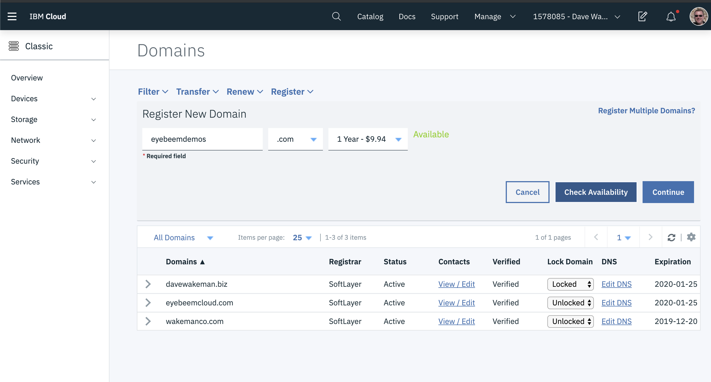
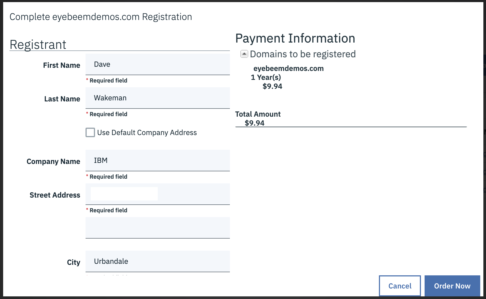
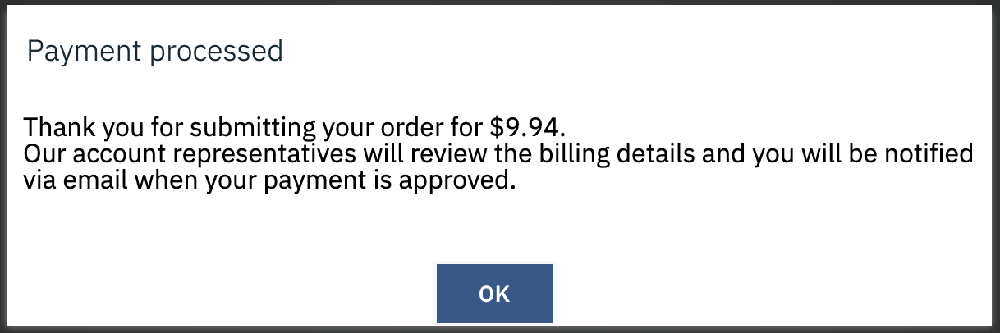
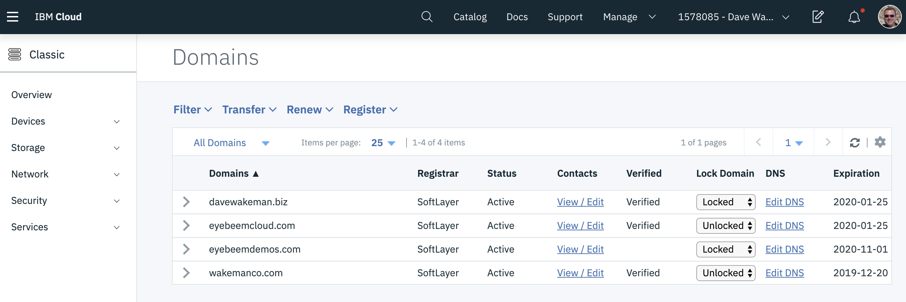
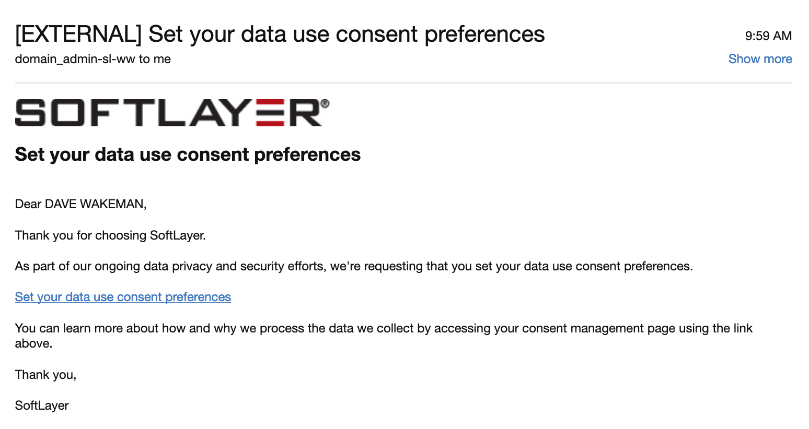
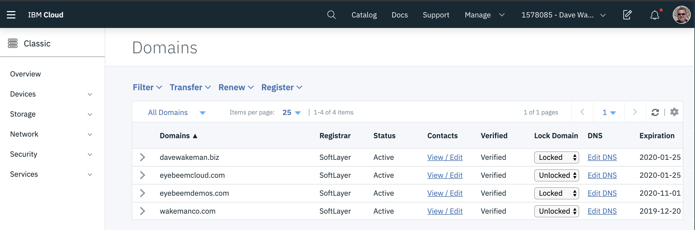

# Custom Domains

## Creating your own domain

A domain is created by using one of the many services called **Registrars** that will do all of the things that are required for your domain.  Specifically they will be the custodian of your domain with all of the appropriate information about you.

You can use any registrar you like; there are many of them out there.  IBM provides this capability with IBM Cloud.  This document will use IBM Cloud as the registrar.

To create your domain:

Login to IBM Cloud and navigate to the catalog.  Search for "domain".

Click on the `Domain Name Service` tile as seen in the image above.

On this page click the blue `Create` button.

Expand the `Register` menu, enter your domain and click the `Check Availability` button, as shown in the image above.  If your domain is available, click `Continue`.

Provide the required information as shown in the screen above and click `Order Now`.  You should see a confirmation window:

Click `OK`.  Then click on the `refresh` icon in the list menu.

You can see your new domain!  Notice that it's not "verified" yet.  You will get an email from Softlayer that confirms that you've ordered your domain.  The email will look something like this:

After some time (could be minutes) Softlayer does things to verify your domain.  Wait a few minutes and refresh the domain list.  When your domain is verified you will see the `Verified` column change, as shown below:

That's it!  Your domain is now ready for use.

