# Manage your domain with IBM Cloud Internet Services

If you have your own domain you can manage it using IBM Cloud Internet Services.  This service provides a number of management, reliability, performance and security features for your domain.  You can learn more about IBM Cloud Internet Services <a href="https://cloud.ibm.com/docs/infrastructure/cis?topic=cis-getting-started" target="_blank">here</a>.

## Provision Cloud Internet Services

The first steps to using Cloud Internet Services is to provision an instance of it in your IBM Cloud account.

Login to IBM Cloud, navigate to the catalog and search for "internet".

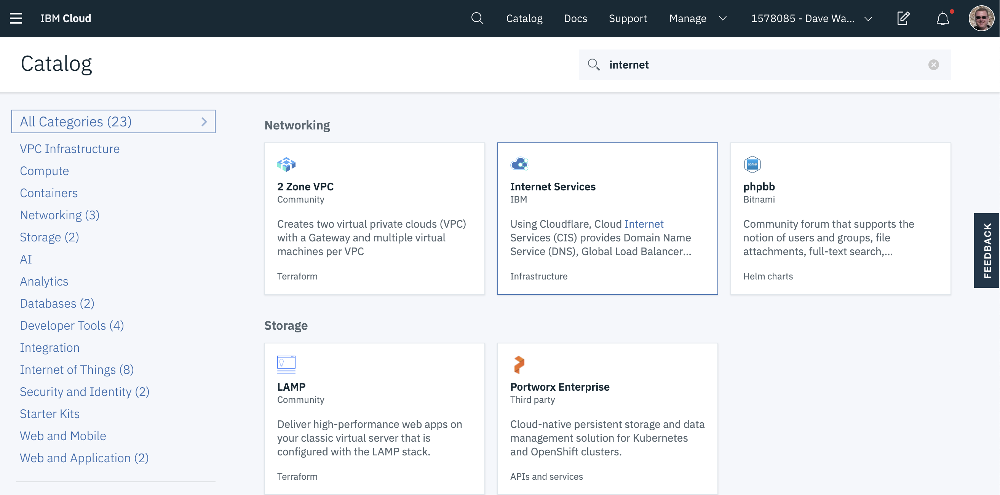

Click on the tile for Internet Services.

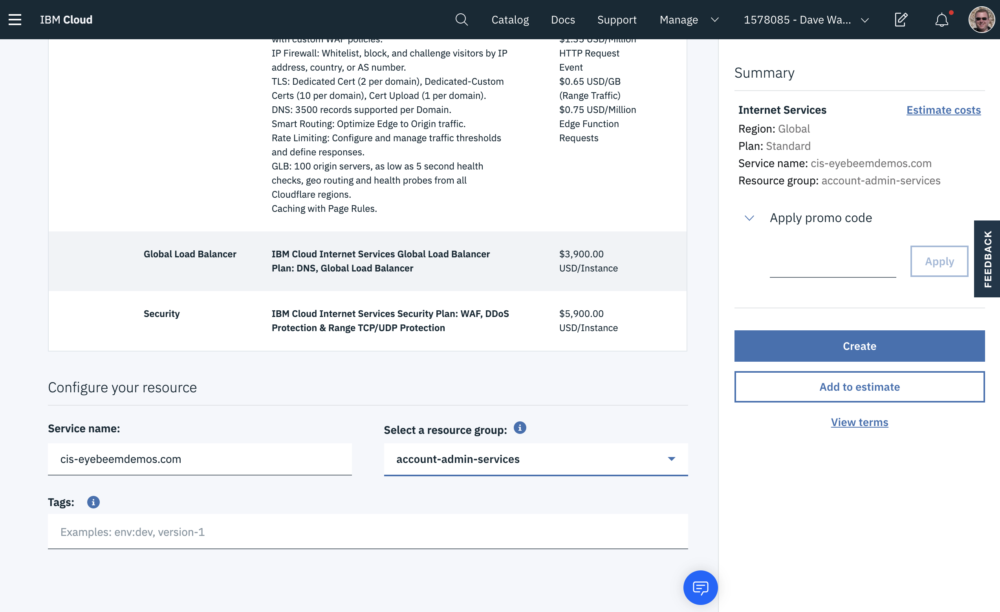

Select the Standard plan, scroll down and provide a name for your instance and a resource group, then click `Create`.  You will see the screen below, where you will add your domain to your CIS instance.

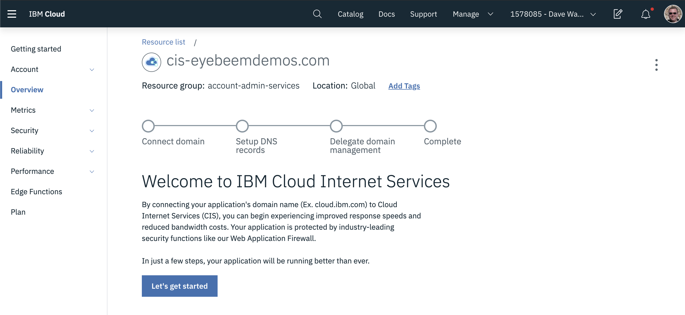

Click on the `Let's Get Started` button to continue.

## Add your domain to Cloud Internet Services

You should seen the screen below.

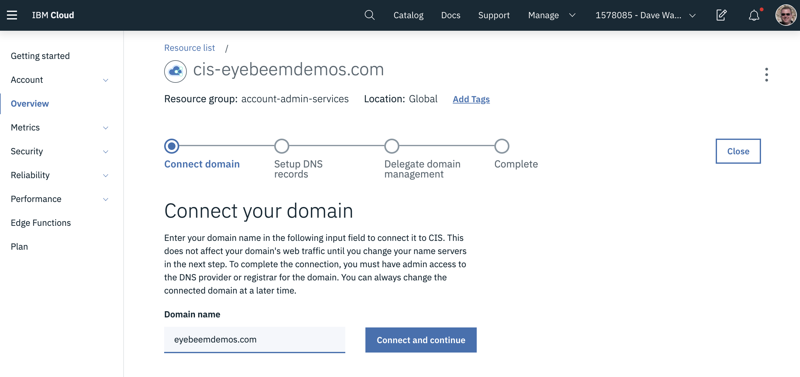

Enter your domain in the screen above and click `Connect and Continue`.

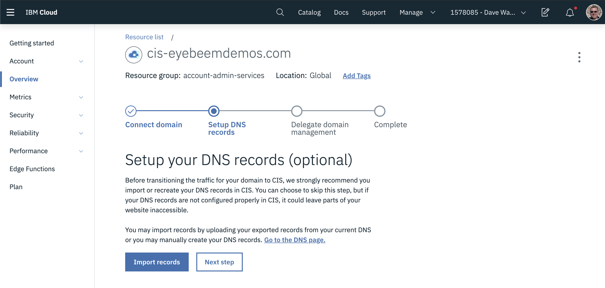

If you have DNS records in your existing DNS provider you can export them and import them here.  In this case we don't have any existing records, so click `Next Step`.

The next step is VERY IMPORTANT!  It tells your registrar (where you registered your domain) to delegate to CIS for name servers.

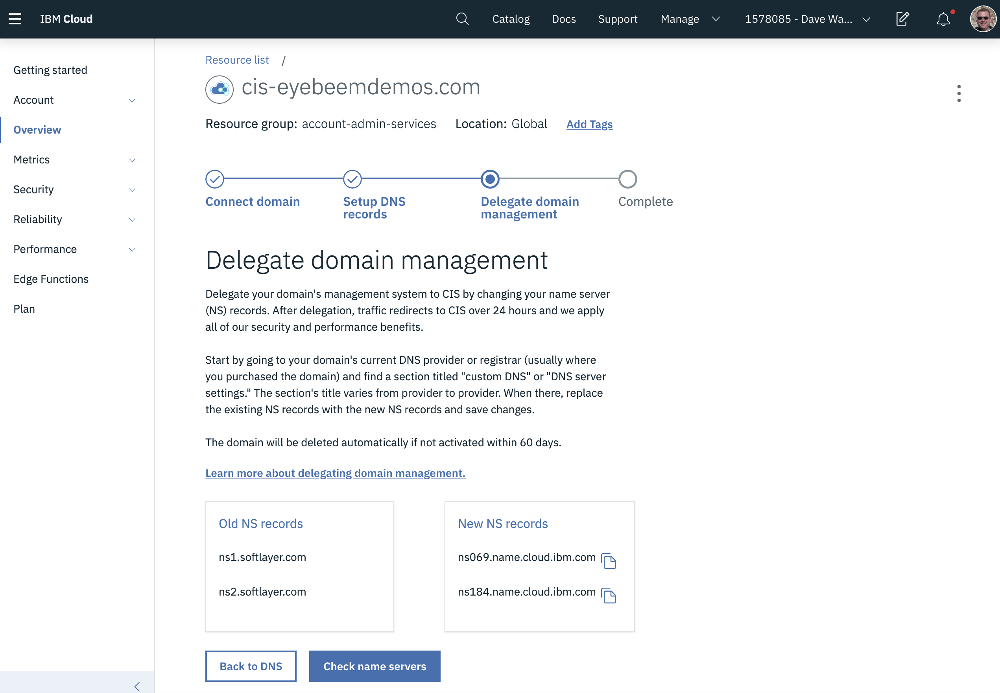

You need to update the regisrar with the new name servers in the New NS records table above.  In the case where you used Softlayer to register your domain, here are the steps to follow.

Go to Classic Infrastructure in IBM Cloud.  Expand the Services menu on the left and click on "Domain Registration".

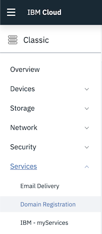

On the page below, click the arrow to the left of your domain name to expand it.  Make sure the "Lock Domain" dropdown is set to "Unlocked" and click the  "Add / Edit DNS" link  for your domain.

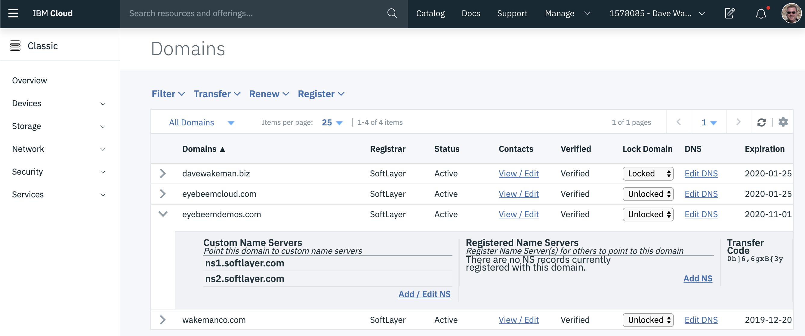

Replace the two existing name servers with the two from your CIS domain.  When you first click the link the screen will look like this:

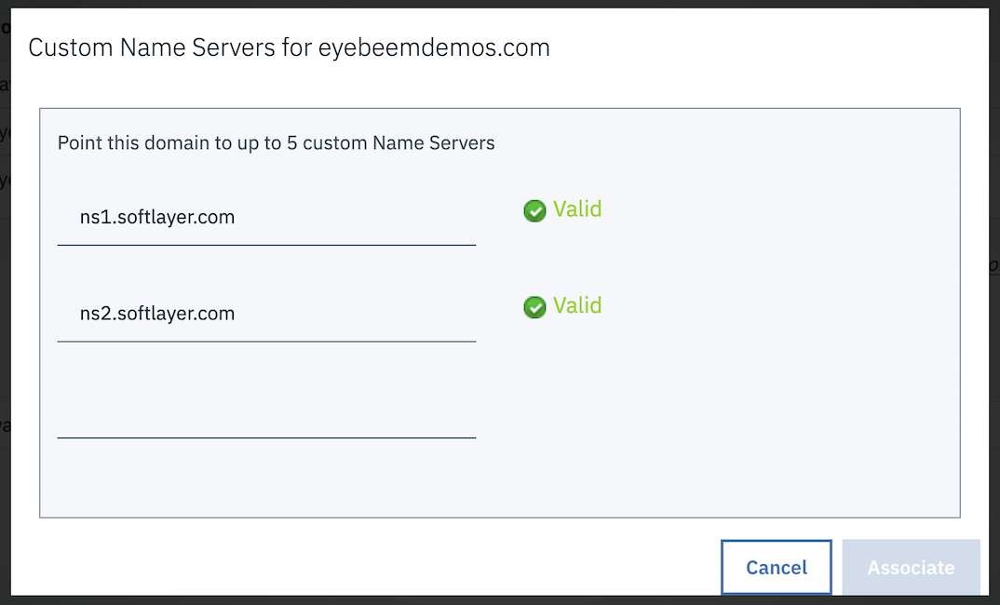

When you replace these name servers with new ones it will look something like this:

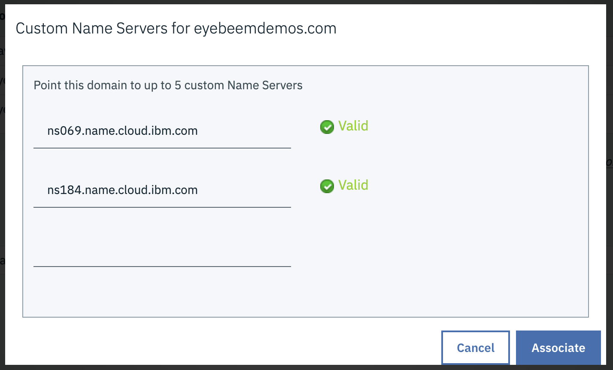

Note:   Your name servers will be different, but they should match what you have on the CIS screen below.  If they do, click "Associate" on the screen above.

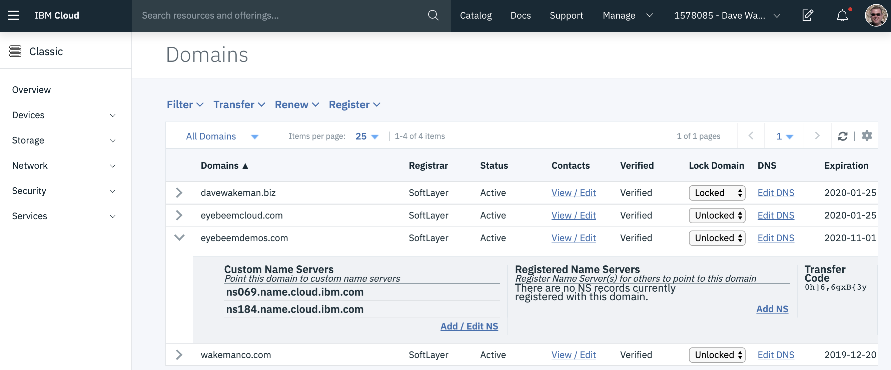

Go back to the CIS screen.  Click "Check Name Servers" to validate that your name servers were updated.  You might get a warning saying that the name servers were not updated.  This is okay; it takes a few minutes for the updates to propagate.  If that happens, refresh the page and try again in a few minutes.  You may also get an error saying that "you can only perform this action once per hour".  This is also okay.  If you refresh the page again you will eventually see that your domain has become active.

When that happens it means that now Cloud Internet Services is managing your domain! There is one more step that you should do at this point.  By default, the Web Application Firewall is not enabled for your domain.  To enable it, click on the `Web Application Firewall` link on the overview page and move the slider to the right.

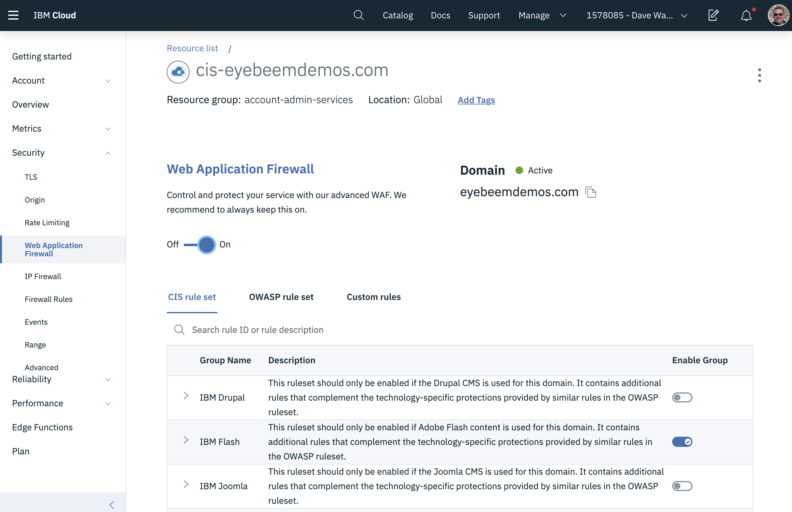

## Adding DNS records

To add a DNS record for your application you will create either an `A` or `CNAME` record.  An `A` record maps your application to a specific IP address, whereas a `CNAME` record creates a mapping from your domain to another hostname.  When you use a `CNAME` record you don't need to know the specific address, nor do you need to know if it ever changes.

When you create an kubernetes cluster in the IBM Cloud Kubernetes Service (IKS), or an IBM Cloud Foundry Enterprise Environment (which is built on IKS), an `ingress subdomain` is created automatically for you and is managed by IKS.  When you create your own host name, say `myapp.eyebeemdemos.com`, and that application is running in Cloud Foundry Enterprise, you will need to create a `CNAME` record for it in Cloud Internet Services.

To add a `CNAME` record for you application, go to the `Overview` page for your Cloud Internet Services instance.

Click on the link for `DNS Records`.  Scroll down to the `DNS Records` section.  Change the record type to `CNAME`, enter your app name in the `Name` field and the ingress subdomain for your Cloud Foundry Enterprise cluster in the `Alias Domain Name` field.

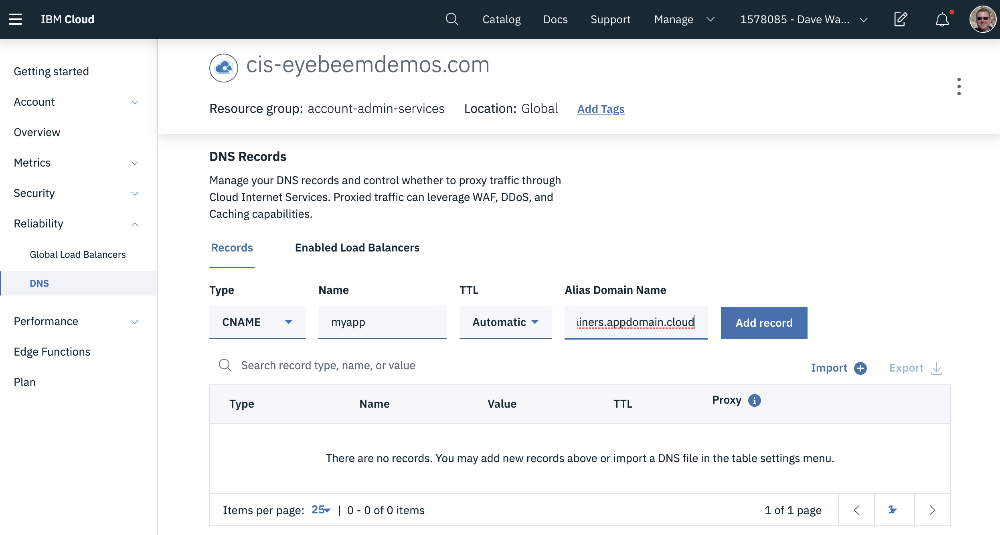

Click the `Add Record` button.  You will see your new record show up in the list.  To enable the security features (ie. TLS) you need to enable the proxy by clicking on the slider.

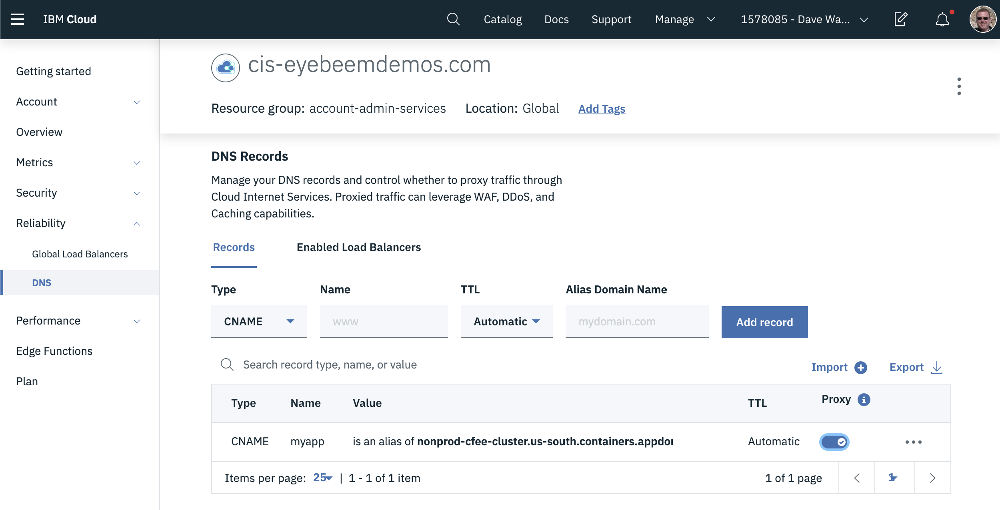

Now your `CNAME` record has been added, but it may still take a few minutes for it to be available, as the DNS record needs to be propagated out to all the other DNS servers.  When it is ready you will be able to ping it.

!!! note
    The address you see when you ping your hostname is actually an IP address for your Cloud Internet Services instance.  All traffic gets routed there first so that security features can be applied.  This also includes the TLS-enabled connection between Cloud Internet Services and your Cloud Foundry Enterprise cluster.

## Ordering Origin Certificates

## Ordering Edge Certificates

To properly encrypt traffic between your domain in CIS and the browser you need to have edge certificates.  Without them the browser will not trust your application because it did not present a certificate signed by a trusted authority.  Edge certificates are signed by a trusted authority.

To order edge certificates for your domain in IBM Cloud Internet Services, go to the `Security -> TLS` pane in the left nav, then click the button on the right to order a certificate.

!!! note
    You can add multiple subdomains to the certificate when you order it.  This will allow you to use a single certificate for all of the subdomains you add to it.  You can always order another certificate if you add subdomains later, but you cannot add them to an existing certificate.

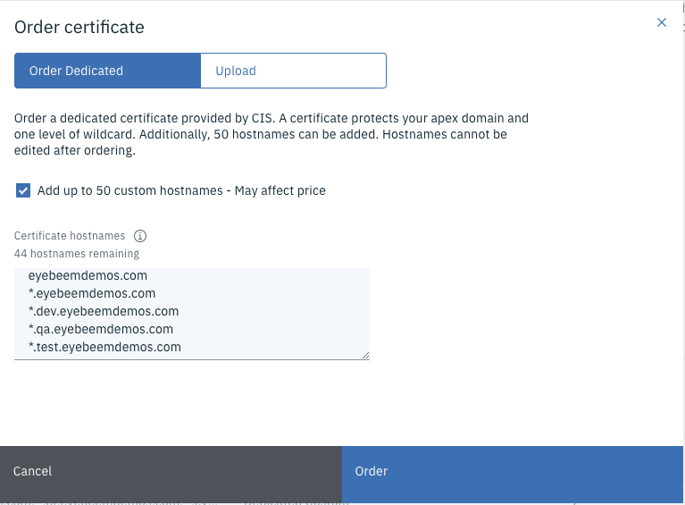

Once you have completed the order you will see them listed:

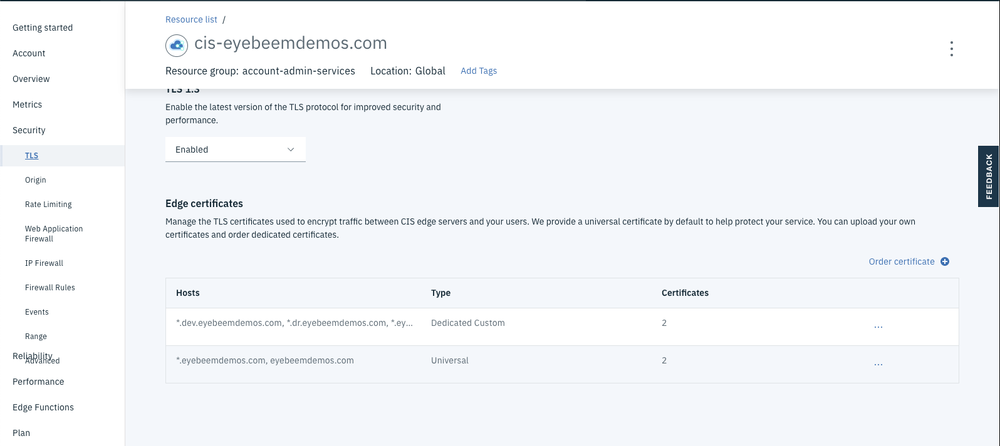

You can view the details of the certificate by clicking the three dots to the right.  The details include a list of all of the subdomains covered by the certificate.

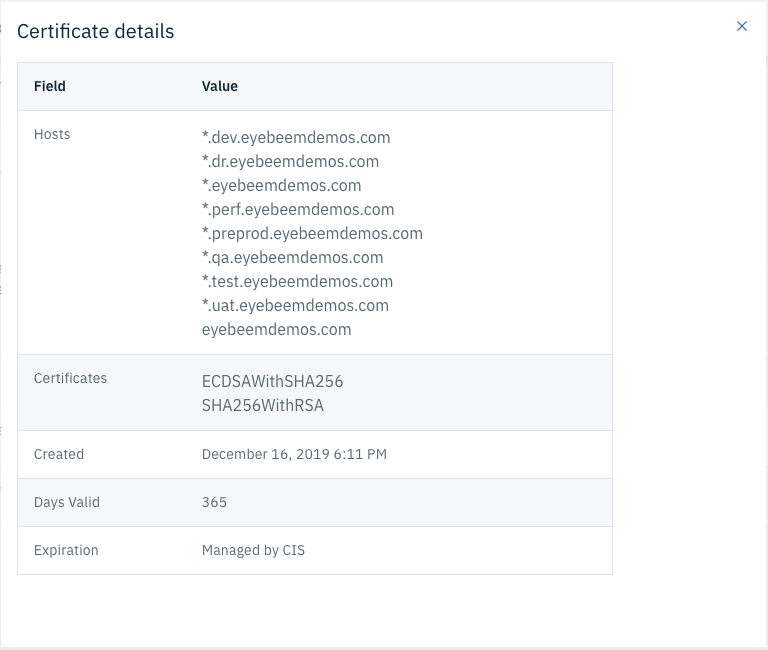

Here is what the TLS page should look like:

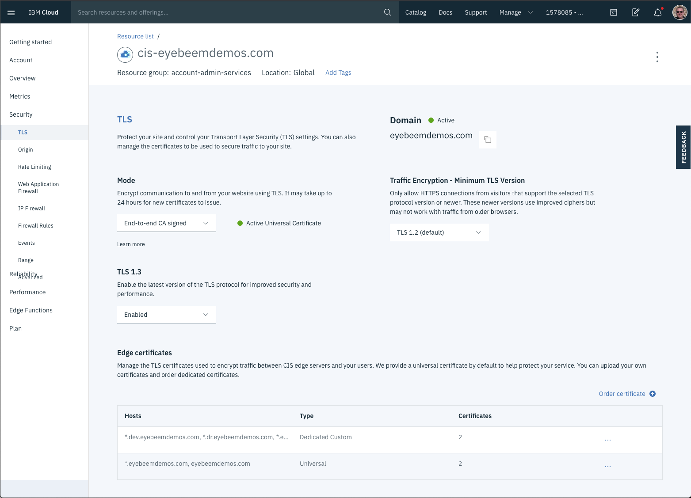

## Configuring your domain in Cloud Foundry Enterprise

Setting up your custom domain for use in Cloud Foundry Enterprise is pretty simple.  You will want to order an origin certificate for your domain in Cloud Internet Services, as shown in the previous section.  This will allow you to use TLS for communication from Internet Services to your Cloud Foundry Enterprise cluster.  You will also need a DNS CNAME record for your application so that Internet Services will route traffic to your Cloud Foundry Enterprise cluster.

The diagram below shows the basic configuration for using your custom domain.  The `Edge Services` box on the left is your Cloud Internet Services instance.  It contains the origin certificates you ordered above, and the DNS CNAME record that maps your hostname, `myapp.<your-domain>.com` to the ingress subdomain that was created by your Cloud Foundry Enterprise cluster.  The ingress subdomain is how all traffic gets routed to your cluster.  

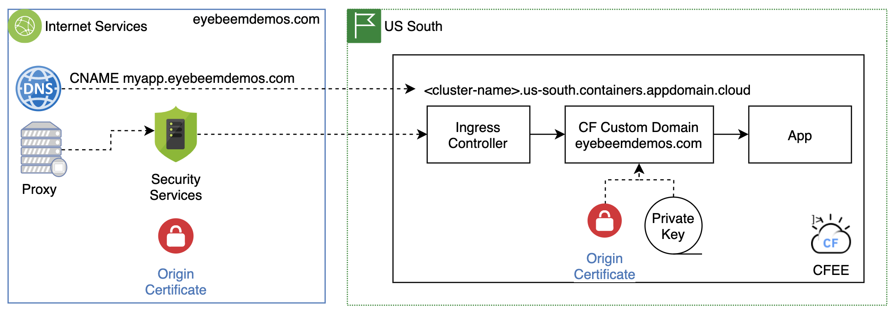

