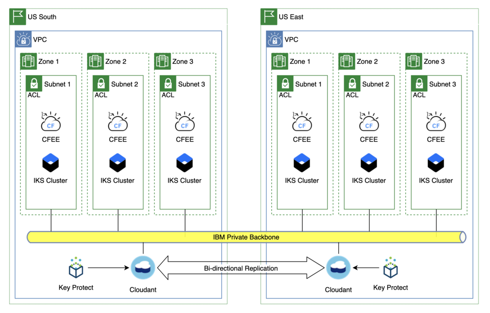

# Disaster Recovery

## Overview

The approach to defining the disaster recover strategy needs to be systematic, and start with the "application", which is defined as a set of compute resources (IKS or OpenShift apps, VSIs, services, etc.) that make up a "business application".   While a holistic approach may be desired, the reality is that each business application is independent, with its own RTO/RPO requirements, which for many customers is expressed in the form of a set of service classes or tiers.

| Resiliency Tier | Recovery Description | Recovery Time Objective | Recovery Point Objective |
| :-------------: | -------------------- | :---------------------: | :----------------------: |
| Tier 1          | Continuous Availabilty | <= 1 Hour             | <= 1 Hour                |
| Tier 2          | Advanced Recovery    | > 1 Hrs - <= 24 Hrs     | <2 Hrs - <24 Hrs         |
| Tier 3          | Standard Recovery    | > 24 Hrs - <= 72 Hrs    | Last Backup              |
| Tier 4          | No       Recovery    | N/A                     | N/A

_**Note:** The IBM Cloud platform itself must support the LOWEST number in the range.  Therefore, for the majority of their applications (Tier 1 and Tier 2), the IBM Cloud services (OpenShift, IKS, ICD, Cloudant, ICOS, Key Protect, Push Notifications, etc.) must have options/capabilities for support application recovery in 1 hour or less.  For databases that require backup/restore, in order to qualify for Tier 2 the backups need to be every two hours?  Sounds like the app owners can choose their RPO, so they could schedule their backups accordingly to fit both RTO and RPO they decide for themselves._

Since each business application will have a unique set of compute, service and other resources, each one will need to be reviewed to make sure that the strategy and requirements for DR for that app are understood, documented and implemented (automation?) before going to production.  To build the framework that will drive that analysis and work we will profile three business applications with comment sets of resources to create the scaffolding that application teams can use for their own applications.

**High Availability and Disaster Recovery**

When dealing with improved resilience it important to make some distinctions between High Availability (HA) and Disaster Recovery (DR).

HA is mainly about keeping the service available to the end users when "ordinary" activities are performed on the system like deploying updates, rebooting the hosting Virtual Machines, applying security patches to the hosting OS, etc. For our purposes, High Availability within a single site can be achieved by eliminating single points of failure. The Blue Compute sample application in its current form implements high availability.
HA usually doesn't deal with major unplanned (or planned) issues such as complete site loss due to major power outages, earthquakes, severe hardware failures, full-site connectivity loss, etc. In such cases, if the service must meet strict Service Level Objectives (SLO), you should make the whole application stack (infrastructure, services and application components) redundant by deploying it in at least two different Bluemix regions. This is typically defined as a DR Architecture.

There are many options to implement DR solutions. For the sake of simplicity, we can group the different options in three major categories:

- **Active/Passive -** Active/Passive options are based on keeping the full application stack active in one location, while another application stack is deployed in a different location, but kept idle (or shut down). In the case of prolonged unavailability of the primary site, the application stack is activated in the backup site. Often that requires the restoring of backups taken in the primary site. This approach is not recommended when loosing data can be a problem (e.g. when the Recovery Point Objective (RPO) is less than a few hours ) or when the availability of the service is critical (e.g. when the Return to Operations (RTO) objective is less than a few hours).
- **Active/Standby -** In the Active/Standby case the full application stack is active in both primary and backup location, however users transactions are served only by the primary site. The backup site takes care of keeping a replica of the status of the main location though data replication (such as DB replication or disk replication). In case of prolonged unavailability of the primary site, all client transactions are routed to the backup site. This approach provides quite good RPO and RTO (generally measured in minutes), however it is significantly more expensive than the Active/Passive options because of the double deployment (e.g., resources are wasted because the Stand by assets can't be used to improve scalability and throughput).
- **Active/Active -** In the Active/Active case both locations are active and client transactions are distributed according to predefined policies (such as round-robin, geographical load balancing, etc. ) to both regions. In the case of failure of one site the other site must be able to serve all clients. It's possible to achieve both an RPO and RTO close to zero with this configuration. The drawback is that both regions must be sized to handle the full load, even if they are used at the half of their capabilities when both locations are available. In such cases the Bluemix Autoscaling service can help in keeping always resources allocated according to the needs (as happens with the BlueCompute sample application).

*Source: [Making Microservices Resilient](https://github.com/ibm-cloud-architecture/refarch-cloudnative-resiliency#high-availability-and-disaster-recovery)

## Cloud Architecture

## Network Architecture

## Sample Application Architecture

### Application Profiles

One approach is to build a set of architecture profiles that represent the majority of apps.  These profiles would include options for various classes of service, compute requirements, and all the other stuff listed below.

#### Tier 1

Tier 1 applications have a requirement that the platform be available in less than an hour in the event of a disaster where the primary MZR becomes unavailable.  To achieve this with CFEE it will be necessary to have a fully-configured instance of CFEE up and running in hot standby mode in the backup MZR.  This includes:

**Platform:**

- VPC with subnets that use non-overlapping CIDR blocks and on-premise connectivity configured
- CFEE provisioned in the VPC
- Org, spaces, custom domains and other custom configurations needed
- All applications deployed with the same version as deployed in primary MZR

**Application:**

- All applications deployed with the same version as deployed in primary MZR
- Dependent services provisioned and necessary data replication strategy in place (bi-directional, read only replica, etc.)

    _**Note:** Databases that use backup/restore as their only cross region replication option will not support Tier 1 availability unless the backups occur hourly and a restore can be completed in less than an hour._
    
- Service credentials and service bindings

##### Tier 1 Compute

In order to meet Tier 1 RTO/RPO these components will need to be preconfigured and at their production workload capacity in US East.  

The size of the CF Enterprise or IKS clusters in US East may only need to be large enough to support Tier 1 and 2 workloads.  All applications can always be deployed there (as they are today in Dedicated) but for Tier 3 and 4 applications they could be stopped.  The idea would be to allow for Tier 1 and 2 apps to immediately become available with enough capacity to run them should a failure occur, but to save money the cluster would only be scaled up to match the primary cluster (and support the Tier 3/4 workloads) when actually needed, as Tier 3/4 apps have longer RTO in which the scaling operation would complete.

The same technique could be applied to updates to the CF Enterprise or IKS clusters.  The first step would be to scale up the backup cluster to full capacity (matching the primary cluster) before starting the upgrade.  Then do some sort of blue/green update where workload could be switched to the backup while the primary cluster is upgraded.  Once the primary cluster is upgraded and verified, workload would be switched back, the backup cluster could be scaled back down and then upgraded.

**Gaps/Unknowns**

1. Where will traffic routing be managed/changed in order to redirect from primary to backup site?  Where is it done today?
1. For databases, do we have any issues or constraints with scaling in terms of timing?  For example, for Cloudant Enterprise, will there always be enough capacity in the backup MZR such that all databases in the instance in the primary MZR are able to be replicated or restored?  If not this could be an impact on RTO for apps that use Cloudant.

##### Tier 1 Application - Cloudant

In this scenario the data will be replicated automatically by Cloudant.  In the event of a disaster the only change needed will be to reconfigure DNS to point to the cluster in US East.

**Benefits**
- Fastest recovery time, dependent only on the time it takes to verify that the data was replicated and make the DNS switch 

**Impacts**
- Cost.  To support the recovery time objective the only viable option is the active/hot standby model.
- Development teams need to update their deployment pipelines to also deploy their apps to the standby CFEE cluster every time they deploy to production.  And validate that it was successful.

##### Tier 1 Application - PostGreSQL

In this scenario the data will be replicated automatically by IBM Cloud Databases to a read-only replica in the backup MZR.  In the event of a disaster the application team will need to manually trigger a promotion of the read-only replica to become the leader.  This action will take some time; as a read-only replica the service instance is NOT configured using an HA topology . When the promotion occurs several steps happen to elevate the instance to an HA configuration.

The only other change needed will be to reconfigure DNS to point to the cluster in US East, once the database promotion is complete.

**Benefits**
- Faster recovery time, as the data is already replicated to the backup MZR.  There is still some latency related to the time it takes to reconfigure the database to an HA configuration.
**Impacts**
- Cost.  To support the recovery time objective the only viable option is the active/hot standby model.
- Development teams need to update their deployment pipelines to also deploy their apps to the standby CFEE cluster every time they deploy to production.  And validate that it was successful.
- Manual intervention is required to trigger and monitor the promotion of the read-only replica to leader status.

[Configuring read-only replicas](https://cloud.ibm.com/docs/databases-for-postgresql?topic=databases-for-postgresql-read-only-replicas)

**Basic Steps:**

- create instance in primary MZR (i.e. Dallas)
- create read-only replica in DR MZR (i.e. Washington, DC)
    - Read-only replica is a single zone instance
- If primary MZR is unavailable, promote read-only replica to leader.  Now DR MZR becomes the leader
    - updates the config in the DR MZR to be MZR resilient, meaning additional nodes are added
    - takes a full backup of the database in the DR MZR
    - DR MZR becomes the leader and ties to original leader in primary MZR are broken
        - original instance in Primary MZR can be deleted.  This deletes all backups in the primary MZR.
        - if original instance is not deleted (i.e. backups are still available) a new instance can be created by restoring from a backup, should that become necessary.
        - the backups taken in the original MZR are still accessible even if that MZR is completely unavailable; they are stored in cross-regional ICOS buckets.
- If a read-only replica is promoted to leader, the original leader is no longer viable.  
- To move the data/workload back to the original MZR, create a read-replica in the original MZR and promote it to be the leader.  This does create a new instance of the database, not a restore of the original instance.

##### Tier 1 Application - Cloud Object Storage

In this scenario the data is always available in both MZRs via cross-regional buckets.  Therefore, the only change needed is to update the DNS routing to point to the backup MZR.

#### Tier 2

Tier 2 applications have a requirement that the platform be available in less than an hour in the event of a disaster where the primary MZR becomes unavailable.  To achieve this with CFEE it will be necessary to have a fully-configured instance of CFEE up and running in hot standby mode in the backup MZR.  This includes:

**Platform:**
- VPC with subnets that use non-overlapping CIDR blocks and on-premise connectivity configured
- CFEE provisioned in the VPC
- Org, spaces, custom domains and other custom configurations needed
- All applications deployed with the same version as deployed in primary MZR

**Application:**
- All applications deployed with the same version as deployed in primary MZR
- Dependent services provisioned and necessary data replication strategy in place (bi-directional, read only replica, backup/restore, etc.)
- Service credentials and service bindings

##### Tier 2 Application - MongoDB

In this scenario, the data is not replicated to the backup MZR.  When a disaster is declared the application team will need to create a new database instance in the backup MZR by restoring the data from backup.  

_**Note:** The backup from the database instance in the Primary MZR is available in the backup MZR even if the primary MZR is completely unavailable._

Once the data is restored, the only other change needed is to change the DNS routing to point to the backup MZR.

**Backup and restore procedures**

- [ElasticSearch](https://cloud.ibm.com/docs/services/databases-for-elasticsearch?topic=cloud-databases-dashboard-backups)
- [MongoDB](https://cloud.ibm.com/docs/services/databases-for-postgresql?topic=cloud-databases-dashboard-backups)
- [Redis](https://cloud.ibm.com/docs/services/databases-for-redis?topic=cloud-databases-dashboard-backups#backups-and-restoration)

## References

- [IBM Kubernetes Service Multi-Region Architecture](https://cloud.ibm.com/docs/tutorials?topic=solution-tutorials-strategies-for-resilient-applications#kubernetes)
- [Strategies for Resilient Applications](https://cloud.ibm.com/docs/tutorials?topic=solution-tutorials-strategies-for-resilient-applications#strategies-for-resilient-applications)
- [Secure web applications across multiple regions](https://cloud.ibm.com/docs/tutorials?topic=solution-tutorials-multi-region-webapp#secure-web-application-across-multiple-regions)
- [Resilient and secure multi-region Kubernetes clusters with IBM Cloud Internet Services](https://cloud.ibm.com/docs/tutorials?topic=solution-tutorials-multi-region-k8s-cis#resilient-and-secure-multi-region-kubernetes-clusters-with-cloud-internet-services)

# ibm-cloud-services-resilience
This repository provides links to the HA / DR / Backup information for the IBM Cloud Services in Scope.

| Services | DR Capabilities | DR Ownership/Control | Documentation | RTO |
|---|---|---|---|---|
| Console | Core service available in multiple regions | IBM | N/A | HA |
| IAM | Core Service available in multiple regions | IBM | N/A | HA |
| CFEE | Service available in multiple regions | Client | Tgt. end of November | based on Client DR Implementation |
| Cloudant | Service available in multiple regions | Client | [Disaster recovery and backup](https://cloud.ibm.com/docs/services/Cloudant/guides?topic=cloudant-disaster-recovery-and-backup) | based on Client DR Implementation |
| IBM Cloud DB Elastic Search | Service available in multiple regions | Client | [Managing Backups](https://cloud.ibm.com/docs/services/databases-for-elasticsearch?topic=cloud-databases-dashboard-backups) | based on on Client DR Implementation |
| IBM Cloud DB Mongo DB | Service available in multiple regions | Client | [Managing Backups](https://cloud.ibm.com/docs/services/databases-for-mongodb?topic=cloud-databases-dashboard-backups) |
| IBM Cloud DB Postgres | Service available in multiple regions | Client | [Managing Backups](https://cloud.ibm.com/docs/services/databases-for-postgresql?topic=cloud-databases-dashboard-backups) | based on Client DR Implementation |
| IBM Cloud Object Storage | Service available in multiple regions | Client | [About IBM Cloud Object Storage](https://cloud.ibm.com/docs/services/cloud-object-storage/basics?topic=cloud-object-storage-about-ibm-cloud-object-storage) | depends on Client DR Implementation |
| IKS | Service available in multiple regions | Client | [High availability for IBM Cloud Kubernetes Service](https://cloud.ibm.com/docs/containers?topic=containers-ha#ha) [Planning your cluster for high availability](https://cloud.ibm.com/docs/containers?topic=containers-ha_clusters#ha_clusters) | based on Client DR Implementation |
| Key Protect | Regional: IBM is responsible for bringing the service back in a different Region | IBM | N/A | the current documented RTO is <1 day |
| Message Hub/Event streams | Service available in multiple regions | Client | [FAQs](https://cloud.ibm.com/docs/services/EventStreams?topic=eventstreams-faqs#disaster_recovery) | based on Client DR Implementation |
| Push Notification | Regional | IBM | TBD | the current documented RTO is 1-3 days |
| Virtual Private Cloud | Service available in multiple regions | Client | [Introduction](https://cloud.ibm.com/apidocs/vpc-on-classic) | based on Client DR Implementation |
| Watson Natural Language Understanding (NLU) | Client is responsible for restoring the service back in a different Region | Client | [High availability and disaster recovery](https://cloud.ibm.com/docs/services/natural-language-understanding?topic=natural-language-understanding-ha-dr) | based on Client DR Implementation |

Other documentation:

* [Build resilient applications on the cloud](https://www.ibm.com/cloud/garage/architectures/resilience/allresiliencesolutions)
* [Hybrid integration for solutions that span environments](https://www.ibm.com/cloud/garage/architectures/hybridIntegration/hybrid_dr_microservices)
* [Hybrid integration for solutions that span environments](https://www.ibm.com/cloud/garage/architectures/hybridIntegration/hybrid_connectivity)
* [Strategies for resilient applications](https://cloud.ibm.com/docs/tutorials?topic=solution-tutorials-strategies-for-resilient-applications#strategies-for-resilient-applications)
