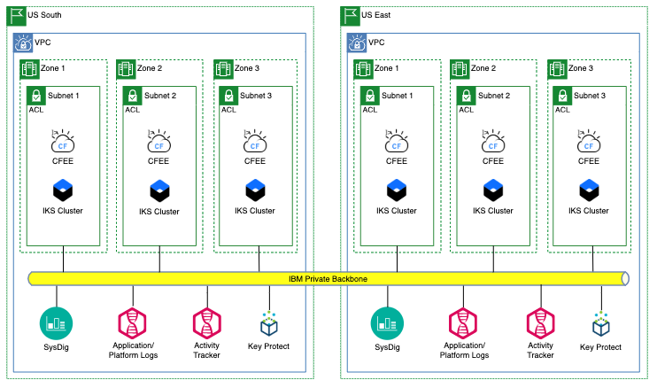

## Overview

The architecture that we want to create looks like this:

Regardless of whether you choose to run your applications in IBM Cloud Kubernetes Service (IKS) or IBM Cloud Foundry Enterprise Environment (CFEE) the provisioning process will be substantially the same, at least as far as the architecture goes.  For the purposes of this document we wil use CFEE as the compute platform.

In addition to the clusters themselves, most enterprises will use additional tools for managing and monitoring the environment.  We will add additional services from IBM Cloud into the mix by provisioning them and configuring your clusters to use them.

- Logging - Log Analysis with LogDNA
- Auditing - Activity Tracker with LogDNA
- Monitoring - SysDig
- Encryption - Key Protect

## Setting up the VPC

You can use Schematics on IBM Cloud to set up your VPCs.  Schematics uses terraform to create and manage the infrastructure.  Directions for using Schematics can be found [here](../infrastructure/schematics.md), and you can use this repo for your schematics workspaces for your VPCs.

<a href="https://github.com/dwakeman/private-vpc-terraform" target="_blank">https://github.com/dwakeman/private-vpc-terraform</a>

You will need to create a separate workspace for each VPC, one in US South and one in US East.  The terraform project will create your VPC in the region you specify, and it will create three subnets for you, in different availability zones.  

## Provision the clusters

### Provision cluster in US South

