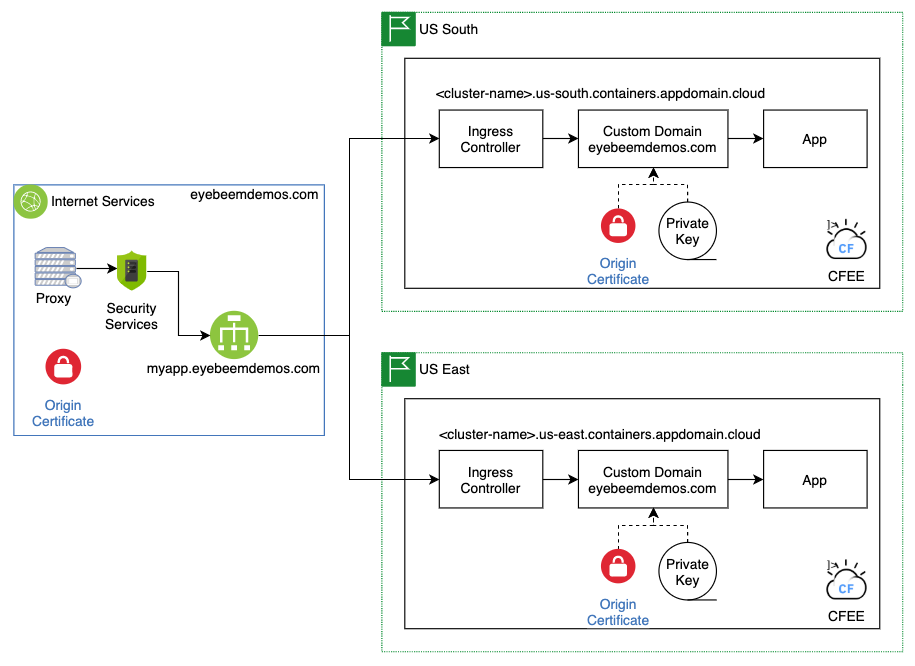

## Overview

One of the great things about hosting your application in the cloud is the variety of options to consider when planning for a high availability application deployment pattern.  Most cloud providers offer multiple regions around the world with some sort of multi-zone architecture to facilitate such deployments.  

### What to consider

- **Compute -** Your app will need a place to run.  There are many choices for compute, including bare metal and virtual servers, platforms like Kubernetes or Cloud Foundry, and serverless platforms.  Each option will have its own set of characterstics, tools and features to consider; this document will focus on two of the more popular ones, cloud foundry and kubernetes.
- **Data -** If your apps will include data, as most do, you need to consider which database technology to use, and how to configure it for use in a multi-region deployment.  Most cloud provider-managed databases are "regional" in nature, meaning they provide high availability within a region, but not across regions. It is up to you to configure them such that the data is properly replicated, backed up/restored, etc., as appropriate for your application.
- **DevOps -** How are you going to deploy your application?  If your application is to  highly available it has to stay up during deployments.  There are many patterns for doing this, some built into the compute platforms themselves.  Kubernetes, for example, does rolling deployments automatically so that your application is always available, asusming your application is configured correctly.  Blue/green deployments are another common pattern that are used with many compute platforms.
- **Routing -** How are you going to route the traffic to your application?  You want your application to be served up by a single URL, like `myapp.eyebeemdemos.com`, but you need the capability to route traffic to multiple instances of your application. If you're using kubernetes or cloud foundry they will automatically provide application load balancer capabilities to route traffic to multiple instances running in the same region (i.e kubernetes cluster).  But what about a cross-region scenario? There are multiple ways to accomplish this; this document will leverage IBM Cloud Internet Services by creating a global load balancer that will perform health checking and routing.

## Architecture

At a high level the architecture looks like this:

In the diagram above you can see the that application is deployed into two regions, `US South` and `US East`.  In each region the compute platform - in thise case IBM Cloud Foundry Enterprise, which runs on IBM Kubernetes Service.

Within each region, the application is part of a subdomain provided by Cloud Foundry Enterprise: `<cluster-name>.<region>.containers.appdomain.cloud`.  These subdomains can be used as sources in a global load balancer called `myapp.eyebeemdemos.com` in IBM Cloud Internet Services, which will route traffic across both regions.  There is additional setup work that needs to be done for you to be able to use your own domain.  More information can be found [here](../custom-domain/create-domain.md).

## DevOps

It is common for enterprises to use multiple non-production environments as they develop and test their applications.  The number of these environment varies, but in general there are at least three:

- **Dev -** this is where developers do their initial testing in a server-based environment
- **Test -** Consolidated testing of multiple components is done here by the development team before handing the app over to users for testing
- **UAT -** This is where user acceptance testing is performed

In addition to these non-production environments the application will have at least one production environment where the application will be used.  It may also be important to have multiple production environments in different regions around the world.  Typically there will also be a backup or disaster recovery environment.  For this document, the non-production environments above will be implemented as different namespaces within the same IKS cluster, and the production environment will be a namespace in the production IKS clusters in two different regions.  
Another common practice is to use different subdomains for each environment.  As the application moves through the environments on the way to production, its URL will change:

- **Dev -** myapp.dev.eyebeemdemos.com
- **Test -** myapp.test.eyebeemdemos.com
- **UAT -** myapp.uat.eyebeemdemos.com

To enable this capability you will need to perform a few steps:

- create some DNS CNAME record to point these URLs to the ingress subdomain for your non-production IKS cluster
- make sure you have certificates for these wildcard domains (i.e. `*.dev.eyebeemdemos.com`)
- create a kubernetes secret with the certificate and private key
- create an ingress controller to configure TLS termination and map a route to your app

Documentation for these steps can be found in the IBM Kubernetes Service documentation [here](../custom-domain/create-domain.md).

