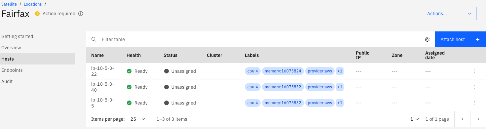
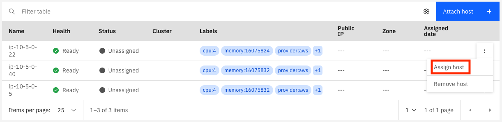
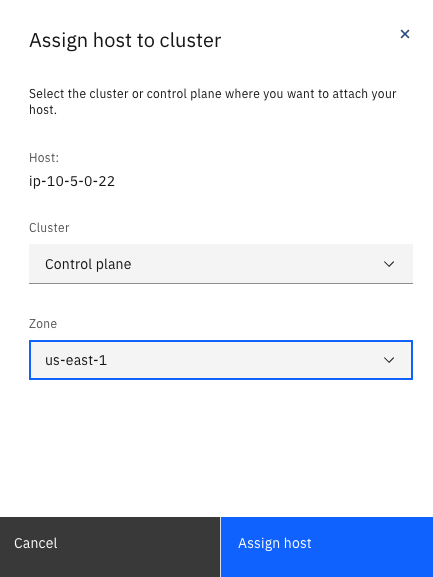
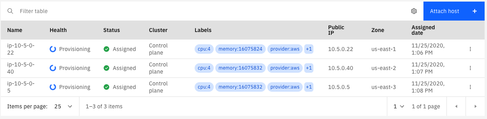
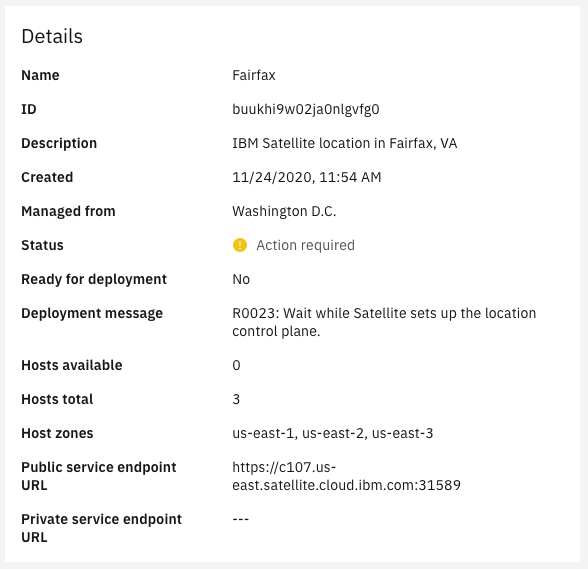
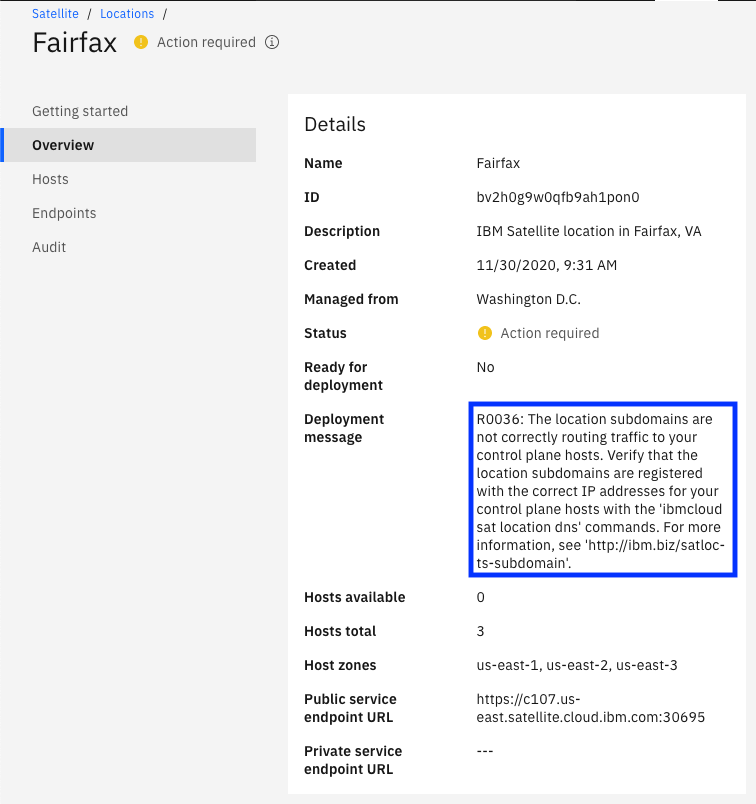
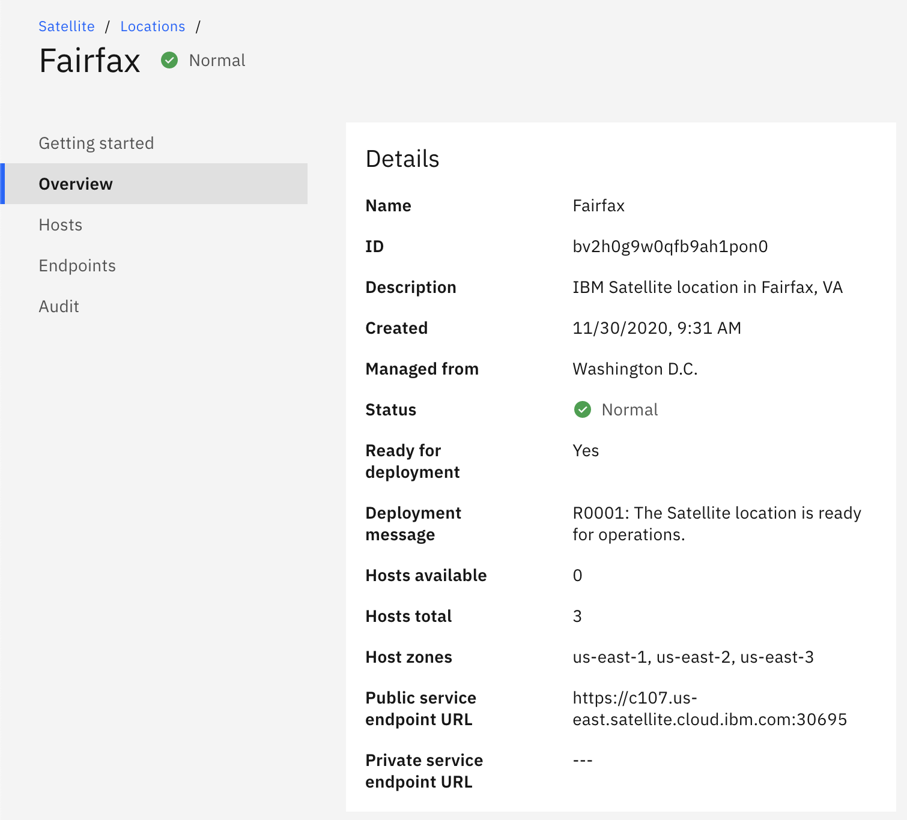

# Assign Hosts

At this point you have created an IBM Satellite location and created some hosts in AWS that are attached to your location.  In order to finish setting up your location we need to assign some hosts to the control plane.  You will need at least three hosts, managed from three different zones in IBM Cloud.  When you created the hosts, you provisioned them in different availability zones in AWS; when you assign each host to the control plane you will select a different IBM Cloud availiability zone to manage each of these hosts.

Let's get started!

To Assign hosts to your control plane:

1. Access your IBM Satellite location in IBM Cloud by using the  icon and choose `Satellite`.  On the Satellite landing page, click the `Locations` item on the left navigation menu.

1. Click on your location in the list.  It should automatically take you to the `Hosts` page where you will see your EC2 instances.  If you don't end up on the `Hosts` page click on the `Hosts` link in the left navigation menu.

    

    !!! note
        When you assign a host to the control plane you will want to have each host managed by a different availability zone in IBM Cloud.  However, the IBM Cloud console does not know anything about your EC2 instances.  You will have to manually decide which of your hosts should be managed by which zone in IBM Cloud.  

        The name of your hosts in the IBM console will probably be something like `ip-<an-ip-address>`.  That IP address is the private IP address of the host.  In AWS the guest OS in your host does not know anything about public IP addresses; that's just how AWS networking works.  If you want you can match up the host with the right EC2 instance by comparing the name of the host in IBM Cloud with the private IP address of your EC2 instance.

1. Click on the three dots at the far right of the first line in the table of hosts. In the menu that pops up select `Assign host`.

    

1. In the dialog that pops up there are two dropdown menus.  The first one is for the cluster to which the host will be assigned.  Right now only the `Control plane` is avaiable; later, when you provision other IBM Services will show up on this list.  In the `Zone` field, there is a list of all of the availability zones in the IBM Cloud MZR.  Choose any of the three zones and click `Assign host`.

    

    You wil see in the table of hosts that the status changes to `Assigned` and the `Health` changes to `Provisioning`.  

1. Repeat the steps above for the other two hosts.  Be sure to pick different zones for each one, and different than the first host.

    

Now we wait for the provisioning to finish.  Click on the `Overview` link in the left navigation menu to go back to the overview page for your location.  The `Deployment message` should now be `R0023: Wait while Satellite sets up the location control plane.`  That message will change when the provisioning is complete.

!!! tip
    IBM Satellite, like all services in IBM Cloud, does a certain amount of logging at the platform level.  Now would be a create time to create an instance of [IBM Log Analysis with LogDNA](https://cloud.ibm.com/catalog/services/ibm-log-analysis-with-logdna?callback=%2Fobserve%2Flogging%2Fcreate) in the IBM Cloud region where your location is defined and enable it for [Platform Logging](https://cloud.ibm.com/docs/Log-Analysis-with-LogDNA?topic=Log-Analysis-with-LogDNA-config_svc_logs) in that region.  You will be able to see logs from IBM Satellite as the provisioning progresses.

!!! note
    At this time the message when provisioning is done will probably be an error having to do with DNS or routing or something.  This is expected, according to the [documentation](https://cloud.ibm.com/docs/satellite?topic=satellite-providers#aws-reqs-dns-control-plane); when the hosts were attached to the location the value for the public IP address was actually set to the private IP address.  This is due to the way AWS does networking.  We will need to run a command using the IBM Cloud CLI and the satellite plugin to register the public IP addresses for your control plane hosts with the subdomain that IBM created for your control plane.

1. When the provisioning is complete the deployment message changes to:

     `R0036: The location subdomains are not correctly routing traffic to your control plane hosts. Verify that the location subdomains are registered with the correct IP addresses for your control plane hosts with the 'ibmcloud sat location dns' commands. For more information, see 'http://ibm.biz/satloc-ts-subdomain'.`

     

     Now it is time to update the DNS entry for your location with the public IP addresses of your control plane hosts.

1. Open a terminal on your computer and login to the IBM Cloud CLI.  If you don't have the CLI installed you can find instructions [here](https://cloud.ibm.com/docs/cli?topic=cli-install-ibmcloud-cli).  Run this command to list your satellite locations:

    `ibmcloud sat location ls`

    The output will look like this:

        Retrieving locations...
        OK
        Name      ID                     Status            Ready   Created      Hosts (used/total)   Managed From   
        Fairfax   buukhi9w02ja0nlgvfg0   action required   no      1 day ago    3 / 3                Washington D.C.   
        Toronto   butv8rdw0lre015nkteg   normal            yes     2 days ago   3 / 6                Washington D.C.   
    
    To see the existing IP addresses registered for your location run this command:

    `ibmcloud sat location dns ls --location <location id or name>`

    For example:

        ibmcloud sat location dns ls --location Fairfax
        Retrieving location subdomains...
        OK
        Hostname                                                                                        Records                                                                                         Health Monitor   SSL Cert Status   SSL Cert Secret Name                                          Secret Namespace   
        f3dc29213e9fd2bee18b6-6b64a6ccc9c596bf59a86625d8fa2202-c000.us-east.satellite.appdomain.cloud   10.5.0.5,10.5.0.22,10.5.0.40                                                                    None             creating          f3dc29213e9fd2bee18b6-6b64a6ccc9c596bf59a86625d8fa2202-c000   default   
        f3dc29213e9fd2bee18b6-6b64a6ccc9c596bf59a86625d8fa2202-c001.us-east.satellite.appdomain.cloud   10.5.0.5                                                                                        None             creating          f3dc29213e9fd2bee18b6-6b64a6ccc9c596bf59a86625d8fa2202-c001   default   
        f3dc29213e9fd2bee18b6-6b64a6ccc9c596bf59a86625d8fa2202-c002.us-east.satellite.appdomain.cloud   10.5.0.40                                                                                       None             creating          f3dc29213e9fd2bee18b6-6b64a6ccc9c596bf59a86625d8fa2202-c002   default   
        f3dc29213e9fd2bee18b6-6b64a6ccc9c596bf59a86625d8fa2202-c003.us-east.satellite.appdomain.cloud   10.5.0.22                                                                                       None             creating          f3dc29213e9fd2bee18b6-6b64a6ccc9c596bf59a86625d8fa2202-c003   default   
        f3dc29213e9fd2bee18b6-6b64a6ccc9c596bf59a86625d8fa2202-ce00.us-east.satellite.appdomain.cloud   f3dc29213e9fd2bee18b6-6b64a6ccc9c596bf59a86625d8fa2202-c000.us-east.satellite.appdomain.cloud   None             creating          f3dc29213e9fd2bee18b6-6b64a6ccc9c596bf59a86625d8fa2202-ce00   default   

    You can see that the IP addresses are all `10.5.x.x`, which are the private IP addresses in my VPC.

    The command to register new IP addresses in DNS will look like this:

    `ibmcloud sat location dns register --location <location ID or Name> --ip <aws_host_public_ip> --ip <aws_host_public_ip> --ip <aws_host_public_ip>`

    Each of the `<aws_host_public_ip>` placeholders will contain the public IP address of one of your control plane hosts.  You can get these IP addresses from the `Instances` console of the EC2 Dashboard.

1. Once you have updated the location DNS with the public IP addresses it's time to wait for the DNS updates to be propogated and for the location to recover from the error.  If all goes well, in a few minutes the deployment message will change to:

    `R0001: the Satellite location is ready for operations.`

    

**Congratulations!** Your location is up and running normally.  Now it is time to add some more hosts to your location and provision other services, like OpenShift on IBM Cloud.