# Create Hosts

We will use the script generated you created the location as the `User Data` to be passed into each EC2 instance created.

Don't forget to update it with the right update commands after the `API_URL` variable, as documented.

Navigate to the EC2 console and let's get started!

## Create SSH Key

To create an SSH Key:

1. Click on the `Key pairs` link in the EC2 console.

    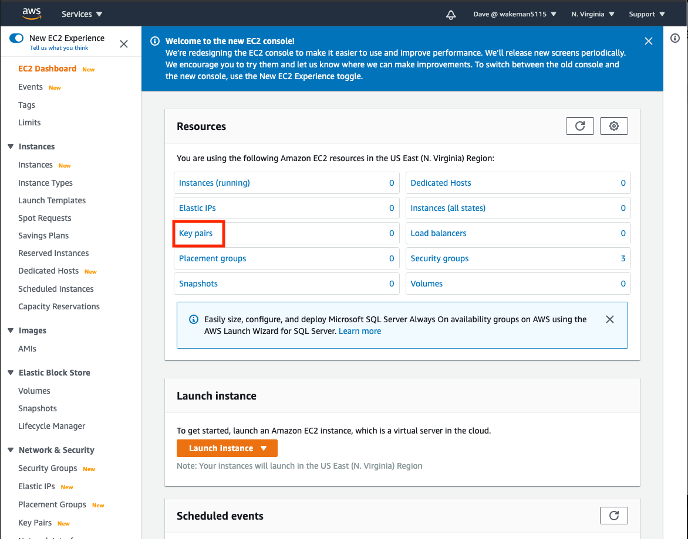

1. You will probably see that you have no key pairs in the list. 

    !!! note
        AWS will allow you to generate a new key pair, in which it will generate and download a key file (a file with a `.pem` extension) that you can later specify as the private key when you use the `ssh` command. It will save the public key in the key pair object in AWS and add that public key to your EC2 instance when you create it (assuming you choose this key).

        The other option is to import a key.  In this case you will import the contents of your public key and AWS stores it in the key pair.  You can use this option if you already have an SSH key and don't want to create a new one.

    - If you choose to import an existing key, click the `Actions` dropdown at the top of the list and select `import key pair`.  Give your key a name and copy/paste the contents of your key into the text box in the `Key pair file` section.  You could also use the `Browse` button to choose the file.  Click `Import key pair`.

        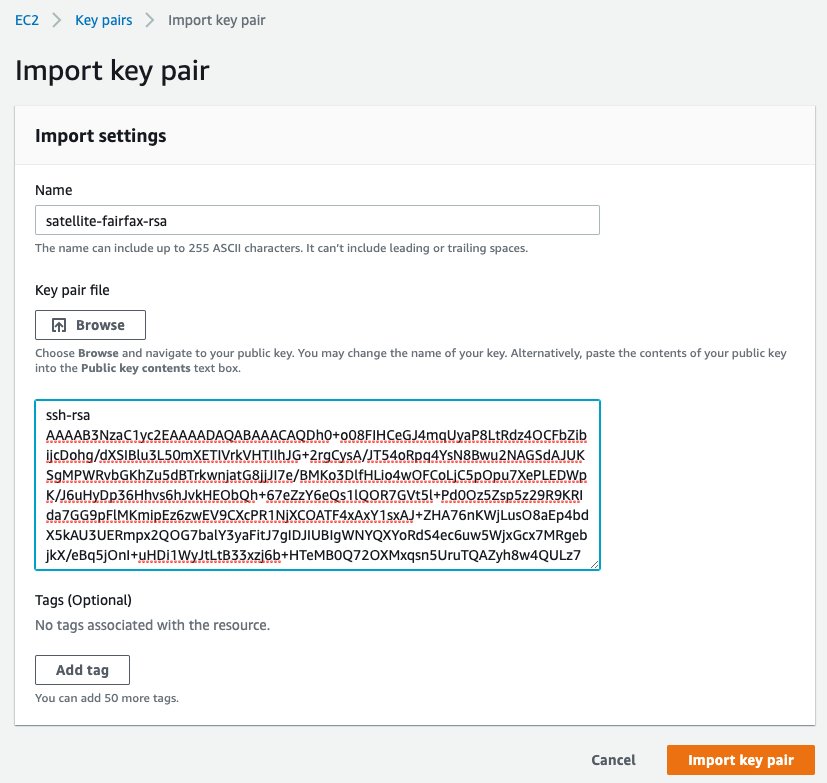

    - If you choose to create a new key pair click the `Create key pair` button above the list of keys on the Key pairs console.  Give your key a name, leave the `file format` set to `pem` and click `Create key pair`.

        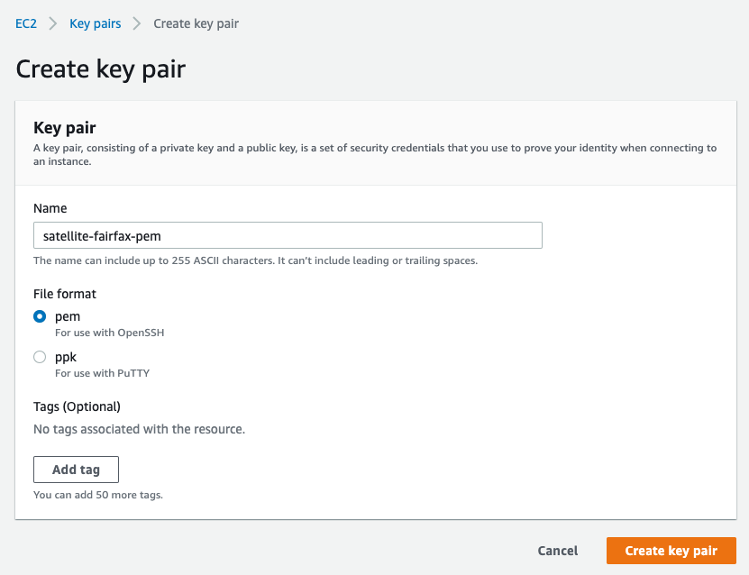

        !!! warning
            Be aware that when you clicked the `Create key pair` button, the browser automatically downloaded a file.  This is very important!!  This is your private key, and you will need it later if you use the `ssh` command to access your EC2 instance.  

            **DO NOT LOSE THIS FILE!**  You will never get a chance to download it again and without it you will not be able to access your EC2 instance.

## Create EC2 instances

Now we are ready to create some EC2 instances to use for the control plane for you IBM Cloud Satellite location.  These hosts have some minimum requirements, which are documented [here](https://cloud.ibm.com/docs/satellite?topic=satellite-host-reqs).  For the most part, the key requirements are:

- at least 4 vCPUs
- at least 16GB Memory
- at least 100GB attached storage

To create an EC2 instance:

1. Click on the `Instances` link in the left navigation menu of the EC2 Dashboard.

1. Click on the `Launch instances` dropdown and select `Launch instances`.

    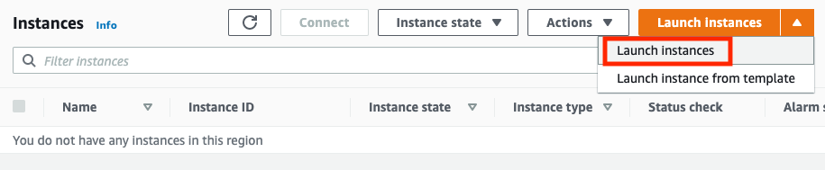

1. The first step is to select an Amazon Machine Image (AMI) to use for the EC2 instance.  Search for `RHEL-7.9` in the search window.  We want to use a community image, so click the link for results in Community AMIs.

    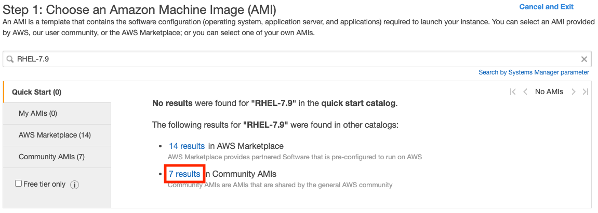

1. There should be an image on the list with a name like `RHEL-7.9_HVM_GA-20200917-x86_64-0-Hourly2-GP2`.  Click the `Select` button on the line containing that image.

    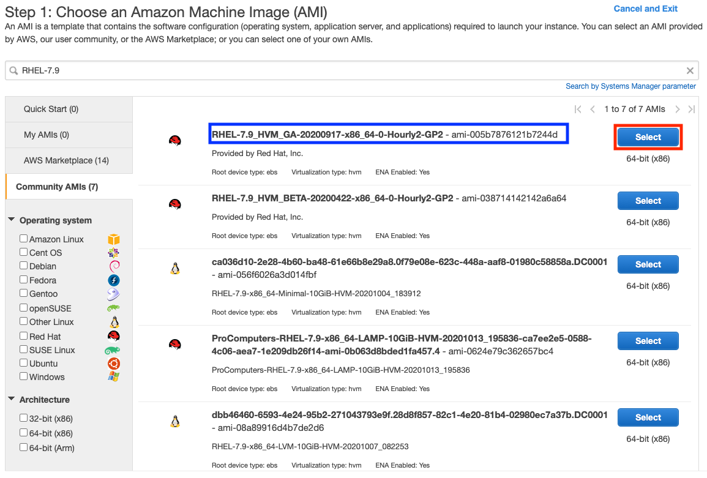

1. Next you need to choose the instance type.  This is the hardware configuration for the instance.  Click the checkbox next to `t3.xlarge`.  This type has 4 vCPUs and 16GB of RAM.  Click `Next: Configure Instance Details`.

    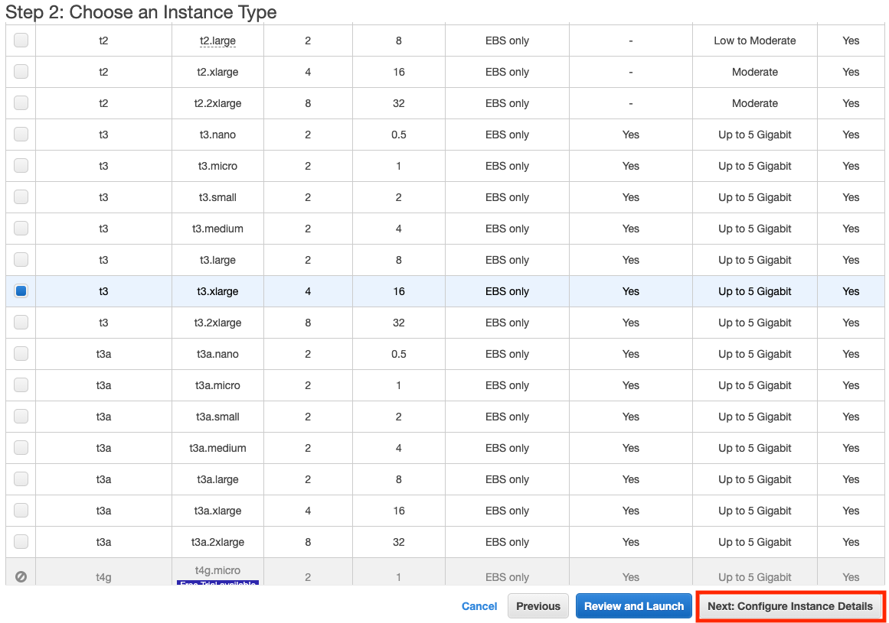

1. In the `Configure Instance Details` page there are several things we need to change.  
    - Click the `Network` dropdown and select your VPC.  The subnet should automatically fill in with one of the subnets in your VPC.  Click on the `Auto-assign Public IP` dropdown and choose `Enable`.

        !!! attention
            Take note of which subnet is selected!  We want each of our EC2 instances for the control plane to be on different subnets; this will give us instances in different availability zones for resilience.

        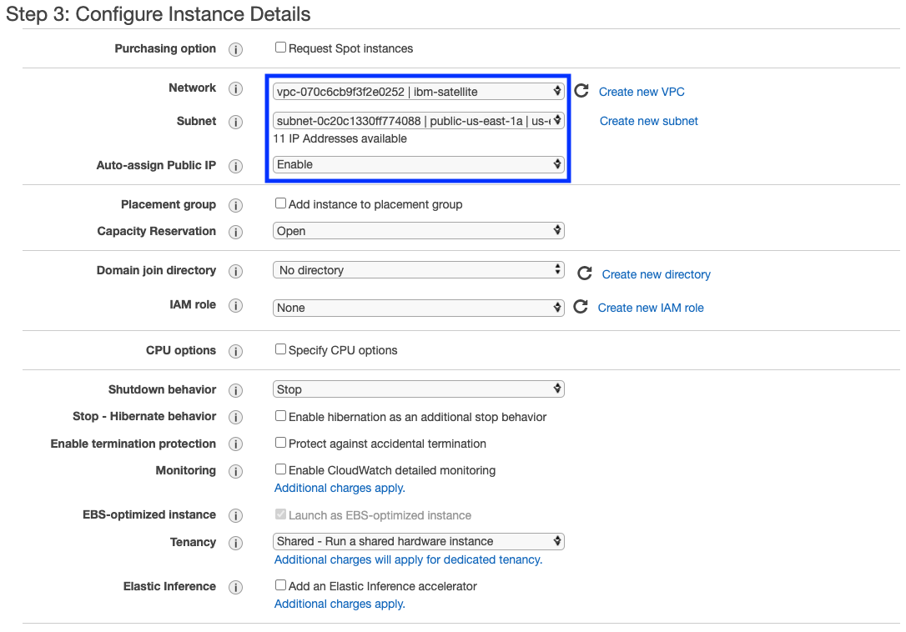

    - Scroll down to the bottom of the form and find the `user data` field.  This field can contain a script that will be automatically executed when the instance is created.  Click the `as file` radio button, click the `Choose file` button and select the script that you downloaded when you created your satellite location.

        !!! note
            Remmeber that you updated the script with some additional commands after you downloaded it.  Before selecting the file, check to be sure those updates are in the file.

        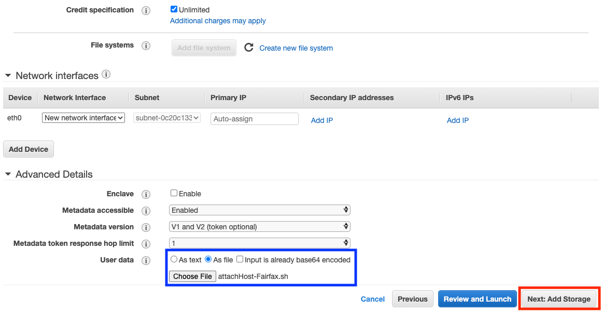

    Click the `Next: Add Storage` button.

1. All we need to do on the storage page is change the size of the volume to make sure it meets the minimum requirements.  Click in the `Size` field and change the value to `100`.  Click `Next: Add Tags`.

    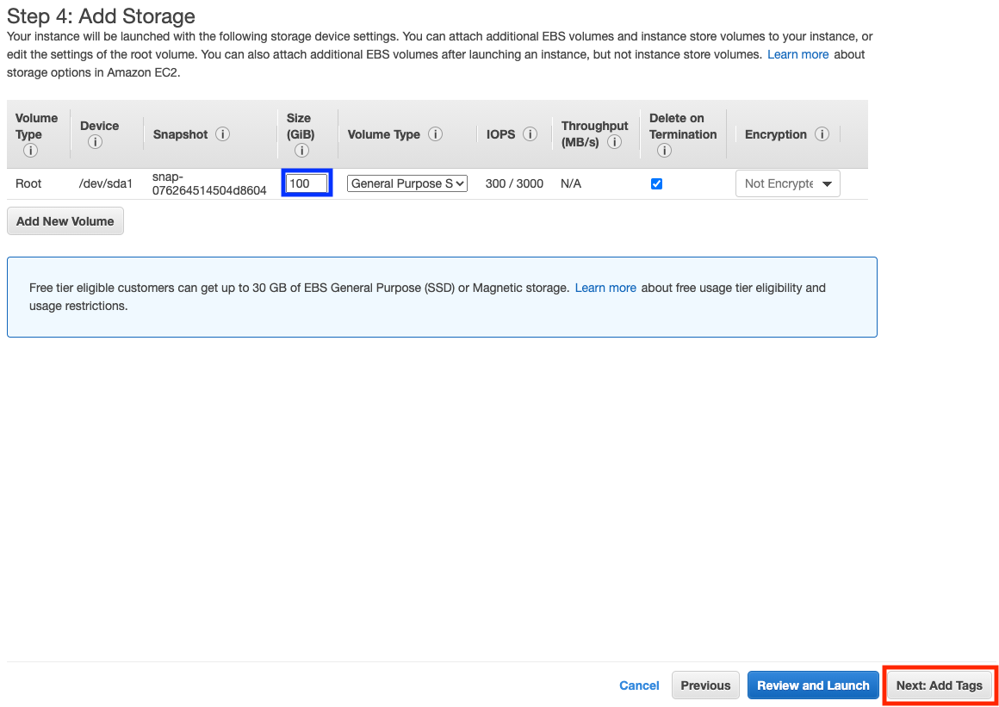

1.  Add some tags if you wish.  At a minumum you should provide a `Name` tag, which gives your EC2 instance a name.  It might be a good idea to add tags for `sat-location-name` and `sat-location-id` so that you have traceability back to your IBM Cloud Satellite location.  When done adding tags click `Next: Configure Security Group`.
    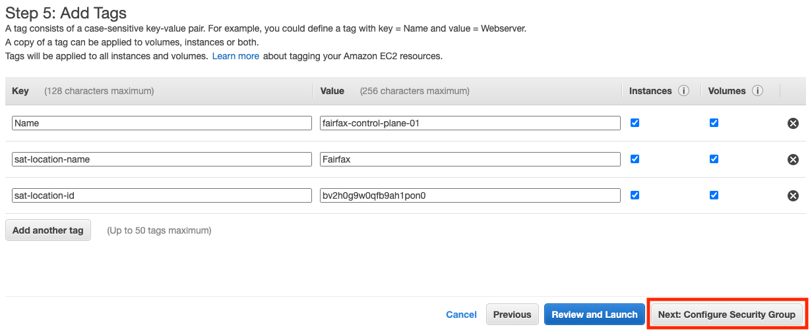

1. Next we need to specify the security group to attach to this EC2 instance.  We already created one earlier, so we will use that one.  Click the radio button for `Select an **existing** security group`, then click the checkbox next to the security group you created.  Click `Review and Launch`.

    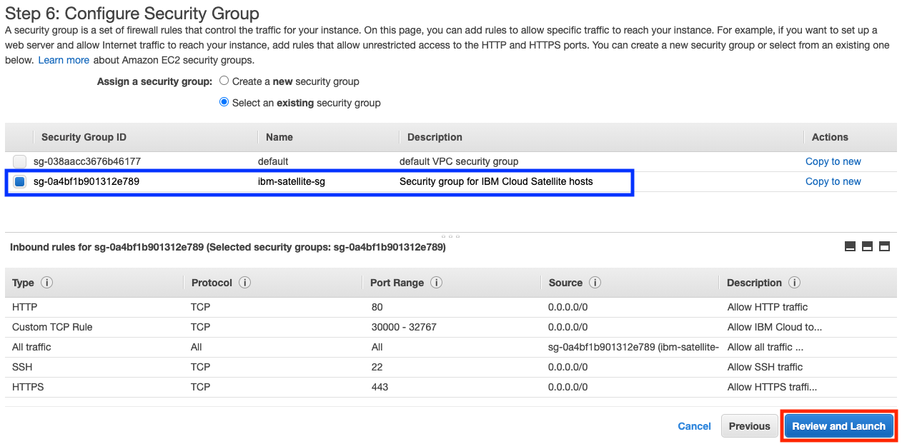

1. Review the details on the `Review Instance Launch` page to verify that they are correct.

    !!! caution
        You might see a warning that your security group is open to the world.  That is because we used `0.0.0.0/0` as the source for the inbound security rules.  That is okay for demo and testing purposes but is not best practices for production.  IBM documents the minumum required [inbound and outbound connectivity](https://cloud.ibm.com/docs/satellite?topic=satellite-host-reqs#reqs-host-network-firewall-inbound) requirements that are needed for your location to function properly.  More access may be required for services you provision into your IBM Satellite location.

1. When you are satisfied that everything is correct, click the `Launch` button.  A new dialog will pop up asking you to specify a key pair.  Make sure the first dropdown is set to `Choose an eisting key pair`.  If not, click the dropdown and select it.  Then click the second dropdown to choose the key pair you created earlier.  Click the checkbox acknowledging that you can't access the intance without the file.  Click `launch Instances`.

    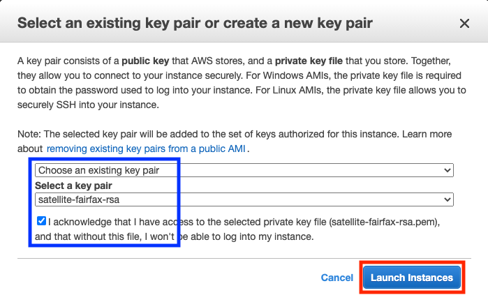

You will be shown a `Launch Status` page.  Click the `View Instances` button at the bottom to go back to the `Instances` dashboard.  You may also want to go back to your IBM Satellite location and view the `Hosts` tab.  After a few minutes your new EC2 instance should show up.

At this point you should see your EC2 instance being provisioned.  Once created it will run the registration script you generated when you created your location and will attach itself to your location.  Usually this process takes just a few minutes.  When it is ready you will see your host on the `Hosts` page for your location.

Now repeat the steps above to create two more EC2 instances.  Remember to:

- Use a different subnet in your VPC for each instance.  You want each of your three control plane hosts to be in a different availability zone.
- Use a different value for the `Name` tag so that each instance has a unique name.

Once all three instances are up and running your `Instances` view in the EC2 dashboard will look like this:

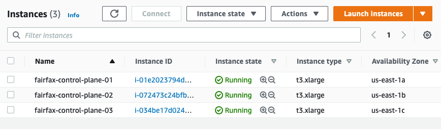

!!! attention
    The control plane for an IBM Cloud Satellite location requires at least 3 hosts that are managed from 3 different availability zones in IBM Cloud.  The hosts themselves do not have to be separated from each other, but it is a good practice to separate them if possible.

When they have all been attached to your satellite location you will see them in the `Hosts` page.

!!! note
    It may take several minutes for the hosts to appear in the satellite location hosts page.

**Congratulations!**  You have successfully created EC2 instances and attached them to your IBM Satellite location.  Next we will assign them to the control plane for your location.