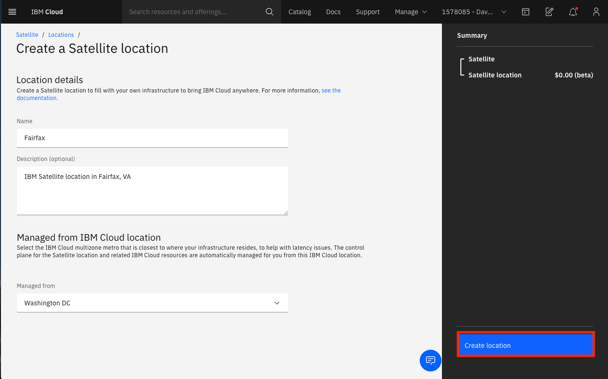
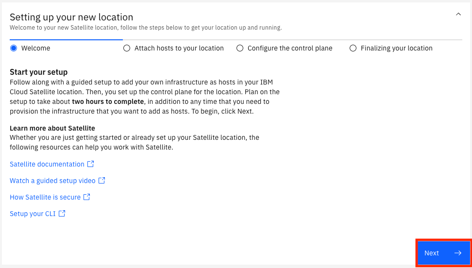
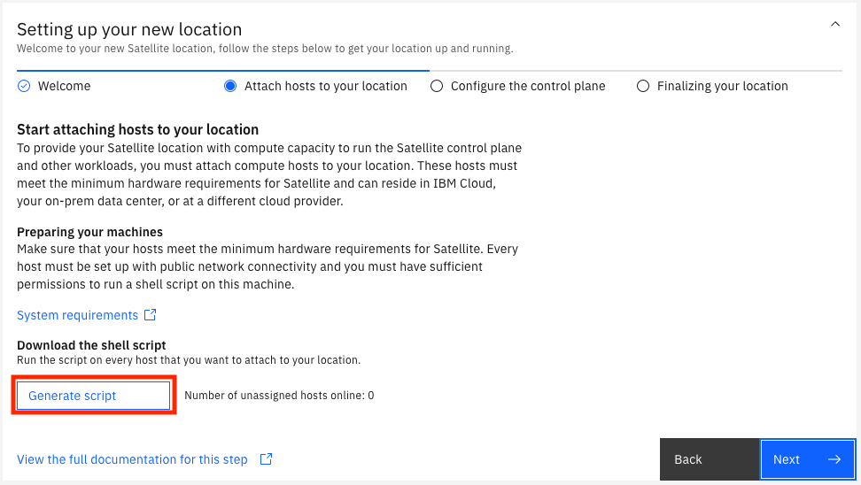
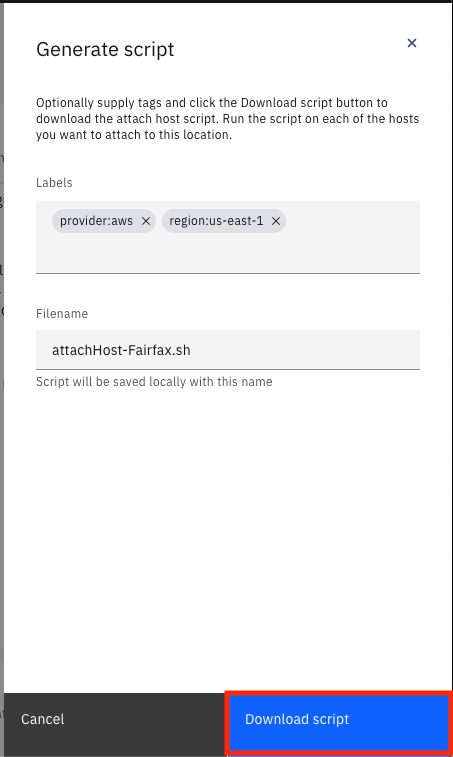
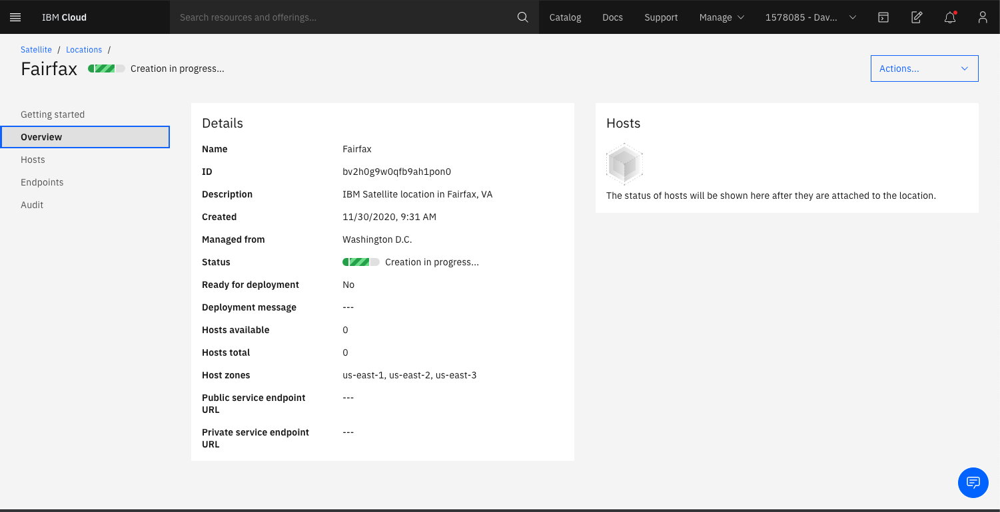
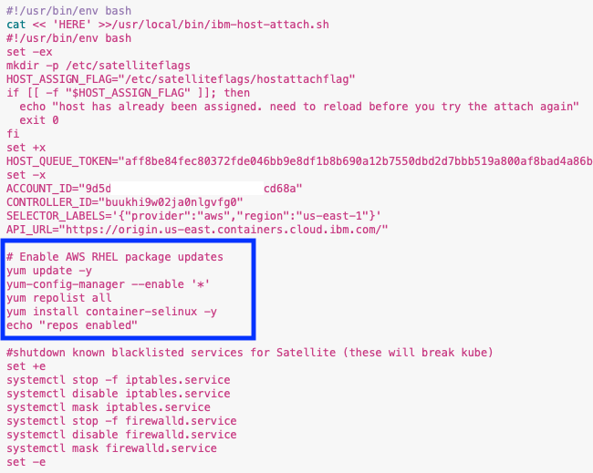

# Overview

Creating an IBM Satellite Location is actually pretty simple.  We simply need to give it a name and specify the IBM Cloud Multi-Zone Region from which the satellite location will be managed.  We also need to generate and download a script that will be run on each host to attach it to the satellite location.

## Create Location

1. Click on the  icon then click on `Satellite`.  Click on the `Create a Satellite location` button.

1. Fill out the name and (optional) description for your location.  Click on the `Managed from` dropdown and select `Washington DC`.

    !!! info
        IBM Satellite locations can have hosts wherever you need them, but your location is still managed from a Multi-Zone Region (MZR) in IBM Cloud.  There will be management traffic between hosts in your location and the MZR, so be sure to select the MZR that is closest to your location.

    

1. Click the `Create Location` button to create your location.  You will be taken to the `Getting Started` page for your location.  It is a helpful wizard that explains what you need to do next to finish setting up your location.  We will be doing some of this in the next steps, but we do need to generate a script that we will need later.  Click on `Next`.

    

1. Click on the `Generate script` button.

    

1. Add some tags if you wish, then click the `Download script` button.

    

1. We will come back and finish the configuration later.  For now, click the `Overview` link on the left navigation menu to see a summary of your location.  

    

    !!! note
        The status field for your location may be slighly different than the one in the screen shot above.

    !!! tip
        Many of the components you will create in AWS allow tags, so take note of the name and ID of your location.  It is helpful to add `sat-location-name` and `sat-location-id` tags to your AWS resources using these values so that you can later link them back to which location they are attached.

## Update registration script

In order to attach hosts to your satellite location you have to run the script you downloaded in the previous section.  In many cases you will need to do this manually, but with AWS you can provide a cloud-init script that will run when the EC2 instance gets created.  We will use this feature, but first we need to edit the script; we also need to run some operating system updates, as documented [step 2 here](https://cloud.ibm.com/docs/satellite?topic=satellite-providers#aws-reqs-launch-template), and we can add these commands to the script.

1. Open the script you downloaded in the text editor of your choice.  Add the following lines to the script after the line that sets the `API_URL` environment variable.

    
        # Enable AWS RHEL package updates
        yum update -y
        yum-config-manager --enable '*'
        yum repolist all
        yum install container-selinux -y
        echo "repos enabled" 
    

    Your script should look like this:

    

1. Save the script; we will use it later when we create the hosts.

**That's it for now.  Next it is time to create all of the prerequisite resources in AWS.**

## (Alternative Path) Creating AWS resources with terraform

If you know how to use terraform there is a folder in this repo that contains [terraform scripts](https://github.com/dwakeman/cloud-adoption-ibm/tree/main/docs/satellite/terraform/aws) for creating all of the AWS resources, including the EC2 instances.  Before you run the terraform you need to create your location and generate/download the registration script.  

!!! note
    This terraform will create 3 EC2 instance for the control plane and 3 instances for use as worker nodes for an OpenShift cluster.  If you don't want to create the worker node hosts right away you can comment them out in `main.tf`.

To use Terraform to create your AWS resources: 

1. Create your location and download the registration script.
1. Copy and paste the contents of the registration script into the `userdata.sh` script in the terraform folder.
1. Update the `userdata.sh` script by following the step 2 of the instructions [here](https://cloud.ibm.com/docs/satellite?topic=satellite-providers#aws-reqs-launch-template).  You only need to do step 2.
1. Update the `provider.tf` file with the appropriate AWS region you want to use.
1. Update the `variables.tf` file as appropriate:
    - Set the `satellite-location-name` to a value that does not include any spaces.  This does not have to match your location name in IBM Cloud, it's just a value to be used when naming resources.
    - Set the availability zones as appropriate for the region you chose.
    - Specify the name of the SSH key you created in AWS.
    - Specify the AMI to use.  The name of the one I used is `RHEL-7.9_HVM_GA-20200917-x86_64-0-Hourly2-GP2`.  In my account the AMI id is `ami-0d2bf41df19c4aac7` but I am not sure that is the same ID in every account.
    - set the `control-plane-instance-type` as appropriate.  The type `t3.xlarge` does work.
    - set the `worker-plane-instance type as appropriate.  It can be the same as the control plane.
1. Make sure you have the AWS CLI installed and a configuration profile set so that it knows what credentials to use.  More information about authentication with the AWS terraform provider can be found [here](https://registry.terraform.io/providers/hashicorp/aws/latest/docs#authentication).  If you don't want to install the AWS CLI you might be able to use environment variables to set your access key and secret key.
1. Run `terraform init` to initialize the AWS terraform provider.  Run`terraform plan` to see what the script will do, then run `terraform apply` to create the resources.

