# Prerequisites

Before we can create hosts to be used with an IBM Cloud Satellite location we must build a number of underlying resources that will be needed.  We also need to set up appropriate configuration of the networking components so that traffic will be allowed to flow appropriately betweeen IBM Cloud and your location.

These instructions assume that you have an AWS account (either your own account or a user in an existing acccout) where you have Administrator access.  Technically you only need certain permissions to create the necessary resources, but for convenience you should try and use an account where you have administrive access.

You need virtual servers (EC2 instances) to be hosts for your location.  To create EC2 instance you will first need to create some other resources:

1. VPC 
1. 3 subnets in different availability zones
1. Internet gateway attached to VPC
1. Route table for VPC with two routes:
    - "local" - this should be created by default
    - `0.0.0.0/0` - Internet gateway
1. Security Group with appropriate rules
1. SSH key

So log into your AWS account and let's get started!

## Create VPC

Navigate to the VPC console in AWS.  The console will look like the screen shot below.  Notice the AWS region that is selected, as indicated by the blue box in the top right corner.  This is the AWS region the VPC console will use by default when you create resources.

!!! tip
    Make sure that you select the region in which you want to create your IBM Satellite location before creating any resources.

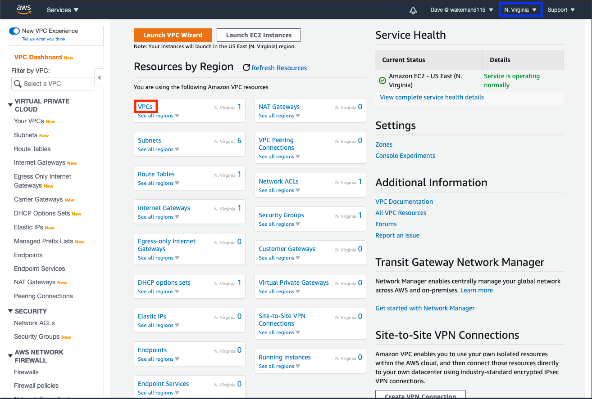

To create a VPC:

1. Click on the `VPCs` link to see the list of VPCs for this region.  AWS automatically creates a default VPC for you when you create your account, so there should already be one in the list.  We will be creating a new one for your satellite location, so click on the `Create VPC` button.

    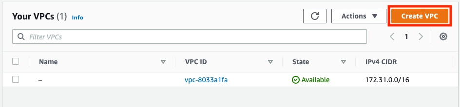

1. Provide a name for your VPC.  

    !!! Info
        [CIDR](https://en.wikipedia.org/wiki/Classless_Inter-Domain_Routing#:~:text=Carl%2DHerbert%20Rokitansky.-,CIDR%20notation,traditionally%20called%20the%20network%20mask.) is a notation for defining blocks of IP addresses.  There are many tools on the internet for converting CIDR blocks to IP Ranges and vice versa.  I commonly use [IP Address Guide](https://www.ipaddressguide.com/cidr).

        For this location we will need 3 subnets, and each one only needs 16 IP addresses.  The CIDR block for the VPC represents all of the IP addresses that could be used in all of its subnets.  We will use `/28` (16 IP Addresses) for our subnets and `/24` (255 IP Addresses) for the VPC itself.

1. Enter `10.5.0.0/24` in the IPv4 CIDR block field.

    !!! caution
        IP address ranges within a VPC are private to that VPC.  However, there may be instances where you need to connect multiple subnets to each other to allow traffic to flow between them.  Therefore, in real scenarios you should take care to use CIDR blocks for each VPC that do not overlap with other VPCs.  That way each subnet will have a unique set of IP addresses and will not cause conflicting routes.

1. Add tags to your VPC.  There is already one there for the name of the VPC; I usually add tags with the name and id of my satellite location in IBM Cloud for traceability.  Since we created the location already I have added two additional tags:  `sat-location-name` and `sat-location-id` using the values from my location.

    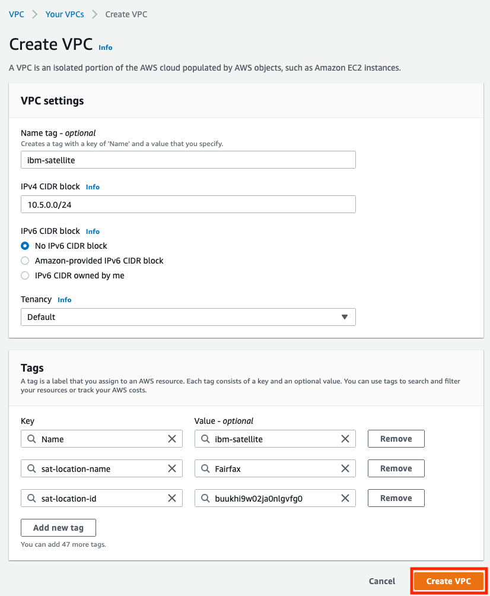

1. Click `Create VPC`.

## Create Internet Gateway

In order for your hosts to communicate with resources on the internet (and for them to be reachable from the internet) you need an Internet Gateway.  After the previous step where you created your VPC you probably landed on a page that looks like this:

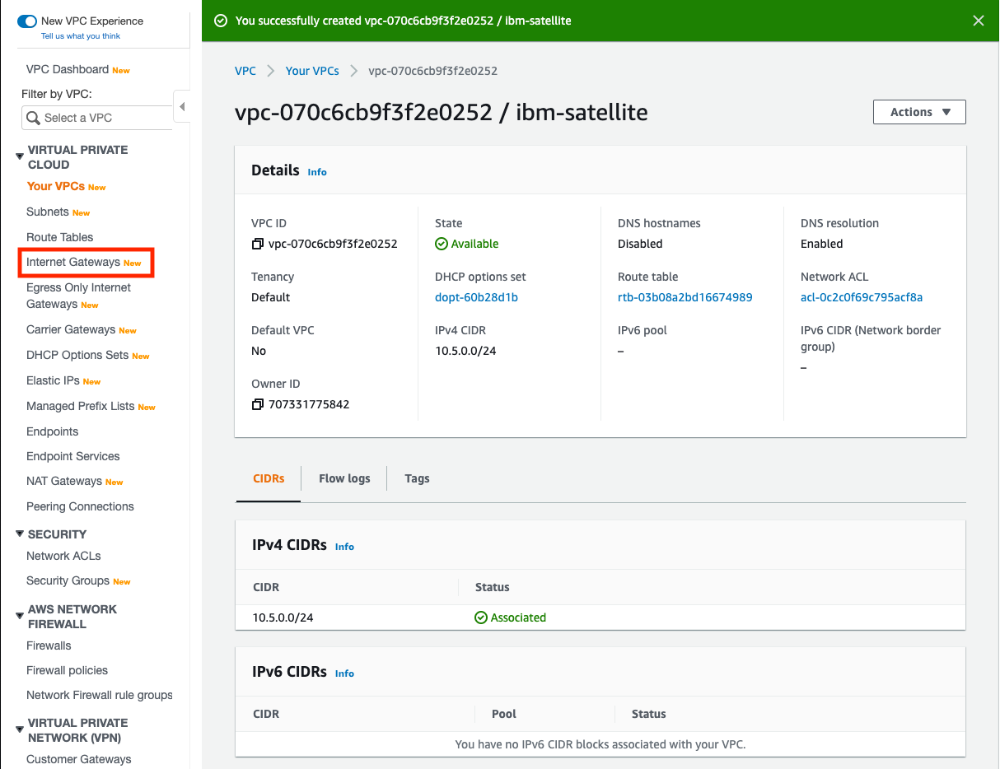

To create an Internet Gateway:

1. Click on the `Internet Gateways` link in the left navigation menu.  There should already be an internet gateway on this list; it is attached to your default VPC.  

    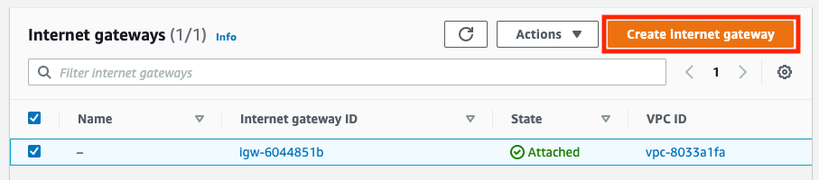

1. Click the `Create internet gateway` button.  Give your gateway a name and add some tags if you wish.  Click on the `Create internet gateway` button to create your gateway.

    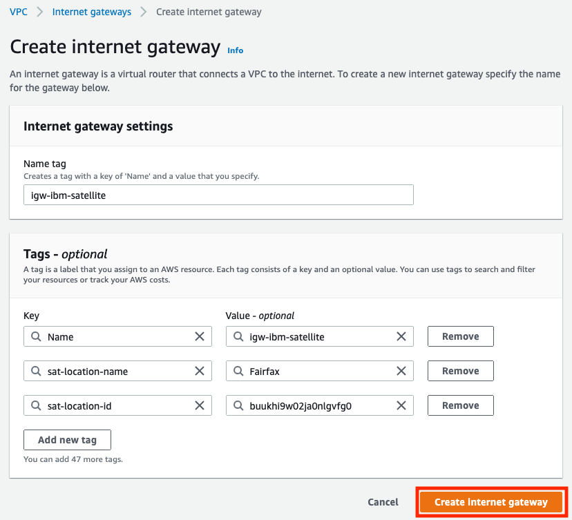

1. Notice that the gateway status is `Detached`, as indicated by the blue box in the image below.  We need to attach this gateway to the VPC we just created.  If the banner is still visible, like in the image below, click on the `Attach to a VPC` button.  If not, click on the `Actions` menu and choose `Attach VPC`.

    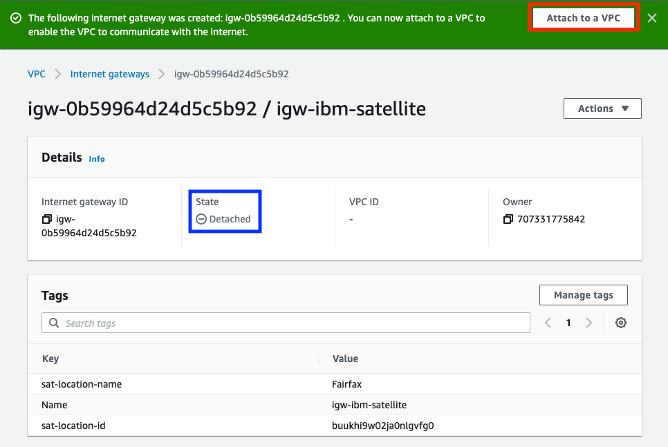

1. Click in the `Available VPCs` search box and select the VPC you just created.  Click `Attach internet gateway`.

    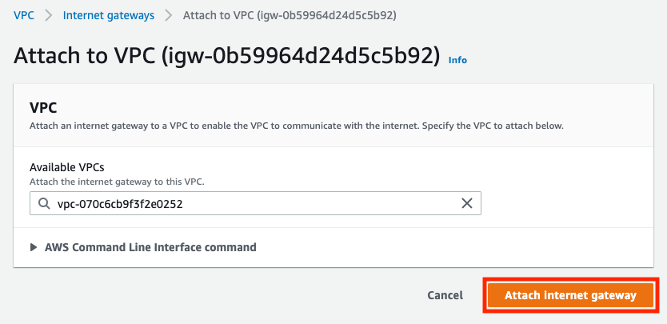

1. Your internet gateway is now attached to your VPC.

    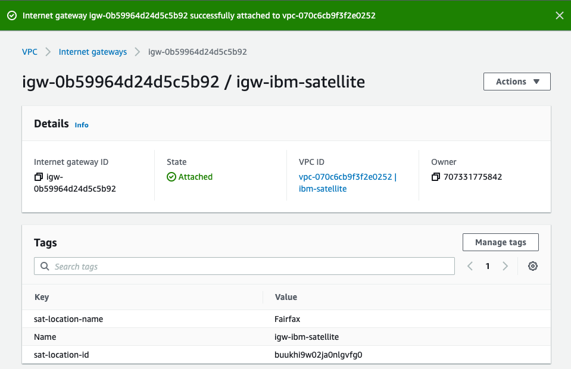

## Create Security Group

1. Click on the `Security Groups` link in the left navigation menu of the VPC dashboard.

    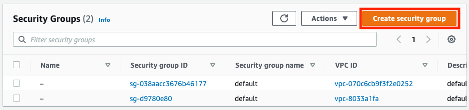

1. Give your security group a name and description.

1. Click on the `VPC` dropdown and select your VPC.

    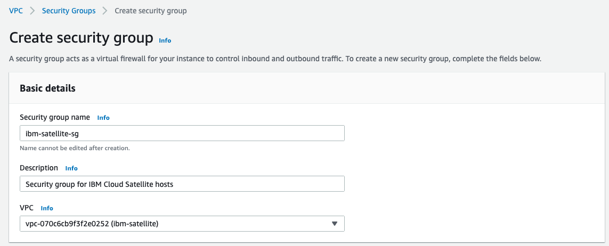

1. In the `Outbound rules` you can see that there is already a rule to allow traffic on all ports to all IPv4 destinations.  

    !!! attention
        If you are not able to open up all protocols and ports for outbound connectivity, you must meet the minimun requirements documented [here](https://cloud.ibm.com/docs/satellite?topic=satellite-host-reqs#reqs-host-network-firewall-outbound).  Otherwize your location will not be able to function properly.

1.  In the `Inbound rules` section we will need to add some rules.  Use the table below to as you create the inbound rules:

    | Type | Port range | Source | Description |
    |------|------------|--------|-------------|
    | Custom TCP | 30000-32767 | 0.0.0.0/0 | Allow IBM Cloud to set up and manage your Satellite location |
    | All Traffic | All | Security Group | Allow all traffic for hosts in this security group |
    | Custom TCP | 80 | 0.0.0.0/0 | Optional: Access the Red Hat OpenShift on IBM Cloud console on the public network |
    | Custom TCP | 443 | 0.0.0.0/0 | Optional: Access the Red Hat OpenShift on IBM Cloud console on the public network |
    | Custom TCP | 22 | 0.0.0.0/0 | Optional: Allow SSH traffic |
    

    !!! attention
        The minimum set of inbound rules required for your location to function properly can be found [here](https://cloud.ibm.com/docs/satellite?topic=satellite-host-reqs#reqs-host-network-firewall-inbound).

1. Let's create the first inbound rule.  In the `Inbound rules` section, click the `Add rule` button.  set the port range to `30000-32767`.  Click on the `Source` search field and select `0.0.0.0/0`.  Add a description if you wish.

1. Click the `Add rule` button again to create the third rule.  Set the port range to `80`.  Click on the `Source` search field and select `0.0.0.0/0`.

1. Click the `Add rule` button again to create the fourth rule for port `443`.  Click on the `Source` search field and select `0.0.0.0/0`.

1. Click the `Add rule` button again to create the fifth rule for port `22`.  Click on the `Source` search field and select `0.0.0.0/0`.  At this point your inbound and outbound rules should look like this:

    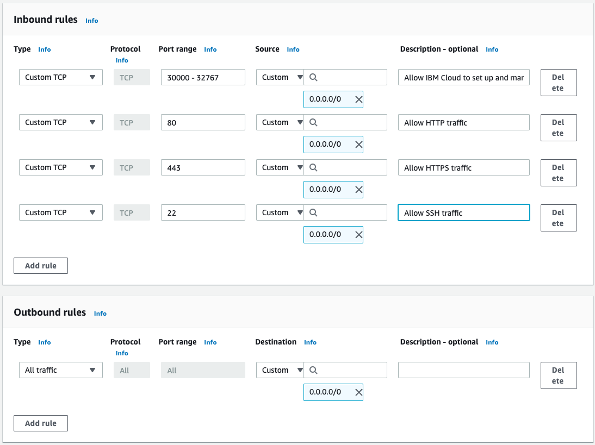

    !!! note
        Need to update this graphic.  Security group rule is missing!  Apparently we can't add a rule for this security group until we create it.  Therefore we will need to create it, then come back in and add the last rule.

1. Add some tags if you wish.  Scroll to the bottom of the page and click `Create security group`.  You should see that your group was created:

    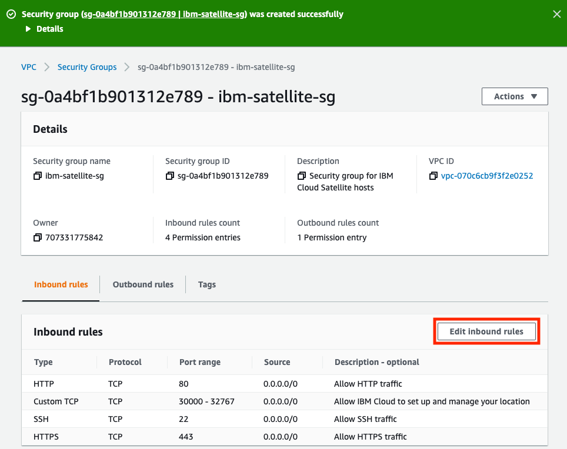

1. We have one more rule to add to the security group - one that allows all traffic on all ports from sources inside this security group.  This rule will allow all hosts attached to this security group to talk to each other on all ports.  Click on the `Edit inbound rules` button.

1. Click on `Add rule` to create another rule.  Set the `Type` to `All traffic` and the `Source type` to `Custom`.  Click in the `Source` field and choose your security group from the `Security Groups` section of the list.

    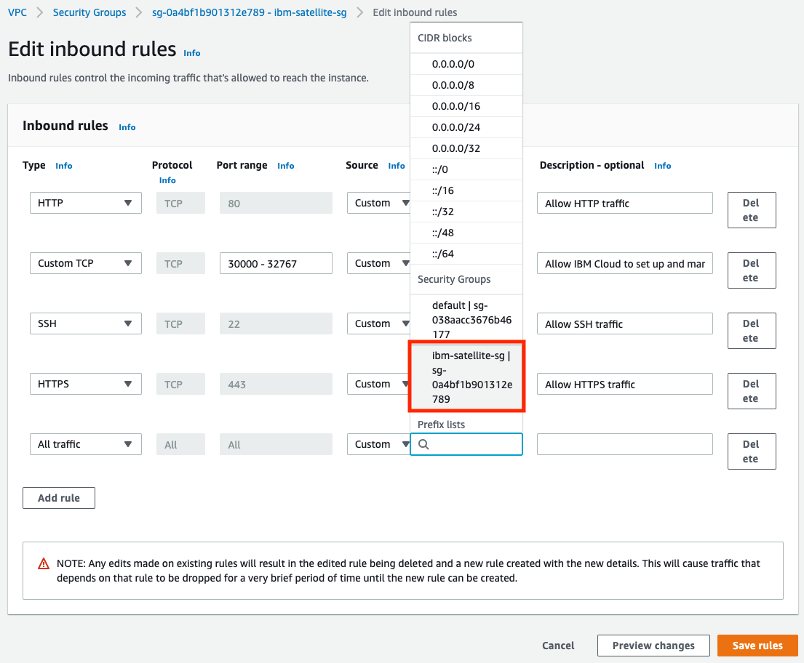

1. Click `Save rules`.  The updated set of rules should look like this:

    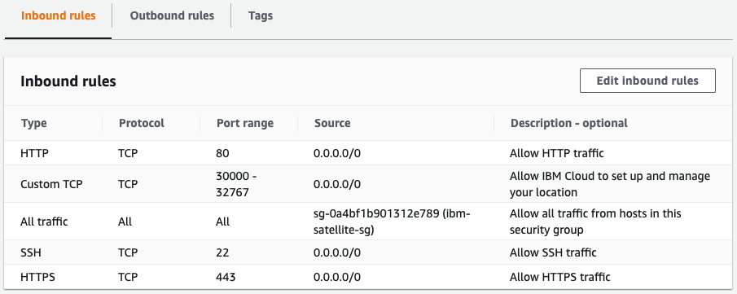

## Create Subnets

Next we need to create some subnets in the VPC so that we can provision some hosts.  In AWS subnets are tied to a specific Availability Zone (AZ) with in a region.  An availability zone is defined as a unique data center/location with its own independent power, networking, cooling, etc.  Availability zones allow you to separate workloads in order to build resilient, highly available applications or systems.  Regions can have different nubmers of availability zones, but each region will have at least three of them.

!!! info
    There is no hard and fast requirement about workload isolation for IBM Cloud Satellite, but is considered a best practices to have hosts in at least 3 different availability zones for any IBM Cloud service you provision into your satellite location.

!!! example
    The table below contains information we will use to create subnets for this exercise.  Each subnet will be created in a separate availability zone in AWS.  This will allow us to provision hosts in each zone.

    | Subnet Name | Availability Zone | CIDR Block |
    |-------------|-------------------|------------|
    | public-us-east-1a | US East (N. Virginia) / us-east-1a | 10.5.0.0/28 |
    | public-us-east-1b | US East (N. Virginia) / us-east-1b | 10.5.0.16/28 |
    | public-us-east-1c | US East (N. Virginia) / us-east-1c | 10.5.0.32/28 |

To create a subnet:

1. Click on the `Subnets` link in the left navigation menu on the VPC Dashboard.

1. There should already be some subnets in the list; these are most likely the subnets that were automatically created with the default VPC.  We will need to create new ones, so click the `Create subnet` button in the top right corner.

1. Click the `VPC ID` field and select the VPC you created.

1. Give your subnet a name; you can use the one from the first row of the table above or use your own.

1. Select the Availability zone.  

1. This step is very important!  Your IPv4 CIDR block must fall within the CIDR block for the VPC (which is shown at the top of the page), and it must not conflict with any other subnets.  Provide a value in the `IPv4 CIDR block` field.

1. Add some tags if you wish and click the `Create subnet` button at the bottom right.

    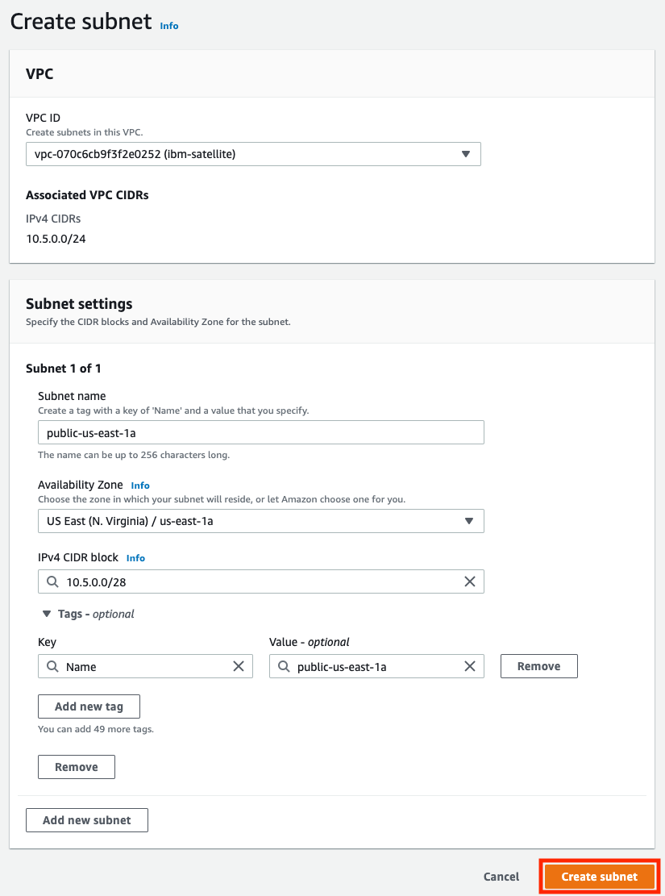

1. Repeat the steps above to create another subnet in a different availability zone.  

1. Repeat the steps above to create a third subnet in a different availability zone than the other two subnets.

You should now have 3 new subnets, in different availability zones, in your new VPC.

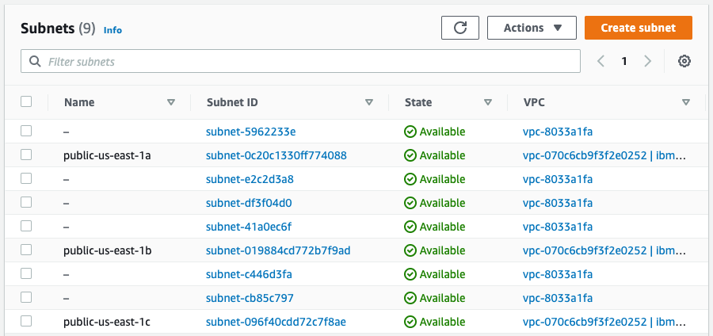

## Create Route Table

Route tables define the appropriate rules for routing traffic where it needs to go.  A default route table was created when you created your VPC; it has one route in it that allows traffic within the VPC to be routed to hosts anywhere inside the CIDR block defined for the VPC.  This is often called a "local" route because the target field is set to `local`.  

Any traffic not destined for a host within the VPC will not get routed, as there are no valid routes to IP addresses outside the VPC.  This is the default routing that AWS sets up for VPCs, in order to protect resources in the VPC.  When subnets are created in the VPC they are implicitly associated the default route table unless they are explicity associated with one.

To create a route table:

1. Navigate to the route tables list by clicking on the `Route Tables` link in the left navigation menu.

1. Click on the blue `Create route table` button.

1. Give your route table a name in the `Name tag` field.

1. Click on the `VPC` dropdown and select your VPC.

1. Add some tags if you wish and then click the `Create` button.

    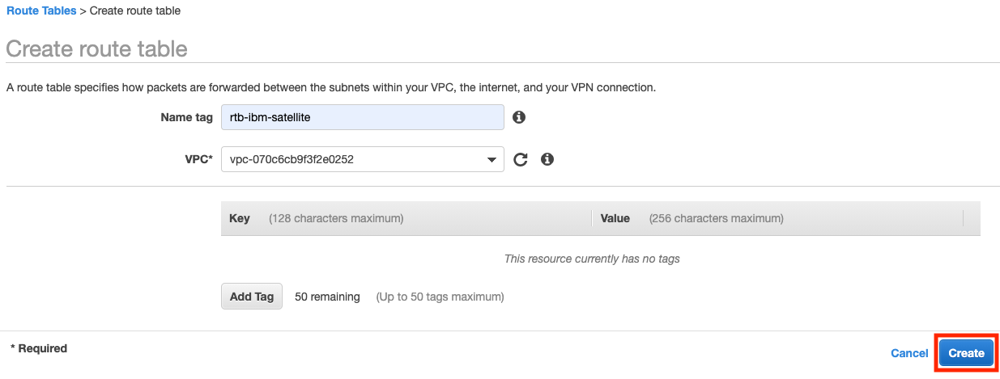

1. Click the Close button.

    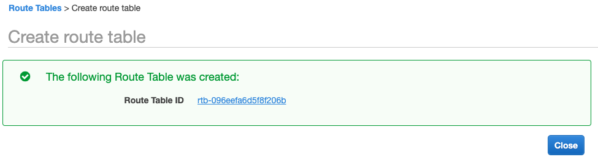

1. You should now be back on the list of route tables.  Click the checkbox next to the name of your route table.  Notice that some tabs below appear below.  Click on the `Routes` tab.  You can see that your route table has one route already; this is the default route that allows traffic to flow freely within the VPC.

    !!! attention
        This route is a requirement for IBM Cloud Satellite.  All of the hosts within the location must be able to communicate with each other.  It is standard practice to have this rule in the route table; if isolation is needed it can be implemented in security groups.

1. We need to add another route that will cover traffic whose destination is outside the VPC.  Earlier we created an internet gateway to allow access to the internet; now we need to add a route to send that traffic to the internet gateway.  Click on the `Edit routes` button.

    

1. Click the `Add route` button to add the new route.  Enter `0.0.0.0/0` in the destination field.  This will send all traffic not covered by other routes in the table.  In the `Target` field choose `Internet Gateway`.  This will change the field into a dropdown that should show the internet gateway you created earlier.

    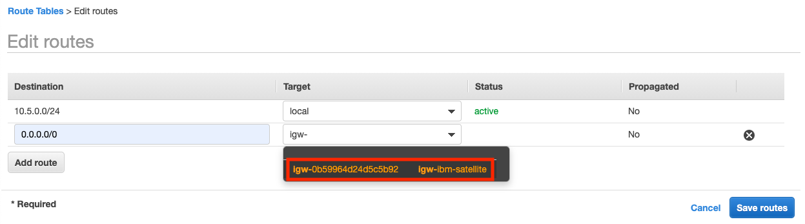

    Then Click on `Save routes`.

    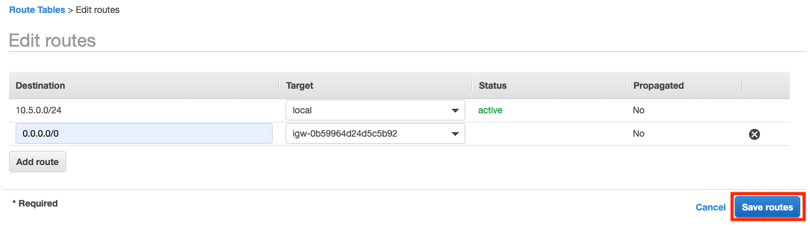

    Click `Close`.

1. Now you can see that the route table has been updated with your new route.

    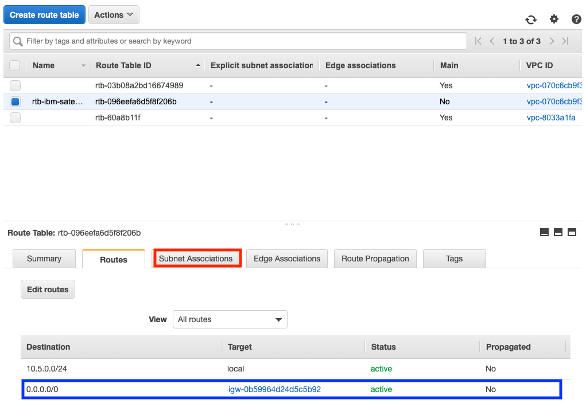

1. The last thing we need to do is associate this route table to the subnets in your VPC.  Click on the `Subnet Associations` tab.  Click the `Edit subnet associations` button.  Click the checkbox by each of the 3 subnets and then click `Save`.

    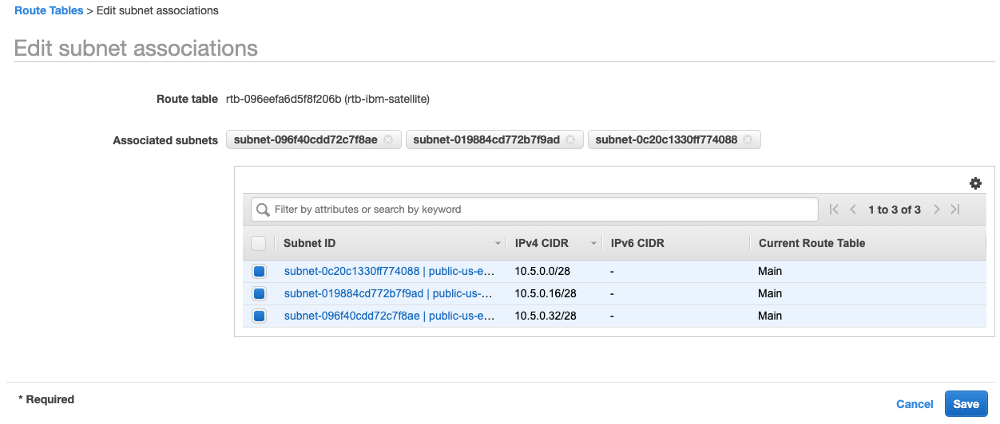

1. Now you can see that all of your subnets are explicitly associated with your route table.

    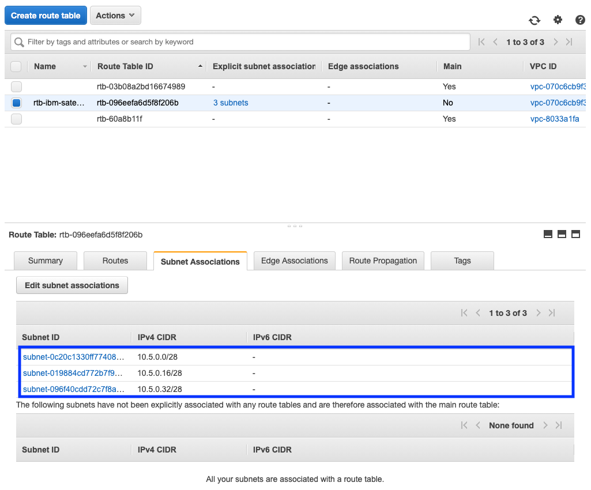
