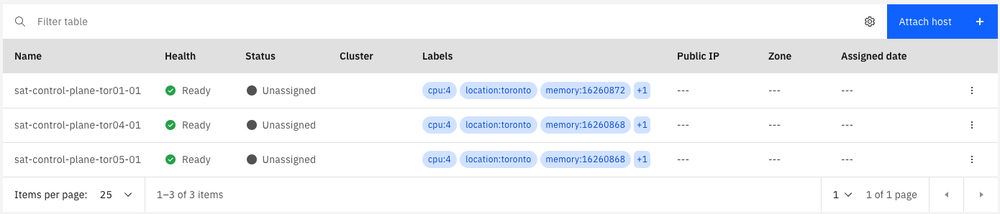
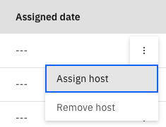
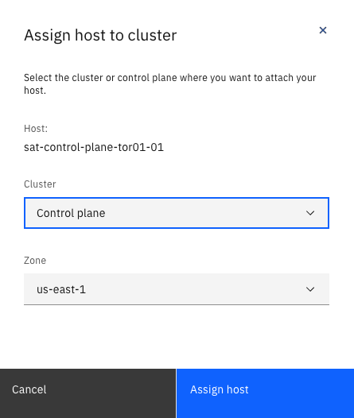
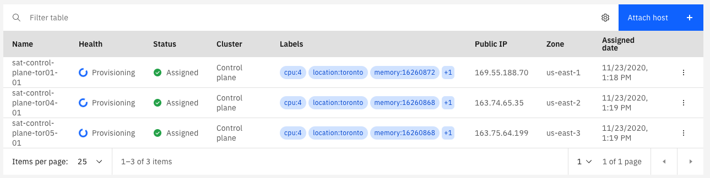
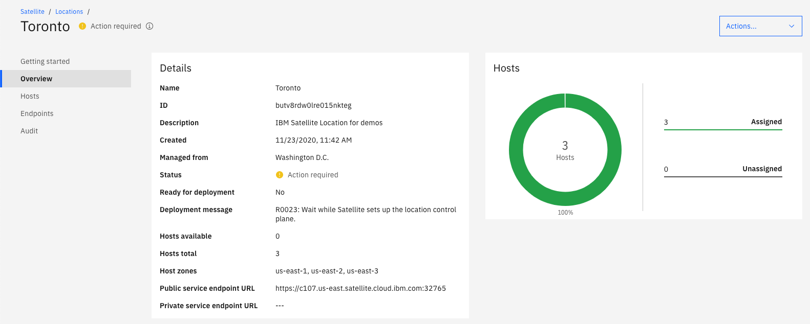
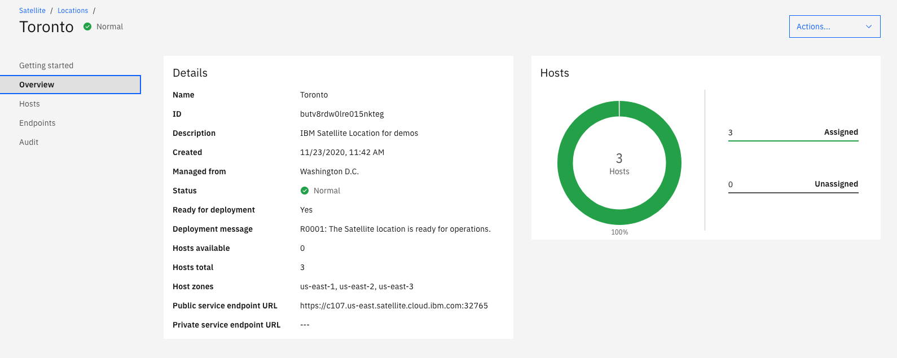

# Assign hosts to the control plane

Hosts will become available when the attach script on each host runs.  You will need a minimum of three hosts for the satellite location control plane.  Ideally these three machines will be geographically dispursed in some way so that the loss of one control plane host does not cause an outage.  

As each of your three hosts that you want to use for your control plane become available on the Hosts tab, you can assign them to the control plane.  When you assign a host to the control plane you choose which Availability zone in the IBM Cloud Multi-Zone Region (MZR) you want to manage the host.  You will be required to assign each host to a different Availability Zone; for resiliency purposes the location will not become available until it has 3 control plane hosts managed by 3 different Availability Zones!

To assign hosts to the control plane:

1. Go to your satellite location in IBM Cloud and go to the `Hosts` page using the left navigation menu.  You should see your host attached hosts.  If some are not there and you recently ran the registration script, wait a few minutes for them to show up.  The registration process typically only takes a few minutes.

    

1. Click the three dots at the right end of the line containing one of your hosts and choose `Assign host`.

    

1. In the dialog that pops up, choose `Control plane` in the `Cluster` field.  At this point it will be your only choice, but once you have the control plane provisioned and you assign other hosts, you could assign more hosts to your control plane.  Or, you could assign them to other clusters that you may have created.

    

1. Repeat these steps for your other two hosts.  Be sure to assign each one to a different zone in the `Zone` field; your location will not become available until your control plane has three hosts assigned to different zones!!

    After you have assigned all three hosts you will see their status change to `Provisioning` in the table.

    

That's it!  Now you just wait until provisioning is complete.  You can monitor the progress from the `Overview` page for your location.  You will see various messages in the `Deployment messages` field as it progresses.

When your location is ready the `Overview` page will look like this:

