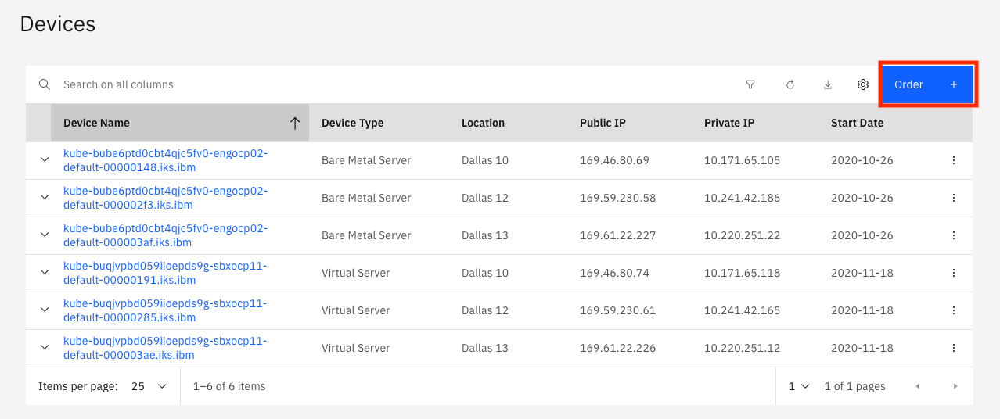
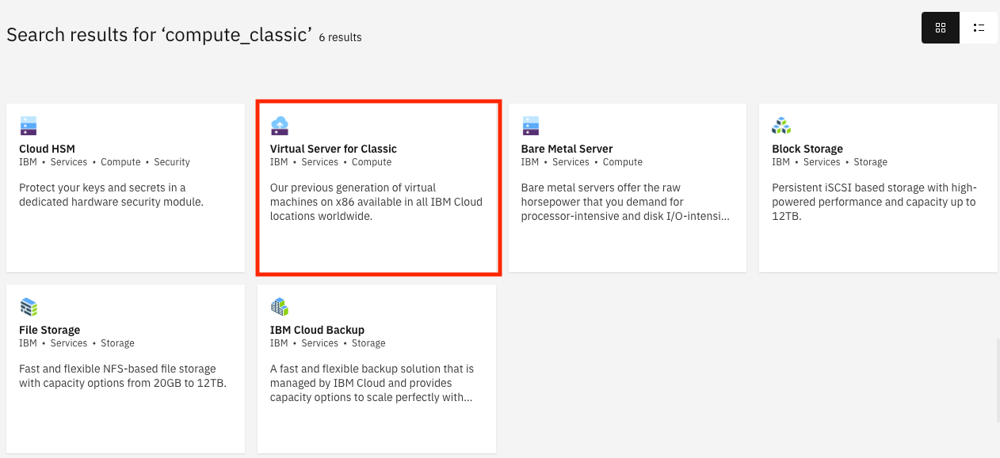
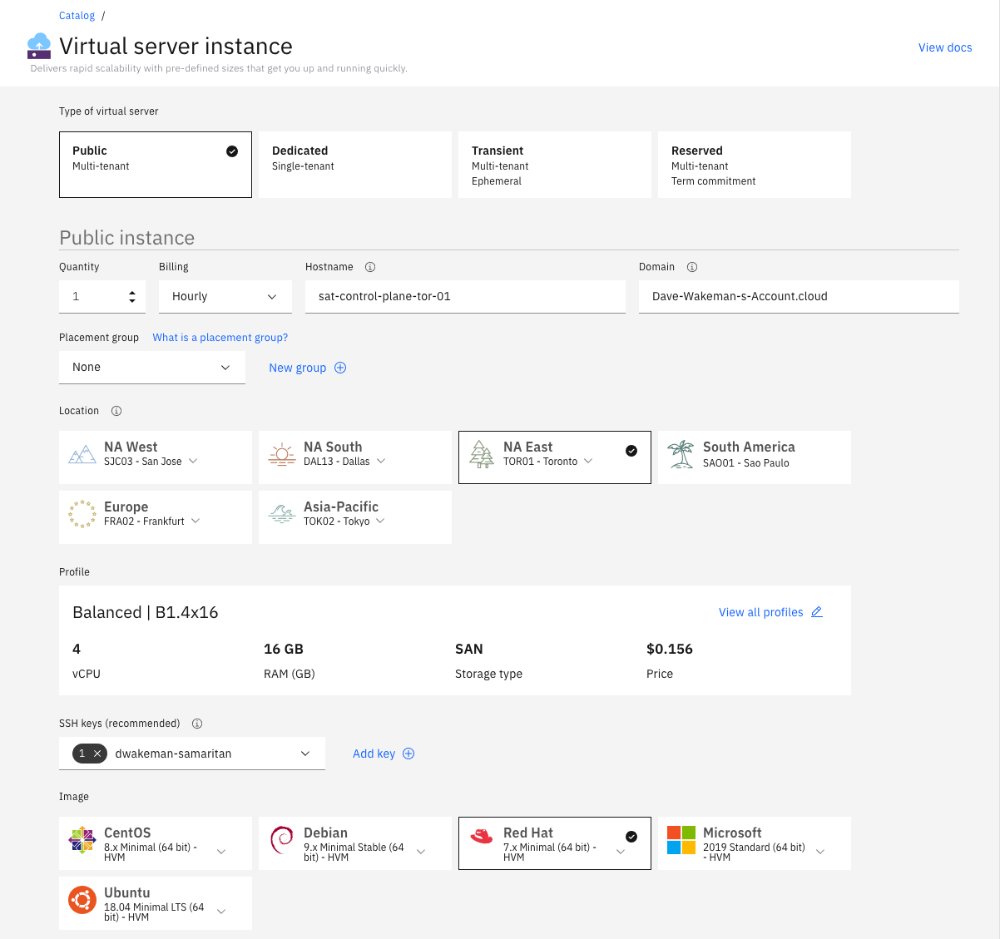
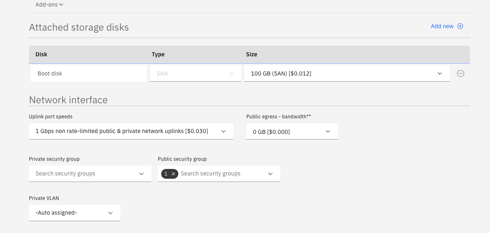

# Create hosts

We should create 3 hosts for the Satellite control plane.  If possible they should be in three different availability zones.  They do NOT need to be in an MZR, but they will be managed from one, so they should be located geographically as close as possible to the MZR you will choose.  In the Beta, only US East (Washington DC) is available in North America, and London in Europe.

To create a host:

1. Log into the IBM Cloud Portal click the  icon and choose `Classic Infrastructure`.  You will probably land on the `Devices` page, but if you don't click on `Devices` on the left navigation menu and then click `Order`.

    

1. Click on the `Virtual Server for Classic` tile.

    

1.  On the next screen, fill in the details for your virtual server.  This example assumes that a satellite location in Toronto is being created.  At a minimum, make these selections:

    - Specify a unique hostname.  
    - For location, select the `NA East` tile and `TOR01 - Toronto` in the dropdown.
    - In the profile section, click the `View all profiles` link and choose `B1.4x16`.  Click `Save profile`.
    - Select your SSH key (the one you created earlier) in the `SSH keys` field.  
    - In the `Image` field select the `Red Hat` tile and choose `7.x Minimal (64-bit) - HVM`.
    - In `Attached storage disks` change the size of the boot disk to 100 GB.
    - (Optional) In the `Network interface` field click the `Uplink port speeds` dropdown and choose `1 Gbps non rate-limited public & private network uplinks`.
    - Click the `Public Security Group` dropdown and pick the `ibm_satellite` security group you created earlier.  When done the order page will look like this:

    
    

    - Click the checkbox agreeing to the third party service agreements and click `Create`.

  Repeat the steps above to create two more virtual servers to be used for your location's control plane.  Make sure they have unique host names and choose different locations:  `TOR04` and `TOR05`.  This will ensure that these three servers are in different data centers for resiliency purposes.
