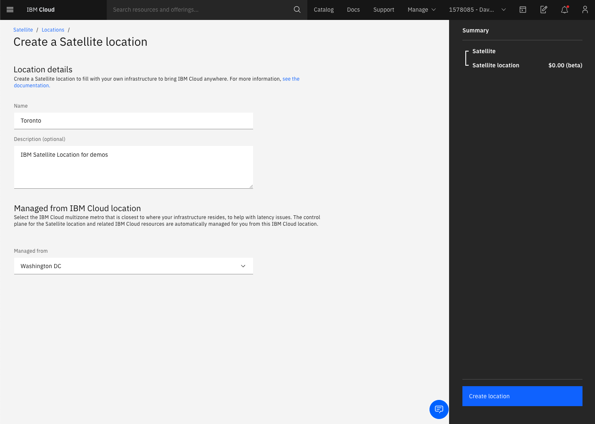
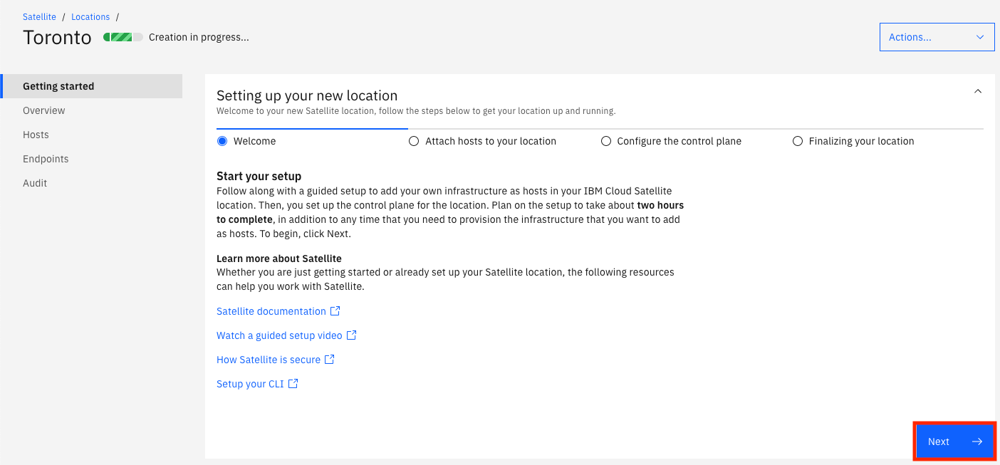
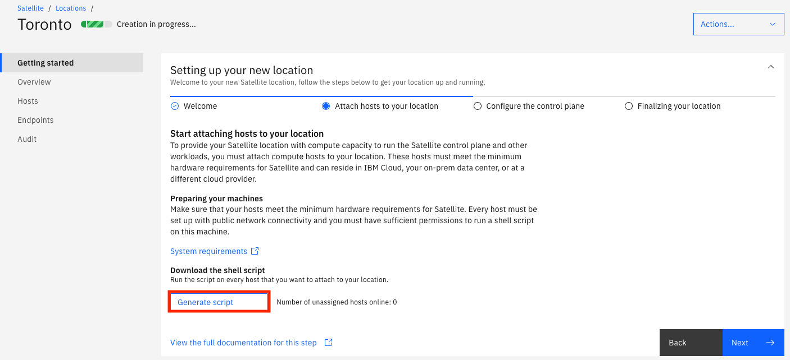
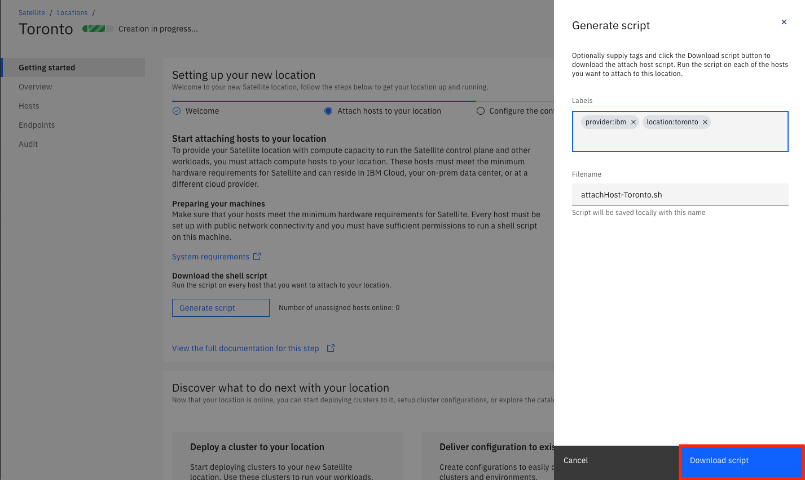

# Overview

## Create the location

Now that we have some hosts we can create a new Satellite location and attached them to it.  In the IBM Cloud Portal, use the left navigation menu to go to the Satellite landing page.  

1. Click on `Create a satellite location`.

1. Provide a name for your location, a description (optional) and choose `Washington DC` in the `Managed from` dropdown.

    

1. Click on `Create Location`.  You will be taken to the Getting Started page for your location.  Click `Next`.

    

1.  Click on the `Generate script` link.

    

1. Provide some Labels if you wish, then click `Download script`.

    

    An example of the content of the script can be viewed here:

    <details>
        <summary>Click here to expand the script</summary>

        ```sh
        #!/usr/bin/env bash
        cat << 'HERE' >>/usr/local/bin/ibm-host-attach.sh
        #!/usr/bin/env bash
        set -ex
        mkdir -p /etc/satelliteflags
        HOST_ASSIGN_FLAG="/etc/satelliteflags/hostattachflag"
        if [[ -f "$HOST_ASSIGN_FLAG" ]]; then
        echo "host has already been assigned. need to reload before you try the attach again"
        exit 0
        fi
        set +x
        HOST_QUEUE_TOKEN="<a really long token will be here....>"
        set -x
        ACCOUNT_ID="<your IBM Cloud Account ID will be here>"
        CONTROLLER_ID="<your satellite location ID will be here>"
        SELECTOR_LABELS='{"location":"toronto","provider":"ibm"}'
        API_URL="https://origin.us-east.containers.cloud.ibm.com/"

        #shutdown known blacklisted services for Satellite (these will break kube)
        set +e
        systemctl stop -f iptables.service
        systemctl disable iptables.service
        systemctl mask iptables.service
        systemctl stop -f firewalld.service
        systemctl disable firewalld.service
        systemctl mask firewalld.service
        set -e

        # ensure you can successfully communicate with redhat mirrors (this is a prereq to the rest of the automation working)
        yum install rh-python36 -y
        mkdir -p /etc/satellitemachineidgeneration
        if [[ ! -f /etc/satellitemachineidgeneration/machineidgenerated ]]; then
        rm -f /etc/machine-id
        systemd-machine-id-setup
        touch /etc/satellitemachineidgeneration/machineidgenerated
        fi
        #STEP 1: GATHER INFORMATION THAT WILL BE USED TO REGISTER THE HOST
        HOSTNAME=$(hostname -s)
        HOSTNAME=${HOSTNAME,,}
        MACHINE_ID=$(cat /etc/machine-id )
        CPUS=$(nproc)
        MEMORY=$(grep MemTotal /proc/meminfo | awk '{print $2}')
        export CPUS
        export MEMORY
        SELECTOR_LABELS=$(echo "${SELECTOR_LABELS}" | python -c "import sys, json, os; z = json.load(sys.stdin); y = {\"cpu\": os.getenv('CPUS'), \"memory\": os.getenv('MEMORY')}; z.update(y); print(json.dumps(z))")

        #Step 2: SETUP METADATA
        cat << EOF > register.json
        {
        "controller": "$CONTROLLER_ID",
        "name": "$HOSTNAME",
        "identifier": "$MACHINE_ID",
        "labels": $SELECTOR_LABELS
        }
        EOF

        set +x
        #STEP 3: REGISTER HOST TO THE HOSTQUEUE. NEED TO EVALUATE HTTP STATUS 409 EXISTS, 201 created. ALL OTHERS FAIL.
        HTTP_RESPONSE=$(curl --write-out "HTTPSTATUS:%{http_code}" --retry 100 --retry-delay 10 --retry-max-time 1800 -X POST \
        -H  "X-Auth-Hostqueue-APIKey: $HOST_QUEUE_TOKEN" \
        -H  "X-Auth-Hostqueue-Account: $ACCOUNT_ID" \
        -H "Content-Type: application/json" \
        -d @register.json \
        "${API_URL}v2/multishift/hostqueue/host/register")
        set -x
        HTTP_BODY=$(echo "$HTTP_RESPONSE" | sed -E 's/HTTPSTATUS\:[0-9]{3}$//')
        HTTP_STATUS=$(echo "$HTTP_RESPONSE" | tr -d '\n' | sed -E 's/.*HTTPSTATUS:([0-9]{3})$/\1/')

        echo "$HTTP_BODY"
        echo "$HTTP_STATUS"
        if [ "$HTTP_STATUS" -ne 201 ]; then
        echo "Error [HTTP status: $HTTP_STATUS]"
        exit 1
        fi

        HOST_ID=$(echo "$HTTP_BODY" | python -c "import sys, json; print(json.load(sys.stdin)['id'])")

        #STEP 4: WAIT FOR MEMBERSHIP TO BE ASSIGNED
        while true
        do
        set +x
        ASSIGNMENT=$(curl --retry 100 --retry-delay 10 --retry-max-time 1800 -G -X GET \
            -H  "X-Auth-Hostqueue-APIKey: $HOST_QUEUE_TOKEN" \
            -H  "X-Auth-Hostqueue-Account: $ACCOUNT_ID" \
            -d controllerID="$CONTROLLER_ID" \
            -d hostID="$HOST_ID" \
            "${API_URL}v2/multishift/hostqueue/host/getAssignment")
        set -x
        isAssigned=$(echo "$ASSIGNMENT" | python -c "import sys, json; print(json.load(sys.stdin)['isAssigned'])" | awk '{print tolower($0)}')
        if [[ "$isAssigned" == "true" ]] ; then
            break
        fi
        if [[ "$isAssigned" != "false" ]]; then
            echo "unexpected value for assign retrying"
        fi
        sleep 10
        done

        #STEP 5: ASSIGNMENT HAS BEEN MADE. SAVE SCRIPT AND RUN
        echo "$ASSIGNMENT" | python -c "import sys, json; print(json.load(sys.stdin)['script'])" > /usr/local/bin/ibm-host-agent.sh
        export HOST_ID
        ASSIGNMENT_ID=$(echo "$ASSIGNMENT" | python -c "import sys, json; print(json.load(sys.stdin)['id'])")
        cat << EOF > /etc/satelliteflags/ibm-host-agent-vars
        export HOST_ID=${HOST_ID}
        export ASSIGNMENT_ID=${ASSIGNMENT_ID}
        EOF
        chmod 0600 /etc/satelliteflags/ibm-host-agent-vars
        chmod 0700 /usr/local/bin/ibm-host-agent.sh
        cat << EOF > /etc/systemd/system/ibm-host-agent.service
        [Unit]
        Description=IBM Host Agent Service
        After=network.target

        [Service]
        Environment="PATH=/usr/local/sbin:/usr/local/bin:/usr/sbin:/usr/bin:/sbin:/bin"
        ExecStart=/usr/local/bin/ibm-host-agent.sh
        Restart=on-failure
        RestartSec=5

        [Install]
        WantedBy=multi-user.target
        EOF
        chmod 0644 /etc/systemd/system/ibm-host-agent.service
        systemctl daemon-reload
        systemctl start ibm-host-agent.service
        touch "$HOST_ASSIGN_FLAG"
        HERE

        chmod 0700 /usr/local/bin/ibm-host-attach.sh
        cat << 'EOF' >/etc/systemd/system/ibm-host-attach.service
        [Unit]
        Description=IBM Host Attach Service
        After=network.target

        [Service]
        Environment="PATH=/usr/local/sbin:/usr/local/bin:/usr/sbin:/usr/bin:/sbin:/bin"
        ExecStart=/usr/local/bin/ibm-host-attach.sh
        Restart=on-failure
        RestartSec=5

        [Install]
        WantedBy=multi-user.target
        EOF
        chmod 0644 /etc/systemd/system/ibm-host-attach.service
        systemctl daemon-reload
        systemctl enable ibm-host-attach.service
        systemctl start ibm-host-attach.service

        ```
    </details>


1. Click `Next`.  You can see that the next step is to assign some hosts to your control plane.  Since we haven't attached any hosts yet we will do this later.  Click `Next`.  This page tells you what will happen once you have attached three hosts and assigned them to the control plane.  You can access this wizard at any time by clicking the `Getting Started` link on the left.  If you do come back to it later you won't have to generate the script again if you already downloaded it.  

1. Click the `Complete` link to exit the wizard.

