# Prerequisites

## Connectivity Requirements

Connectivity requirements are documented [here](https://cloud.ibm.com/docs/satellite?topic=satellite-host-reqs#reqs-host-network-firewall-inbound).  This is a summary of the rules to be created in a security group that will be attached to each host.

### Inbound Rules

| Description | Protocol | Ports | Source |
| ----------- | -------- | ----- | ------ |
| **Required: Allow IBM Cloud to set up and manage your Satellite location** | TCP | 30000-32767 | Any |
| **Required: Allow access for all protocols and all ports to the security group** | All | All | Security Group |
| **Optional: Access the Red Hat OpenShift on IBM Cloud console on the public network** | All | 80 | Any |
| **Optional: Access the Red Hat OpenShift on IBM Cloud console on the public network** | All | 443 | Any |
| **Optional: Access hosts via SSH on the public network** | TCP | 22 | Any |

### Outbound Rules

| Description | Protocol | Ports | Source |
|-------------|----------|-------|--------|
|**Required: Allow IBM Cloud to set up and manage your Satellite location**|All|All|Any|

!!! caution
    These are not the minimum requirements for outbound connectivity; it's just the easiest set of outbound rules for demos.  The actual minimum requirements are [here](https://cloud.ibm.com/docs/satellite?topic=satellite-host-reqs#reqs-host-network-firewall-outbound).

## Creating a security group

In IBM Cloud, navigate to the Classic Infrastructure page using the left navigation menu.

1. Expand the `Security` section on the menu.  Choose `Network Security` -> `Security Groups`.

    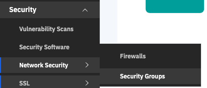

1. You will see a screen similar to the one below.  Click the `Create Group` link.

    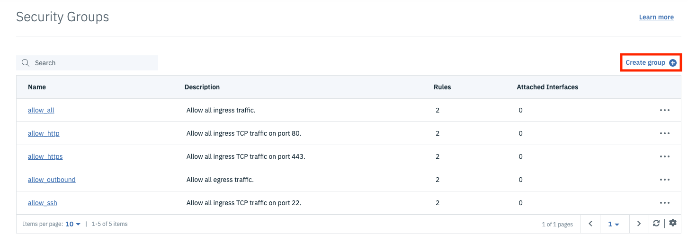

1. Fill in the dialog box with the name and description of your choice, then click `Create group`.

    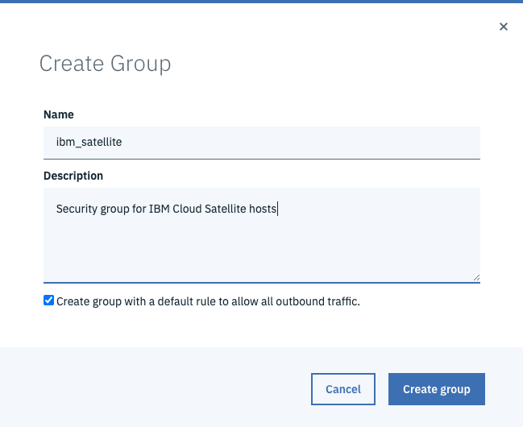

1. You will be taken back to the list of security groups where you will see your group in the list.  Click the link for your group to edit it; we need to add some inbound security rules.

    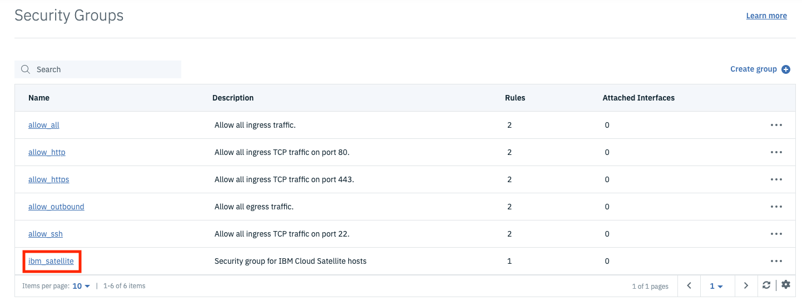

1. Click the `Create rule` link at the top right of the Inbound Rules table.

    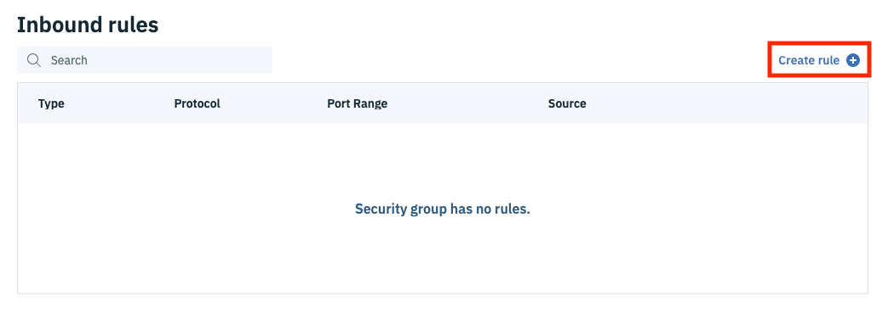

1. The first rule will be to grant access to ports 30000-32767 for the TCP protocol to all incoming source IP addresses.  The CIDR notation for "all IPv4 addresses" is `0.0.0.0/0`.  Change the port range to match the screen shot below, set the Source to `0.0.0.0/0` and click Ok.

    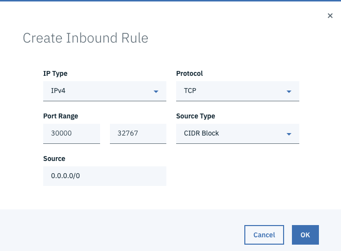

1. Repeat these steps for port 80, which will allow HTTP traffic.  Set both port range fields to `80`.
1. Repeat these steps for port 443, which will allow HTTPs traffic.  Set both port range fields to `443`.
1. Repeat these steps for port 22, which will allow you to SSh into hosts in this security group.  Set both port range fields to `22`.
1. We need one more inbound rule that will allow all traffic among nodes that belong to this security group.  For this rule, change the `Protocol` dropdown to `All`.  This will remove the ports from the dialog.  Change the `Source Type` to `Security Group` and change the `Source` dropdown to your security group.  Note that in the screen shot below, the name of my Security group at the top is `ibm_satellite` and that is what is also selected in the `Source` field.  Click `Ok`.

    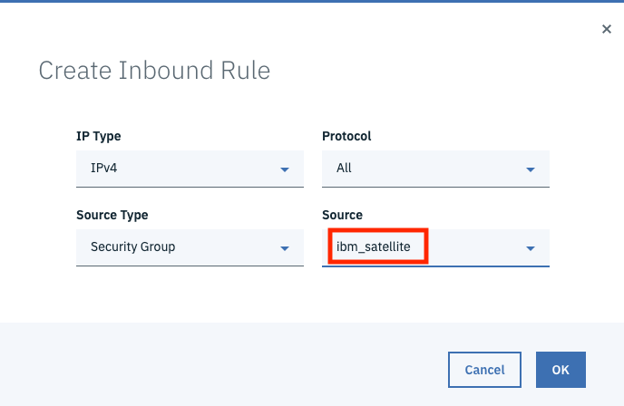

1. The final set of rules should look like this:

    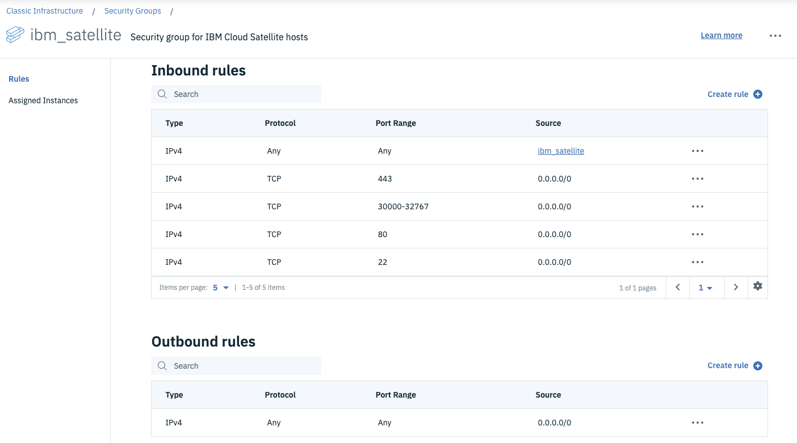

That's it!  We now have a security group that we can attach to the hosts we create to allow the proper inbound and outbound traffic to support IBM Cloud Satellite.  

## Create an SSH Key

You will need to SSH into your hosts to run some updates and a registration script to attach your hosts to your location.  To do this you will need an SSH key that you will provide when you create your hosts.

If you don't have one you will need to create one before you can import it into IBM Cloud.  Check out this page in the [Github Docs](https://docs.github.com/en/free-pro-team@latest/github/authenticating-to-github/connecting-to-github-with-ssh#platform-windows) for more information on creating one or finding an existing one if it exists.

To create an SSH Key in IBM Cloud Classic Infrastructure:

1. In the IBM Cloud Portal use the  icon to access the left navigation menu.  Choose `Classic Infrastructure`.

1. You should be on the Classic Infrastructure landing page.  On the left navigation menu choose `Devices -> Manage -> SSH Keys`.

    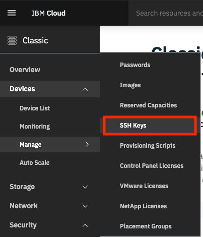

1. Click the `Add` button to add a new SSH Key.

    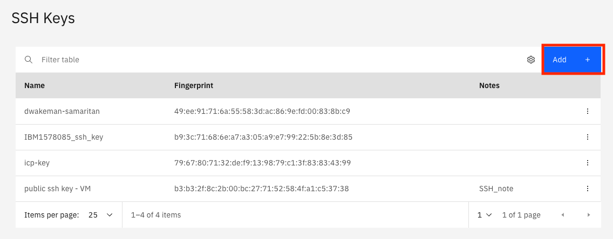

1. Copy and paste your public key into the `Public Key` field.  The public key can typically be found in the `~/.ssh` directory on a mac.  The file name will have a `.pub` extension, like `id_rsa.pub`.  

    `cat ~/.ssh/id_rsa.pub`

    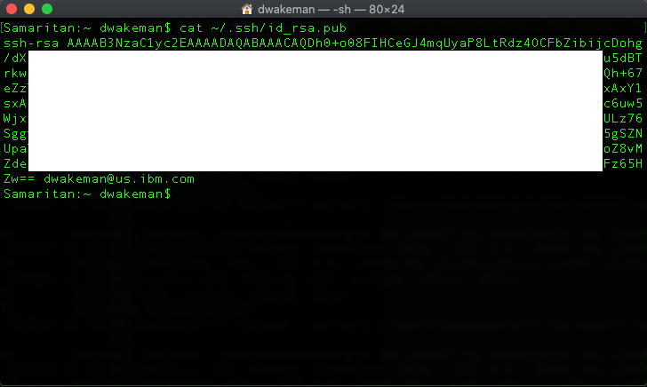

    Copy everything from the `ssh-rsa` to the email address or whatever is at the end of that string of characters and paste it into the `Public key` field.

    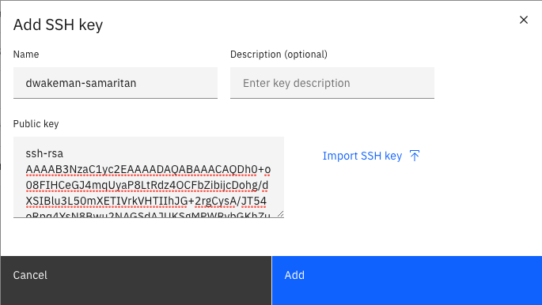

1. Click `Add`.

Now you are ready to create some hosts.
