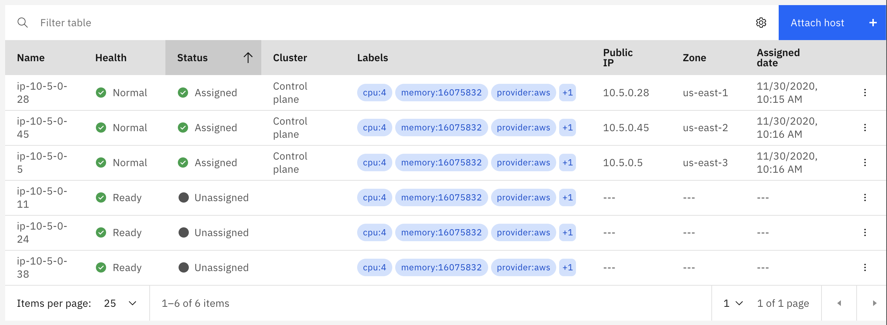
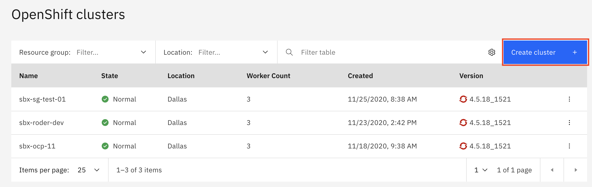
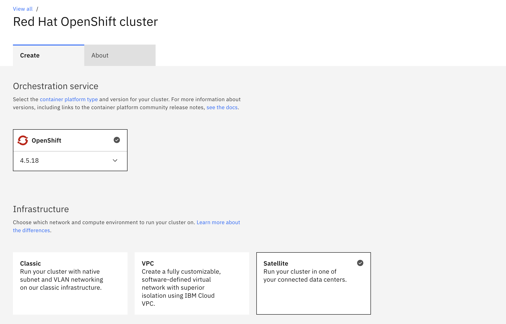
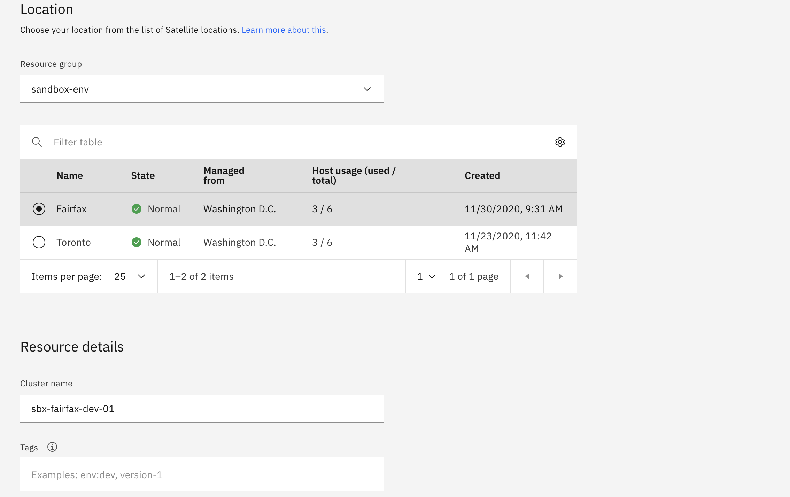
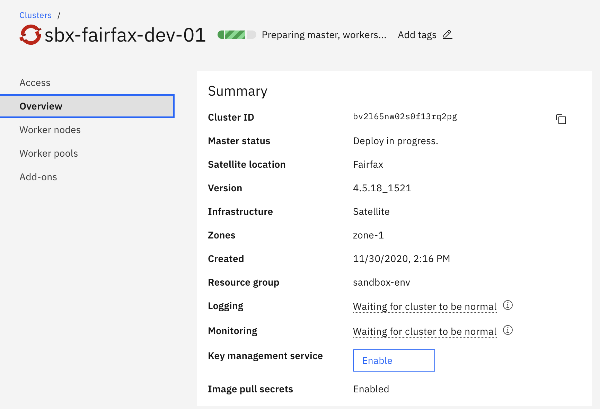
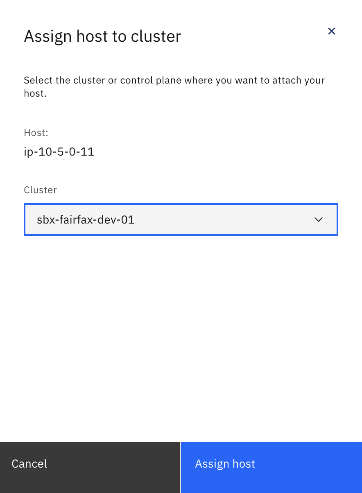
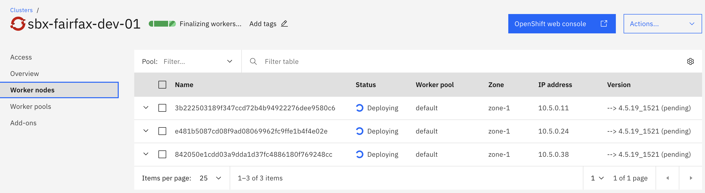
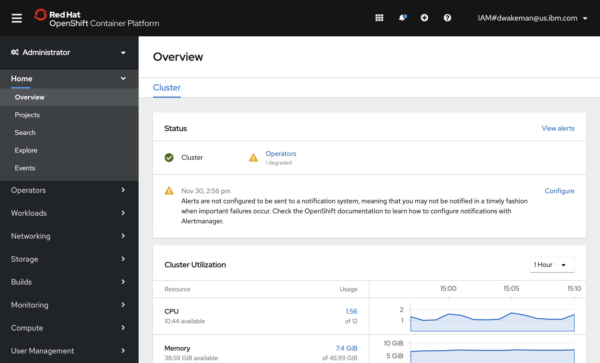

# Overview

This page will contain instructions for provisioning an OpenShift cluster in your location.

## Prerequisites

In order to create an OpenShift cluster in an IBM Cloud Satellite location, you must first create an IBM Cloud Satellite location!  If you do not yet have one you can create one using any of the options documented in the `Create a satellite location` section.  

You will also need some hosts to assign to your OpenShift cluster; preferrably at least 3 hosts in geographically dispersed locations for resiliency.  If you have three hosts available you will see them on the `Hosts` page for your satellite location

!!! warning
    If you do not have any unassigned hosts **please create them before proceeding.**  You can create these hosts using the same steps you used to create the hosts for your satellite location control plane.

1. Navigate to the `OpenShift` page in the IBM Cloud Console by clicking the  icon, then `Kubernetes -> Clusters`.

    

1. Fill in the details.......

    
    

1. When ready, click the blue `Create` button to create your cluster.  You will be taken to the `Getting Started` page for your cluster.  This page has helpful tips for setting up your computer to access your cluster.  You can come back to this page at any time.  Click `Overview` on the left navigation menu to see the overview page for your cluster.

    

    You can see that the `Master status` fields shows `Deploy in progress`.  At this time the master nodes for your cluster are being provisioned in the control plane for your satellite location.  Once that is done the `Master status` field will change to `Ready`.

1. Next you will need to go back to your satellite location and assign some hosts to act as worker nodes for your cluster.  Navigate back to your satellite location and go to the `Hosts` tab.  You will need to assign the three hosts that you provisioned (and that are currently `Unassigned`) to your cluster, in the same way you assigned hosts to your control plane.  

    !!! note
        When you assign hosts to a service like OpenShift on IBM Cloud, you don't specify a `Managed from` zone like you did for your control plane.  The reason is that these hosts are managed completely by your control plane in your satellite location.

1. Click the "three dots" icon at the right of the line for your host and select `Assign host`.  Click the `Cluster` dropdown and select the openshift cluster you just created.

    

1. Repeat the previous step for the other two hosts.

1. Go back to your OpenShift cluster and click on the `Worker Nodes` link in the left navigation menu.  You should now see that your cluster has three worker nodes.

    

1. Go back to the `Overview` tab for your cluster and wait for it to show `Normal` in the cluster status field at the top of the page, just to the right of the cluster name.  If it says `Finalizing workers...` it is not yet done.

    !!! note
        It is common for the worker nodes to report `Critical` status during provisioning.  Do not be alarmed; this occurs when the nodes get rebooted, which is a normal part of the process.  Usually this is a good sign that the provisioning process is almost complete.

    

    !!! note
        If your hosts are running in AWS then the DNS for the ingress subdomain will be incorrect, as was the DNS for your location.  The reason is the same - the script that registers the hosts reports the private IP address instead of the public IP address.  This must be fixed before you can access the OpenShift console.

1. (Optional) If your cluster is running in AWS you will need to run the commands starting in step 4 in the [DNS for cluster load balancing](https://cloud.ibm.com/docs/satellite?topic=satellite-providers#aws-reqs-dns-cluster-nlb) section of the documentation.  
    - Run this command to get the list of private IP addresses currently registered in your cluster's default ingress subdomain:

        `ibmcloud oc nlb-dns ls -c <your_cluster_name`

        For example:

            ibmcloud oc nlb-dns ls -c sbx-fairfax-dev-01
            OK
            Hostname                                                                                  IP(s)       Health Monitor   SSL Cert Status   SSL Cert Secret Name                                       Secret Namespace   
            sbx-fairfax-dev-01-e648741016b5b16f9b585588dcd0ed80-0000.upi.containers.appdomain.cloud   10.5.0.38   None             created           sbx-fairfax-dev-01-e648741016b5b16f9b585588dcd0ed80-0000   openshift-ingress 

    - run this command to register the public IP addresses instead:

        `ibmcloud oc nlb-dns add --cluster sbx-fairfax-dev-01 --nlb-host sbx-fairfax-dev-01-e648741016b5b16f9b585588dcd0ed80-0000.upi.containers.appdomain.cloud  --ip <aws_public_ip>  --ip <aws_public_ip> --ip <aws_public_ip>`

        For example:

            ibmcloud oc nlb-dns add --cluster sbx-fairfax-dev-01 --nlb-host sbx-fairfax-dev-01-e648741016b5b16f9b585588dcd0ed80-0000.upi.containers.appdomain.cloud  --ip 3.82.241.35 --ip 54.242.214.78 --ip 3.81.82.210
            Adding IP(s) 3.82.241.35, 54.242.214.78, 3.81.82.210 to NLB host name sbx-fairfax-dev-01-e648741016b5b16f9b585588dcd0ed80-0000.upi.containers.appdomain.cloud in cluster sbx-fairfax-dev-01 ...
            OK

    - Run this command again to review the new list of IP addresses:

        `ibmcloud oc nlb-dns ls -c <your_cluster_name>`

        For example:

            ibmcloud oc nlb-dns ls -c sbx-fairfax-dev-01
            OK
            Hostname                                                                                  IP(s)                                             Health Monitor   SSL Cert Status   SSL Cert Secret Name                                       Secret Namespace   
            sbx-fairfax-dev-01-e648741016b5b16f9b585588dcd0ed80-0000.upi.containers.appdomain.cloud   3.81.82.210,3.82.241.35,10.5.0.38,54.242.214.78   None             created           sbx-fairfax-dev-01-e648741016b5b16f9b585588dcd0ed80-0000   openshift-ingress   

        You will notice that the three new IP addresses are there, but the original private IP address is still there as well.  We will need to remove the private IP address.

    - Run this command to remove all of the private IP addresses that were originally registered:

        `ibmcloud oc nlb-dns rm classic --cluster sbx-fairfax-dev-01 --nlb-host <your_hostname> --ip <aws_private_ip> --ip <aws_private_ip> --ip <aws_private_ip>`

        !!! note
            You may have more or fewer private IP addresses than in the sample command.  Include the appropriate number of `--ip <aws_private_ip>` paramters to match the number of private IP addresses you retrieved in the command above.

        For example:

            ibmcloud oc nlb-dns rm classic --cluster sbx-fairfax-dev-01 --nlb-host sbx-fairfax-dev-01-e648741016b5b16f9b585588dcd0ed80-0000.upi.containers.appdomain.cloud --ip 10.5.0.38
            Deleting IP 10.5.0.38 from NLB host name sbx-fairfax-dev-01-e648741016b5b16f9b585588dcd0ed80-0000.upi.containers.appdomain.cloud in cluster sbx-fairfax-dev-01...
            OK

1. Try to access the OpenShift console.  Go back to the `Overview` page for your OpenShift cluster and click the blue `OpenShift web console` link at the top right of the page.

    

!!! question
    At this point the console functions, but the ingress operator shows `Degraded` status.  Is that because there is no load balancer?  In IBM Cloud the service automatically creates a load balancer for the ingress, but in satellite it does not.  Should there be steps here to create one?  What would the steps be?

**Congratulations!** You have successfully deployed an OpenShift cluster in your IBM Cloud Satellite location!!
